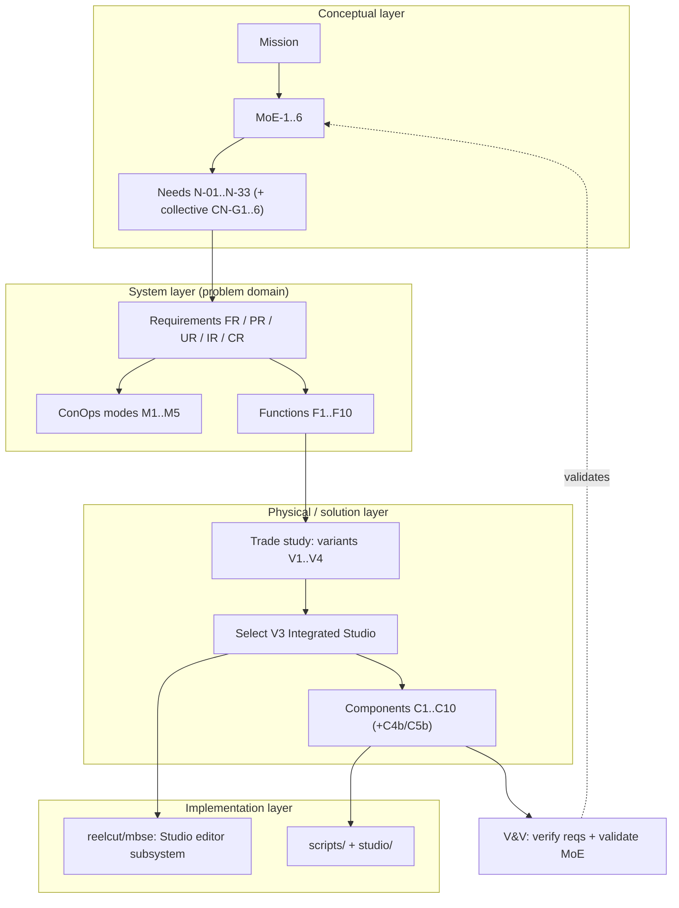
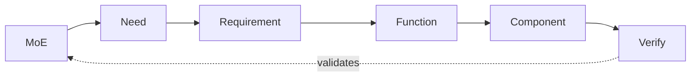
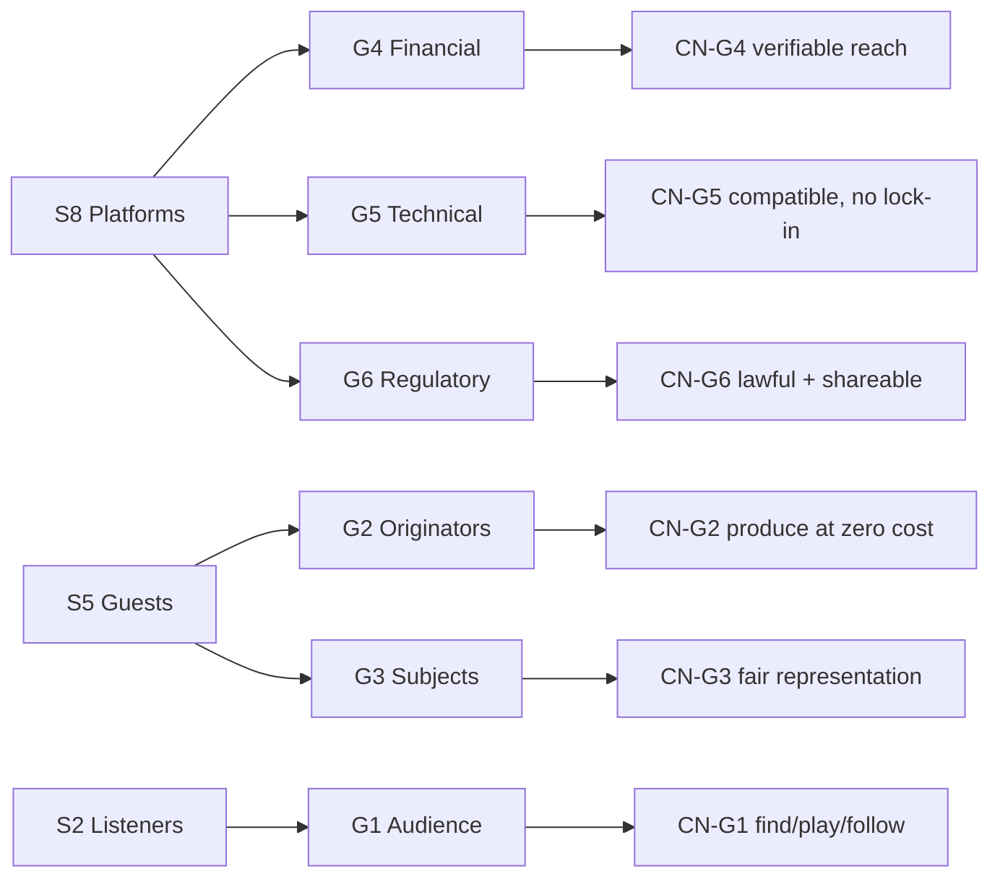
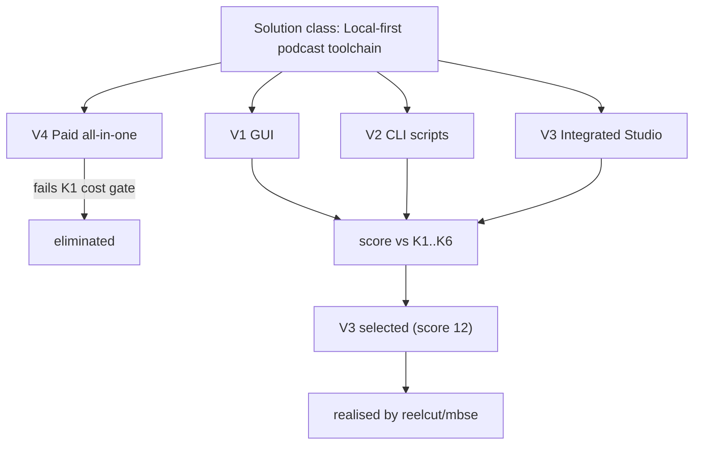
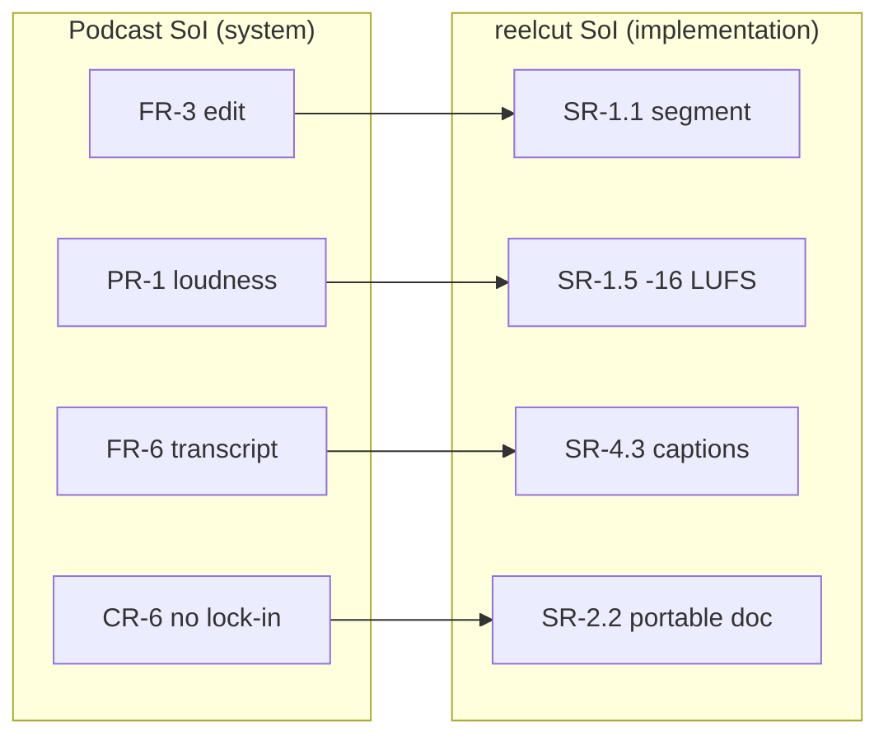

# 9 · Model Map (diagrams)

> One-picture views of the whole model. Source of truth = the Mermaid blocks below;
> rendered SVGs live in [`../diagrams/`](../diagrams/) (run `../diagrams/render.sh`).
> Diagrams are illustrative; the authoritative text is in `00`–`08`.

## 9.1 Lifecycle through-line (concept → implementation)

## 9.2 Traceability spine (no orphans, bidirectional)

## 9.3 Stakeholder groups -> collective needs (many-to-many)

## 9.4 Solution trade study (physical layer)

## 9.5 Cross-layer bridge (podcast requirement -> reelcut)

➡️ Back to the spine: [`08-traceability-matrix.md`](08-traceability-matrix.md).
