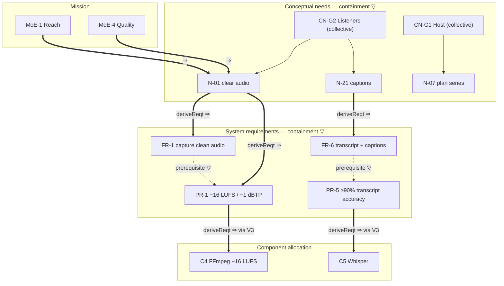
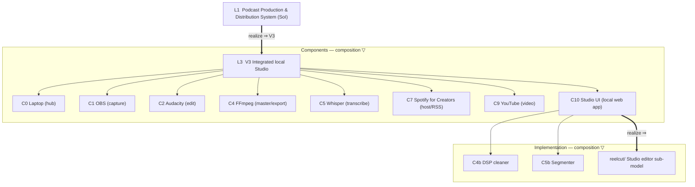
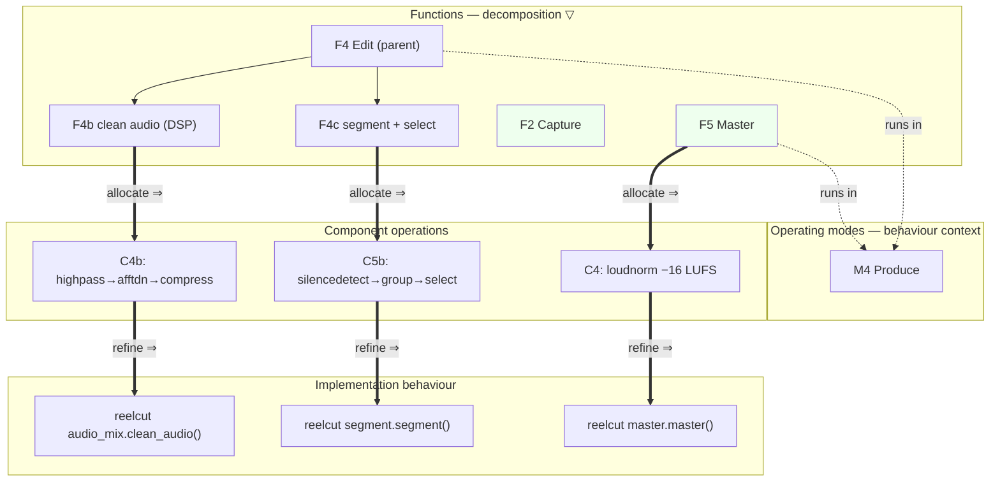
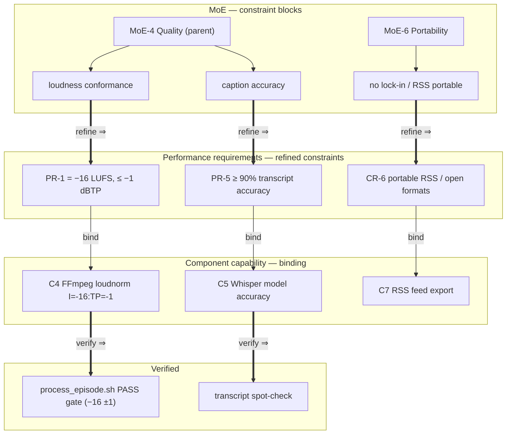
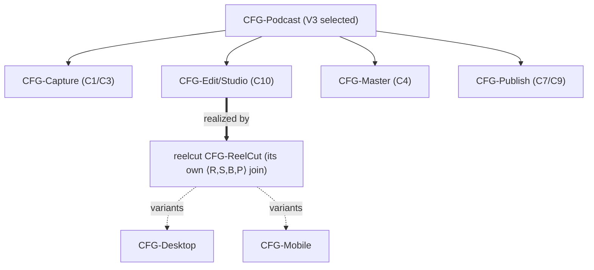

# 10 · Cross-Layer Traceability (four pillars, like-to-like, with decomposition, recursion, and a configuration join)

> **SE step:** make the System-of-Interest's traceability *formal and same-kind across
> every layer*, matching the framework already used in the ReelCut sub-model
> (`reelcut/mbse/8-cross-layer-traceability.md`, DECISIONS ADR-013). Until now this model
> carried a prose requirements-traceability matrix (`08-traceability-matrix.md`) that links
> *across* pillars (need→requirement→function→component→verify). This file adds the missing
> **like-to-like** threads that run *down the layers* within a single pillar —
> **requirement→requirement**, **structure→structure**, **behaviour→behaviour**,
> **parametric→parametric** — each with **within-layer decomposition `▽`**,
> **across-layer realization `⇒`**, applied **recursively**, and routed through a
> **Configuration** join. `08` stays the cross-pillar spine; `10` is the down-the-pillar spine.

## 10.0 Layers and the recursion rule

| # | Layer | Pillar homes |
|---|-------|--------------|
| L0 | **Enterprise / mission** | `00-concept-and-moe.md` (mission, MoE), `01-stakeholders.md` |
| L1 | **Conceptual** | `02-stakeholder-needs.md` (N-01…33, CN-G1…6) |
| L2 | **Logical / system** | `03-requirements.md` (FR/PR/UR/IR/CR), `05-functional-architecture.md` (F1…F10, M1…M5) |
| L3 | **Physical / solution** | `06-physical-architecture.md` (V1…V4 → V3; C0…C10) |
| L4 | **Implementation** | `reelcut/` (Studio subsystem) + repo `scripts/` |
| — | **Configuration (join)** | the selected variant **V3** binds the four threads across each hop (§10.6) |

**Recursion rule (every pillar, every level):** each element carries a *within-layer
decomposition* `▽` (parent → children of the same pillar/layer) and an *across-layer
realization* `⇒` (same-pillar element one layer down, routed via a Configuration item).
Applying `▽` then `⇒` from L0 to L4 yields a self-similar tree, traversable up (`⇐ trace`)
and down (`⇒ derive`) at any depth.

| Pillar | within-layer `▽` | across-layer `⇒` |
|--------|------------------|------------------|
| Requirements | `«containment»` (collective need ⊃ need; req ⊃ sub-req) | `«deriveReqt»` / `«trace»` |
| Structure | `«composition»` (system ⊃ component ⊃ part) | `«allocate»` / `«realize»` |
| Behaviour | `«decompose»` (function ⊃ sub-function) | `«refine»` |
| Parametric | constraint decomposition (MoE ⊃ sub-measure) | `«refine»` value binding |

---

## 10.1 Thread R — Requirement ⇄ Requirement

The collective (group) needs give this model a **real** within-layer requirement
decomposition that `08` did not make explicit: each collective need `CN-Gk` contains the
individual needs of its stakeholder group, which derive into the typed requirements.



**Decomposition added:** `CN-G2 ▽ {N-01, N-21, …}` and `CN-G1 ▽ {N-07, …}` (collective→individual
need), plus the **requirement prerequisite** links `FR-1 ▽→ PR-1`, `FR-6 ▽→ PR-5` (you cannot
normalise loudness without captured audio; you cannot hit transcript accuracy without a transcript).

---

## 10.2 Thread S — Structure ⇄ Structure



**Composition added:** `SoI ⇒ V3 ▽ {C0,C1,C2,C4,C5,C7,C9,C10}`; and the **Studio subsystem**
`C10 ▽ {C4b, C5b}` realized by `reelcut/` — the cross-model structural hand-off (the SoI's
component tree continues into the ReelCut structure thread, `reelcut/mbse §8.2`).

---

## 10.3 Thread B — Behaviour ⇄ Behaviour



**Decomposition added:** `F4 Edit ▽ {F4b clean, F4c segment}` (the §6.6 automation made these
real sub-functions), realized down to the ReelCut behaviour thread (`reelcut/mbse §8.3`).

---

## 10.4 Thread P — Parametric ⇄ Parametric



**Decomposition added:** `MoE-4 Quality ▽ {loudness, caption-accuracy}` → `{PR-1, PR-5}`; the
binding equation (`loudness == loudnorm(I=-16)`) is the constraint carried across the `⇒` hop,
identical to the parameter that the ReelCut parametric thread verifies (`reelcut/mbse §8.4`) —
i.e. the loudness MoP has **one definition** shared across both models.

---

## 10.5 Layers × Pillars closure

| Pillar | L0⇒L1 | L1 ▽ | L1⇒L2 | L2 ▽ | L2⇒L3 | L3 ▽ | L3⇒L4 |
|--------|------|------|------|------|------|------|------|
| Requirements | MoE⇒N | CN-G▽N ✅new | N⇒FR/PR | FR▽PR prereq ✅new | req⇒component | — | ⇒reelcut SR |
| Structure | SoI⇒V3 | — | V3▽C | C10▽C4b/C5b ✅new | C⇒parts | C10▽reelcut ✅new | ⇒reelcut C |
| Behaviour | — | — | F⇒op | F4▽F4b/F4c ✅new | op⇒script | — | ⇒reelcut op |
| Parametric | MoE▽ ✅new | — | MoE⇒PR | MoE▽sub ✅new | PR⇒capability | — | ⇒reelcut MoP |

✅new = like-to-like decomposition formalised by this file (was prose/implicit in `08`).

---

## 10.6 Configuration model — the join (and the cross-model recursion)

The trade study (§6.0) selected **V3 Integrated local Studio**. In configuration terms V3 is the
**root Configuration Item** of the SoI, binding the 4-tuple `⟨R, S, B, P⟩`:

```
CFG-Podcast(V3) = ⟨ R: FR/PR/UR/IR/CR satisfied at $0 with no lock-in,
                    S: components C0…C10,
                    B: functions F1…F10 across modes M1…M5,
                    P: −16 LUFS, ≥90% transcript, RSS-portable ⟩
```

It **decomposes** into per-stage configuration items (Capture, Edit, Master, Publish) mirroring the
component tree, and its **Edit/Studio** sub-configuration is realized by the ReelCut root
configuration — i.e. the recursion crosses the model boundary:



This makes the **system→implementation bridge** a configuration relationship, not a loose pointer:
the SoI's selected configuration `CFG-Podcast(V3)` contains, at its Edit/Studio node, the ReelCut
configuration `CFG-ReelCut` (`reelcut/mbse §8.6`), which itself decomposes into the Desktop/Mobile
variants. The four like-to-like threads therefore run **continuously from the podcast mission down
into the ReelCut implementation** through one chain of configuration joins.

---

## 10.7 Closure

- The cross-model loudness parameter (−16 LUFS / −1 dBTP) and transcript-accuracy target have a
  **single definition** shared by both models' parametric threads — change it in one place.
- `08-traceability-matrix.md` remains the cross-pillar RTM; this file is the down-the-pillar spine.
- A thread is **complete** when every L4 leaf traces `⇐` through one configuration per hop back to an
  L0 MoE/capability in the *same pillar*, and `⇒` back down, with no gap.

*Created 2026-06-24. Companion to `08-traceability-matrix.md` and to
`reelcut/mbse/8-cross-layer-traceability.md` (the realizing sub-model). Keep IDs consistent with
`03-requirements.md`, `05-functional-architecture.md`, and `06-physical-architecture.md`.*
