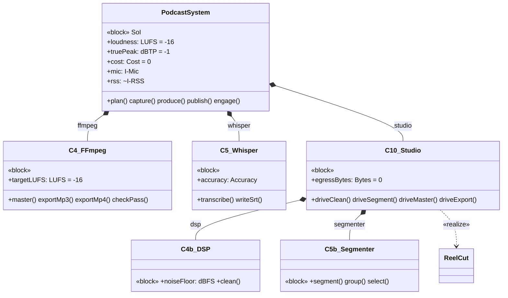
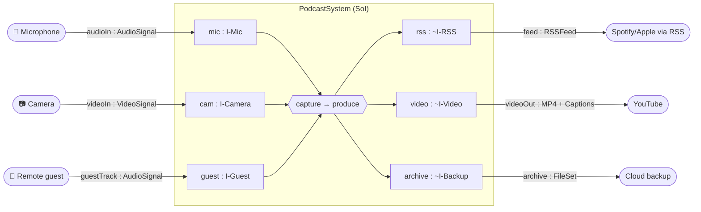

# 11 · Formal Structure — Blocks, Components, Interfaces, Ports & Types

> **SE step:** raise the physical architecture (`06`) from a prose allocation table to a
> **formal SysML structural model**. Every component is a `«block»` with **named and described
> structural features** (ports, value properties, parts) and **behavioural features**
> (operations), every port is **typed by an interface block**, every block is **linked** to a
> function it performs (`«allocate»`) and a requirement it satisfies (`«satisfy»`). This is the
> podcast-model counterpart of `reelcut/mbse/3-system-configuration.md` + `7-properties-and-types.md`.
> Notation is the repo's agreed hybrid (SysML-v2 textual + Mermaid), per ADR-007.

## 11.1 Value-type catalogue (units & quantity kinds)

Every quantitative value property below is typed by one of these. No untyped properties exist.

| Value type | Quantity kind | Unit / range | Used by |
|---|---|---|---|
| `LUFS` | integrated loudness | LU rel. full scale (target −16) | PR-1, MoE-4 |
| `dBTP` | true-peak | dB true-peak (limit −1) | PR-1, MoE-4 |
| `dBFS` | noise floor | dB full scale (≤ −50) | PR-2, MoE-4 |
| `Bitrate` | data rate | kbps (MP3 ≥ 128) | PR-3 |
| `FileSize` | data size | MB (≤ 40 per 30 min) | PR-4 |
| `Accuracy` | ratio | % (transcript ≥ 90) | PR-5 |
| `Effort` | duration | hours/episode (≤ 3) | PR-6 |
| `Pixels` | length | px (artwork ≥ 1400×1400) | IR-2 |
| `Cost` | money | currency (= 0) | UR-2, CR-1 |
| `Bool` | logical | true/false | consent, licence, lock-in flags |

## 11.2 Interface blocks (realize the interface requirements IR-1…4)

Each interface block defines the **named, typed flow properties** crossing a port, and
`«realize»`s the interface requirement that mandates it.

| Interface block | Flow properties (dir : type) | Realizes |
|---|---|---|
| **I-Mic** | `in audioIn : AudioSignal` | IR-1 |
| **I-Camera** | `in videoIn : VideoSignal` | IR-1 |
| **I-Guest** | `in guestTrack : AudioSignal [0..*]` (per-speaker) | IR-4 |
| **I-RSS** | `out feed : RSSFeed` (enclosure, title, pubDate, artwork ≥1400px) | IR-2 |
| **I-Video** | `out videoOut : MP4` (H.264/AAC) | IR-3 |
| **I-Backup** | `out archive : FileSet` (raw + masters) | UR-4, FR-11 |

Signals/flow items used above (`AudioSignal`, `VideoSignal`, `RSSFeed`, `MP4`, `FileSet`,
`MasterWav`, `Transcript`, `Captions`, `CoverArt`) are the typed item-flow dictionary; each is a
`«signal»`/`«block»` carried on the interfaces in §11.4.

## 11.3 System-of-Interest block

**`PodcastSystem`** `«block»` — the Missing Link Podcast Production & Distribution System (SoI).

- **Parts** (composition `▽`): `obs : C1`, `audacity : C2`, `caller : C3`, `ffmpeg : C4`,
  `whisper : C5`, `canva : C6`, `host : C7`, `backup : C8`, `youtube : C9`, `studio : C10`
  (which itself contains `dsp : C4b`, `segmenter : C5b`), all hosted on `laptop : C0`.
- **Ports** (typed by §11.2 interface blocks): `mic : I-Mic`, `cam : I-Camera`, `guest : I-Guest`,
  `rss : ~I-RSS`, `video : ~I-Video`, `archive : ~I-Backup`.
- **Value properties:** `loudness : LUFS = −16`, `truePeak : dBTP = −1`, `cost : Cost = 0`,
  `effortPerEpisode : Effort`.
- **Operations (behavioural):** `plan()`, `capture()`, `produce()`, `publish()`, `engage()` —
  one per ConOps mode group; each is realized by the function chain in `12-formal-behaviour.md`.

## 11.4 Component blocks (C0–C10, C4b, C5b)

Every component is a `«block»` with a **description**, **ports** (typed), **operations**
(named + described behavioural features), **value properties** (structural), the **function it
performs** (`«allocate»`), and the **requirement it satisfies** (`«satisfy»`). No component is
without features, a description, or a link.

| Cmp `«block»` | Description | Ports (typed) | Operations (described) | Value properties | `«allocate»` fn | `«satisfy»` req |
|---|---|---|---|---|---|---|
| **C0 Laptop** | Integration hub running C1–C6 | `usb : I-Mic, I-Camera` | `host()` run all local tools | `storageGB` | F3 | UR-2, HC |
| **C1 OBS** | Records camera+mic+screen to MP4 | `mic:I-Mic`, `cam:I-Camera`, `out:rawAV` | `record()`, `stopAndSave()` | `resolution`, `fps` | F2 Capture | FR-1, FR-2, IR-1 |
| **C2 Audacity** | Multitrack audio editor | `in:rawAudio`, `out:roughMaster` | `cut()`, `denoise()`, `level()`, `addMusic()` | `tracks` | F4 Edit | FR-3, FR-4 |
| **C3 Caller** | Remote-guest call/record tool | `guest:I-Guest`, `out:guestTrack` | `connect()`, `recordPerSpeaker()` | `speakers` | F2 (remote) | FR-10, IR-4 |
| **C4 FFmpeg** | Loudness master + MP3/MP4 export | `in:roughMaster`, `out:MasterWav, MP3, MP4` | `master()` → −16 LUFS, `exportMp3()`, `exportMp4()`, `checkPass()` | `targetLUFS:LUFS=−16`, `truePeak:dBTP=−1` | F5 Master, F6 Export | PR-1, PR-2, PR-3, IR-3 |
| **C5 Whisper** | Local speech-to-text | `in:MasterWav`, `out:Transcript, Captions` | `transcribe()`, `writeSrt()` | `accuracy:Accuracy`, `lang` | F7 Transcribe | FR-6, PR-5 |
| **C6 Canva** | Cover art + social clips | `out:CoverArt` | `makeCover()` (≥1400px), `makeClip()` | `dims:Pixels` | F8 Package | IR-2, FR-9 |
| **C7 Host (Spotify for Creators)** | Free unlimited host; generates RSS | `in:MP3, CoverArt`, `rss:I-RSS` | `publishAudio()`, `emitRss()` | `episodes` | F9 Publish | FR-7, CR-6 |
| **C8 Cloud backup** | Off-device copy of raw + masters | `archive:I-Backup` | `sync()`, `restore()` | `quotaGB` | F3 Ingest/Backup | FR-11, UR-4 |
| **C9 YouTube** | Video host + discovery | `in:MP4, Captions`, `video:I-Video` | `uploadVideo()`, `attachCaptions()` | `channelId` | F9 Publish | FR-8, IR-3 |
| **C10 Studio UI** | One-window local web app (127.0.0.1) | `in:rawAV`, `out:episode_cut, episode_clean` | `driveClean()`, `driveSegment()`, `driveMaster()`, `driveExport()` | `egressBytes:Bytes=0` | F4b, F4c, F5–F7 (HMI) | UR-1, UR-3 |
| **C4b DSP cleaner** | High-pass→denoise→de-click→de-ess→compress | `in:rawAudio`, `out:cleanWav` | `clean()` | `noiseFloor:dBFS` | F4b clean audio | PR-2 |
| **C5b Segmenter** | Whisper + grouping → segments/sub-sections | `in:cleanWav`, `out:segments` | `segment()`, `group()`, `select()` | `gapThresh` | F4c segment | FR-3, UR-1 |

> **Realizes the implementation sub-model:** `C10 ▽ {C4b, C5b}` together are the **Studio editor
> subsystem**; `C10 «realize» reelcut/` (the ReelCut MBSE model is the detailed sub-model of this
> subsystem only — `06` §6.6, `10` §10.2). The ReelCut block features are in
> `reelcut/mbse/3-system-configuration.md` / `7-properties-and-types.md`.

## 11.5 Function structural features (F1–F10, F4b, F4c)

Each function is an `«activity»` with **named, typed input/output object flows** (its structural
features at the behaviour boundary, from `05` §5.2/§5.3) and is `«allocate»`d to the component(s)
above. Behaviour (control flow, modes, states) is in `12-formal-behaviour.md`.

| Fn | Inputs (named : type) | Outputs (named : type) | `«allocate»` to | `«refine»` req |
|---|---|---|---|---|
| **F1 Plan** | `arc, research, guestAvail` | `script, assetList, booking` | C0/docs | N-07, FR-9 |
| **F2 Capture** | `mic:AudioSignal, cam:VideoSignal` | `rawAudio, rawVideo, roomTone` | C1 (+C3 remote) | FR-1, FR-2, IR-1 |
| **F3 Ingest&Backup** | `rawFiles` | `episodeFolder, offDeviceCopy:FileSet` | C0, C8 | FR-11, UR-4 |
| **F4 Edit** | `rawAudio, rawVideo, music` | `roughMaster:Wav` | C2 (+C10) | FR-3, FR-4 |
| **F4b Clean** | `rawAudio` | `cleanWav` | C4b | PR-2 |
| **F4c Segment** | `cleanWav` | `segments, selection` | C5b | FR-3, UR-1 |
| **F5 Master** | `roughMaster` | `MasterWav (−16 LUFS)` | C4 | PR-1, PR-2 |
| **F6 Export** | `MasterWav, editedVideo` | `MP3, MP4` | C4 | FR-5, PR-3, IR-3 |
| **F7 Transcribe** | `MasterWav` | `Transcript:txt, Captions:srt` | C5 | FR-6, PR-5 |
| **F8 Package** | `metadata` | `showNotes, chapters, CoverArt` | C6 | FR-9, IR-2 |
| **F9 Publish** | `MP3, MP4, metadata, art, Captions` | `liveEpisode, RSSFeed` | C7, C9 | FR-7, FR-8, IR-2 |
| **F10 Engage** | `episode, analytics, comments` | `clips, replies, metrics, ideas` | C7/C9, C6 | N-24, N-09 |

## 11.6 Component BDD (composition + features)

## 11.7 System-context IBD (ports ↔ external actors, with item flows)

*Created 2026-06-24. Companion to `06-physical-architecture.md` (allocation) and
`12-formal-behaviour.md` / `13-parametrics-and-requirements.md`. Every block here carries
named+described structural & behavioural features and at least one `«allocate»`/`«satisfy»`/
`«realize»` relationship.*
