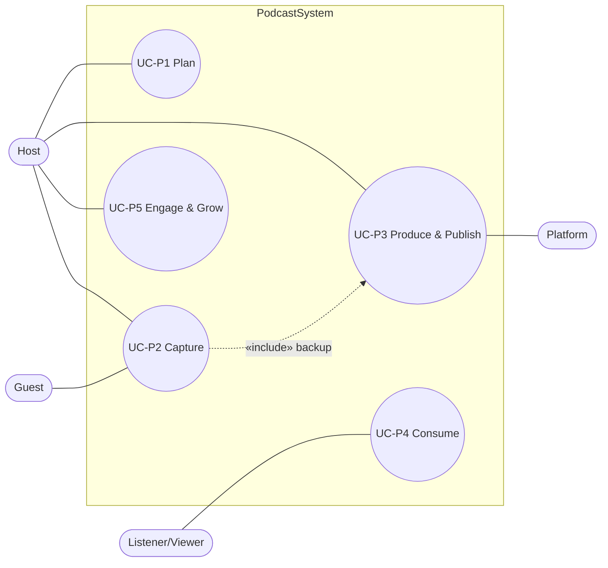
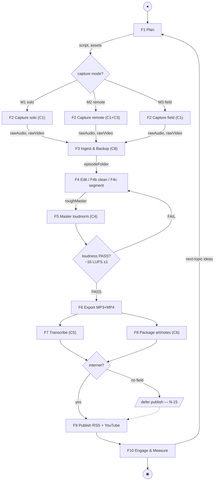
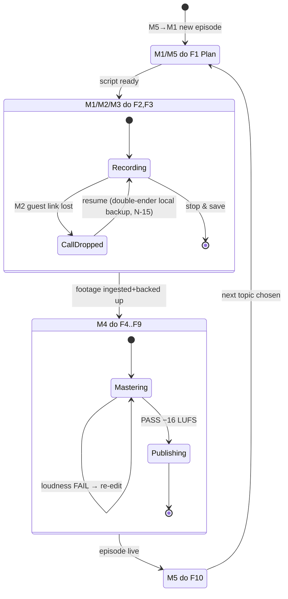
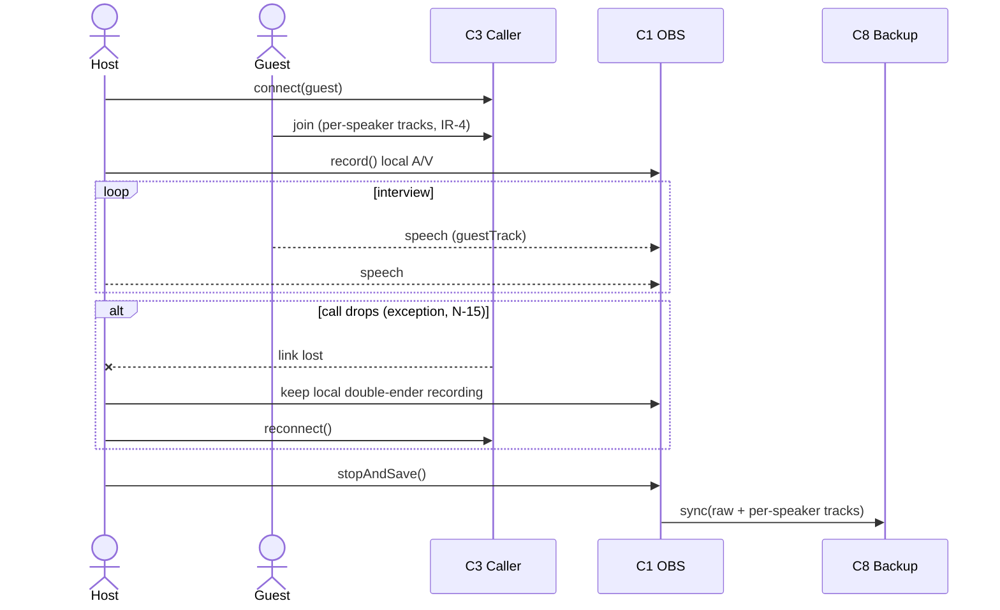

# 12 · Formal Behaviour — Use Cases, Activity, State Machine & Sequences

> **SE step:** formalise the behaviour pillar. Functions `F1–F10` (`05`) and modes `M1–M5`
> (`04`) become a **use-case model**, a **control-flow activity** with object flows and
> exception branches, a **state machine** (modes-as-states + episode lifecycle with recovery),
> and a **sequence** for the hardest scenario. Behaviour was enumerated for completeness —
> **nominal / alternate / exception / edge** — per the repo's MBSE behaviour rule (brainstorming
> discipline). Counterpart of `reelcut/mbse/1-problem-domain/white-box/{2,4,6,7}`.

## 12.1 Actors and use cases

| Actor | Description | Use cases (associations) |
|---|---|---|
| **Host** (primary) | The creator operating the system | UC-P1 Plan, UC-P2 Capture, UC-P3 Produce, UC-P5 Engage |
| **Guest** | Remote interviewee | UC-P2 Capture (remote, M2) |
| **Listener/Viewer** | The audience | UC-P4 Consume (via published episode + captions) |
| **Platform** | Spotify/Apple host + YouTube | UC-P3 Produce → Publish (receives RSS/MP4) |
| **Cloud backup** | Off-device store | UC-P2/UC-P3 backup |

Each use case `«refine»`s the functions that realise it: UC-P1→F1; UC-P2→F2/F3; UC-P3→F4–F9;
UC-P4→(F6/F7 outputs consumed); UC-P5→F10.

## 12.2 Production activity (object flow + exception branches)

Nominal flow plus the alternate capture modes and the master-loudness exception loop.

## 12.3 State machine — operating modes + episode lifecycle (with recovery)

Modes `M1–M5` are formalised as **states**; the do-activity of each is the function set the
ConOps assigns it (`04` §4.1), which links every mode to its requirements.

## 12.4 Sequence — M2 Remote interview (the hardest scenario, with alt/break)

## 12.5 Behaviour-completeness register (nominal / alternate / exception / edge)

| Class | Behaviour | Where handled |
|---|---|---|
| Nominal | Plan→Capture→Ingest→Edit→Master(PASS)→Export→Transcribe→Package→Publish→Engage | §12.2 |
| Alternate | Solo (M1) / Remote (M2) / Field (M3) capture; Studio (C10) vs Audacity edit path | §12.2 CAP branch |
| Alternate | Defer publish when offline in the field, sync later | §12.2 NET branch (N-15) |
| Exception | Master loudness FAIL → re-edit loop until −16 LUFS ±1 | §12.2 CHK / §12.3 Mastering |
| Exception | Remote call drops → double-ender local backup, reconnect | §12.3 CallDropped / §12.4 alt |
| Edge | Guest no-show → fall back to solo (M1) monologue | mode transition Capturing→Planning |
| Edge | Corrupted/over-noisy recording → re-capture (PR-2 gate fails at edit) | re-enter Capturing |

*Created 2026-06-24. Companion to `04-concept-of-operations.md` (modes), `05-functional-architecture.md`
(functions), and `11-formal-structure.md` (the components that perform these behaviours). Every use
case, function, mode and state here is linked (association / «refine» / do-activity / transition).*
