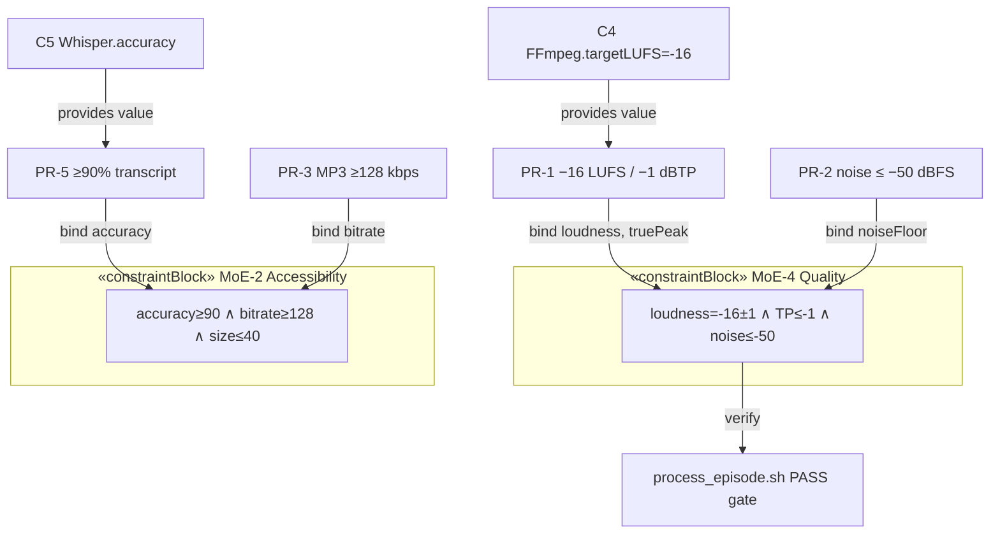
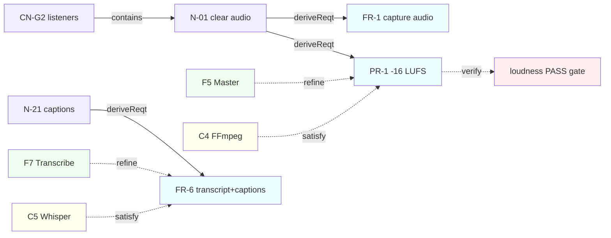

# 13 · Formal Parametrics, Requirements Diagram & Orphan Resolution

> **SE step:** formalise the parametric pillar (MoE as `«constraintBlock»`s bound to performance
> values), draw the **requirements diagram** (derive/refine/satisfy/verify), and **link every
> previously-orphaned element** (trade criteria K1–K6, operating modes M1–M5, configuration items,
> the N-28 numbering gap). Counterpart of `reelcut/mbse/.../4-measures-of-effectiveness.md` +
> `2-solution-domain/4-component-parameters.md`.

## 13.1 MoE as constraint blocks (parametric expressions)

Each Measure of Effectiveness is a `«constraintBlock»` with a named constraint expression over
**value properties bound to performance requirements** — so "effectiveness" becomes computable, not
prose. (Targets from `00` §0.4.)

| MoE `«constraintBlock»` | Constraint expression | Bound value : type | Refined by (`⇒`) |
|---|---|---|---|
| **MoE-1 Reach** | `onRSS ∧ onYouTube ∧ hasMetadata` | `reach : Bool` | FR-7, FR-8, IR-2 |
| **MoE-2 Accessibility** | `hasSrt ∧ hasTxt ∧ accuracy ≥ 90 ∧ bitrate ≥ 128 ∧ fileSize ≤ 40` | `accuracy:Accuracy, bitrate:Bitrate, fileSize:FileSize` | PR-3, PR-4, PR-5 |
| **MoE-3 Sustainability** | `effort ≤ 3h ∧ cost = 0 ∧ singleCommand` | `effort:Effort, cost:Cost` | PR-6, UR-2, UR-4 |
| **MoE-4 Quality** | `loudness = −16 ±1 ∧ truePeak ≤ −1 ∧ noiseFloor ≤ −50 ∧ mp4Valid` | `loudness:LUFS, truePeak:dBTP, noiseFloor:dBFS` | PR-1, PR-2, IR-3 |
| **MoE-5 Integrity** | `licenceLog ∧ consent ∧ ctaPresent` | `integrity : Bool` | CR-1…CR-5, FR-9 |
| **MoE-6 Portability** | `rssExportable` | `portable : Bool` | CR-6 |

## 13.2 Parametric diagram (constraint ↔ value bindings)

## 13.3 Requirements diagram (derive / refine / satisfy / verify)

## 13.4 Orphan resolution — every previously-unlinked element now has a relationship

### 13.4.1 Trade criteria K1–K6 — `«trace»` to source requirement, `«evaluate»` variants
Each criterion now formally derives from the requirement it encodes and evaluates the candidate
variants V1–V4 (scoring in `06` §6.0.4) that selected **V3**.

| Criterion | `«trace»` from requirement | Role |
|---|---|---|
| K1 Cost = $0 (gate) | UR-2, CR-1 | `«evaluate»` V1–V4 → eliminates V4 |
| K2 No lock-in (gate) | CR-6 | `«evaluate»` V1–V4 |
| K3 Beginner-usable | UR-1, UR-3 | `«evaluate»` V1–V4 → favours V3 |
| K4 Low effort | UR-4, PR-6 | `«evaluate»` V1–V4 |
| K5 Offline / field | N-15 | `«evaluate»` V1–V4 |
| K6 Quality | PR-1, IR-3 | `«evaluate»` V1–V4 |

### 13.4.2 Operating modes M1–M5 — formalised as states
Linked in `12-formal-behaviour.md` §12.3 as states whose **do-activity** is the function set the
ConOps assigns (`04` §4.1), each carrying its requirement links (M1→FR-1/2/3/5, M2→FR-10/IR-4,
M3→FR-1/N-15/PR-2, M4→FR-3…9/PR-1…5, M5→FR-11/N-24/N-09). No mode is an orphan.

### 13.4.3 Configuration items — formal IDs and `⟨R,S,B,P⟩` join
| CFG (formal id) | R (requirements) | S (components) | B (functions) | P (parameters) |
|---|---|---|---|---|
| **CFG-Podcast** (root = V3) | all FR/PR/UR/IR/CR | C0–C10 | F1–F10 | −16 LUFS, ≥90%, $0, RSS-portable |
| **CFG-Plan** | N-07, FR-9 | C0/docs | F1 | — |
| **CFG-Capture** | FR-1/2/10, IR-1/4 | C1, C3 | F2, F3 | per-speaker tracks |
| **CFG-Edit** (`«realize»` reelcut) | FR-3/4 | C10 (C4b,C5b) | F4, F4b, F4c | egress = 0 |
| **CFG-Master** | PR-1/2, FR-5/6 | C4, C5 | F5, F6, F7 | −16 LUFS, ≥90% |
| **CFG-Publish** | FR-7/8, IR-2/3 | C7, C9, C6 | F8, F9 | artwork ≥1400px |
| **CFG-Grow** | FR-11, N-24/09 | C7/C9 analytics | F10 | — |

`CFG-Podcast ▽ {Plan, Capture, Edit, Master, Publish, Grow}`; `CFG-Edit «realize» CFG-ReelCut`
(`reelcut/mbse/3-system-configuration.md`), which specialises into Desktop/Mobile — the cross-model
configuration recursion (`10` §10.6).

### 13.4.4 N-28 — numbering gap (resolved as a known gap, not a dangling link)
Need IDs run N-01…N-33 with **N-28 unused** (no element references it anywhere in the model). It is
recorded as an intentional numbering gap in `DECISIONS.md` (RAID I-8) so it is no longer an
unexplained discontinuity. No requirement, function or component depends on N-28.

*Created 2026-06-24. Companion to `00-concept-and-moe.md`, `03-requirements.md`, `06-physical-architecture.md`,
and `08`/`10` traceability. After this file, every podcast element carries named+described features
and ≥1 relationship.*
