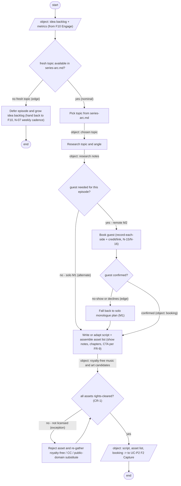
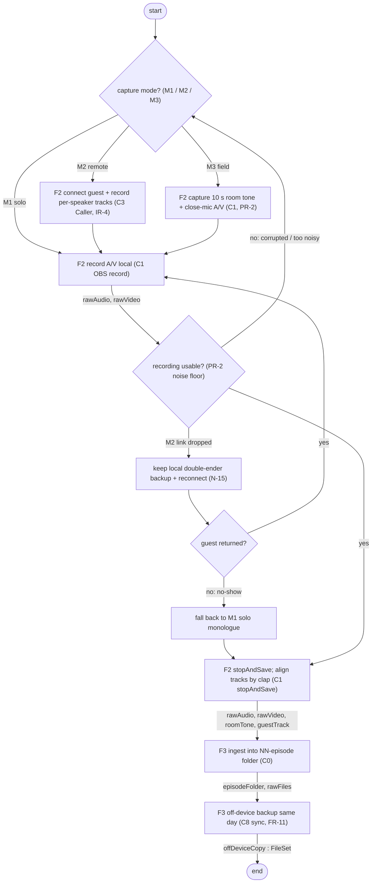
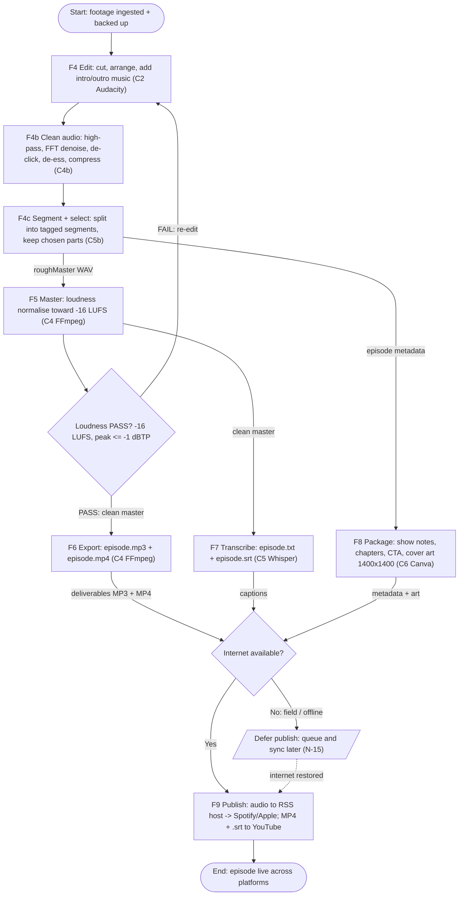
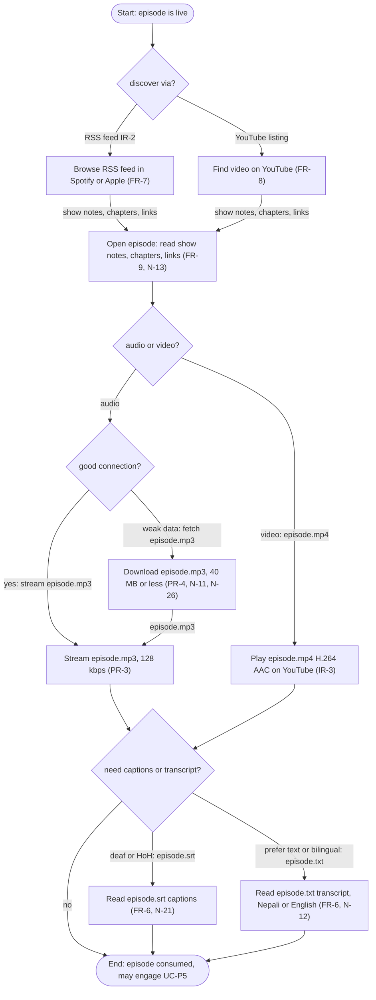
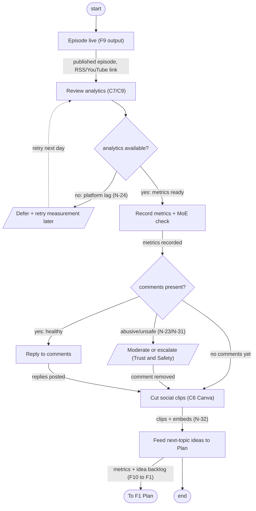

# Per-Use-Case Activity Decomposition

> **SE step (Q1 closure):** one **activity diagram per use case** (UC-P1..UC-P5), each decomposing the
> use case into its sub-activities with control + object flow — companion to `12-formal-behaviour.md`
> (which holds the use-case diagram and the overall production activity). Behaviours enumerated
> nominal / alternate / exception / edge; each diagram render-validated.

## UC-P1 Plan - activity decomposition (refines F1 Plan episode)

SysML activity diagram decomposing use case UC-P1 "Plan" (which refines function F1 "Plan episode", per 12-formal-behaviour.md section 12.1 and 05-functional-architecture.md section 5.2) into its internal sub-activities, with control flow and object flow on the edges. The flow runs: idea backlog + metrics from F10 Engage -> pick topic from series-arc.md -> research topic and angle -> (guest-needed decision) book guest -> write/adapt script and assemble asset list -> (rights-cleared decision) -> emit (script, asset list, booking) downstream to UC-P2 F2 Capture. Three decision nodes realise the alternate/exception/edge splits: solo vs guest (M1/M2), asset rights-cleared (CR-1), and topic-availability (N-07 cadence). Object-flow labels sit on the producing edges; requirement anchors N-07, FR-9, CR-1, N-15/N-16 are placed on the branches they govern.

## UC-P2 Capture — Activity Diagram (control + object flow)

SysML activity diagram decomposing use case UC-P2 "Capture" into internal sub-activities with control flow and object flows. UC-P2 refines functions F2 (Capture) and F3 (Ingest & Backup) per 12-formal-behaviour.md and «include»s the backup hand-off shared with UC-P3. The use case is decomposed into 13 nodes: a capture-mode decision; three mode-specific capture actions (M1 solo local A/V via C1 OBS record(); M2 remote connect-guest + per-speaker tracks via C3 Caller, IR-4; M3 field 10 s room tone + close-mic A/V, PR-2); a PR-2 usability/noise-floor gate; an N-15 double-ender keep-local-and-reconnect recovery; a guest-returned decision; an M1 solo fallback; stopAndSave with clap track alignment (C1 stopAndSave()); F3 ingest into the NN-episode folder (C0); and F3 same-day off-device backup (C8 sync(), FR-11). Edges carry object flows (rawAudio, rawVideo, roomTone, guestTrack, episodeFolder/rawFiles, offDeviceCopy:FileSet) alongside control flow. Behaviour is enumerated for completeness per the repo MBSE brainstorming rule, sourced from 12-formal-behaviour.md §12.5 — nominal, alternate (M1/M2/M3), exception (M2 call drop -> double-ender, N-15), edge 1 (guest no-show -> solo monologue), edge 2 (corrupted/too-noisy fails PR-2 gate -> re-capture loop). Names verified verbatim against the model under /home/user/planets/podcast-the-missing-link/01-systems-engineering/ (11-formal-structure.md, 03-requirements.md, 04-concept-of-operations.md, 05-functional-architecture.md, 12-formal-behaviour.md). Traceability touched: FR-1, FR-2, IR-1 (F2 A/V capture); FR-10, IR-4 (remote per-speaker, C3); PR-2 (room tone / noise-floor gate, <= -50 dBFS); N-15 (double-ender recovery); FR-11, UR-4 (off-device backup, C8).

## UC-P3 Produce and Publish — Activity Diagram

SysML activity diagram decomposing podcast use case UC-P3 "Produce and Publish" (the Host-driven, M4 production-and-publish use case that «refine»s functions F4-F9 per 12-formal-behaviour.md §12.1 and 05-functional-architecture.md). The diagram shows internal control flow and object flow rather than restating the use case. Sub-activities with their allocated components (06-physical-architecture.md §6.2-6.3, §6.6): F4 Edit (C2 Audacity: cut, arrange, add intro/outro music); F4b Clean audio (C4b DSP cleaner: high-pass, FFT denoise, de-click, de-ess, compress, supporting PR-2); F4c Segment + select (C5b Segmenter: split into tagged segments, keep chosen parts); F5 Master (C4 FFmpeg: loudness normalise toward -16 LUFS); a PASS/FAIL loudness gate (PR-1: -16 LUFS +/-1 integrated, true-peak <= -1 dBTP) that loops back to F4 Edit on FAIL; F6 Export (C4 FFmpeg: episode.mp3 per PR-3 + episode.mp4 per IR-3); F7 Transcribe (C5 Whisper: episode.txt + episode.srt); F8 Package (C6 Canva: show notes, chapters, CTA, cover art 1400x1400); F9 Publish (C7 Spotify for Creators audio to RSS host syndicating to Spotify/Apple, plus C9 YouTube for MP4 + .srt). Object flows are labelled on edges to match the §5.3 data hand-off table: roughMaster WAV (F4c->F5), clean master (F5->F7 and gate PASS->F6), deliverables MP3+MP4 (F6->Publish join), captions (F7->join), metadata + art (F8->join). Behaviour completeness is enumerated: NOMINAL = Edit->Clean->Segment->Master(PASS)->Export + Transcribe + Package -> Publish; ALTERNATE = offline/field branch where no internet defers publishing and syncs later (N-15); EXCEPTION = master-loudness FAIL re-edit loop until -16 LUFS +/-1; EDGE = publish deferred-and-resumed when internet is restored. Scope note: F2/F3 capture-and-ingest belong to UC-P2, so this diagram starts where UC-P3 begins (footage already ingested + backed up) and ends at a live episode; F10/UC-P5 engagement is intentionally out of scope. Validated by rendering with mermaid-cli (clean SVG, 13 nodes, ASCII-only, balanced quotes).

## UC-P4 Consume - audience-side activity decomposition

SysML activity diagram decomposing use case UC-P4 "Consume" (actor: Listener/Viewer) of the podcast MBSE model into its audience-side sub-activities, with control flow and object flow on the edges. All names are taken from the real model under 01-systems-engineering/ (12-formal-behaviour.md actors/use-cases; 05-functional-architecture.md functions and data hand-offs; 03-requirements.md; 02-stakeholder-needs.md). UC-P4 consumes the F6/F7/F8 outputs (episode.mp3 PR-3, episode.mp4 IR-3, episode.srt/episode.txt FR-6, show notes/chapters FR-9) distributed by F9 over RSS (FR-7) and YouTube (FR-8). Sub-activities: (1) Discover the episode - diamond {discover via?} splits into RSS podcast app (Spotify/Apple, FR-7) or YouTube (FR-8); (2) Open episode and read show notes / chapters / links (FR-9, N-13); (3) Choose modality - diamond {audio or video?} branches to audio (episode.mp3 via RSS) or video (episode.mp4 on YouTube, IR-3); (4) Play - stream or, on weak data, download (file constraints PR-3 128 kbps, PR-4 <= 40 MB carried as object flow); (5) Accessibility - diamond {need captions or transcript?} routes to episode.srt captions (deaf/HoH, FR-6/N-21) or episode.txt transcript (text-preference/bilingual Nepali-or-English, FR-6/N-12), then converges to end. Object flow is carried on the edges (RSS feed, show notes/chapters, episode.mp3, episode.mp4, episode.srt, episode.txt) rather than only in node labels, so the diagram shows what data moves between sub-activities. Behaviour completeness: Nominal (discover via RSS -> open + read notes -> stream audio -> finish, may engage UC-P5); Alternate discovery (RSS app vs YouTube); Alternate modality (episode.mp3 audio vs episode.mp4 video); Alternate accessibility (captions episode.srt N-21 vs transcript episode.txt / bilingual N-12; chapters to jump N-13); Alternate offline (download for offline/background N-26); Exception weak data ({good connection?} = weak -> download path on PR-3/PR-4 small-file constraints N-11); Edge no-accessibility ({need captions or transcript?} = no -> straight to end).

## UC-P5 "Engage and Grow" — Activity Diagram (refines F10 Engage & Measure)

SysML activity diagram decomposing use case UC-P5 "Engage and Grow" (Host actor; «refine» F10 "Engage & measure", per 12-formal-behaviour.md s12.1) into its internal sub-activities with control flow and object flow on the edges. Entry object flow is F9's output "published episode, RSS/YouTube link" (05 s5.2/s5.3). The four requested sub-activities are present and map to the real model: Review analytics (C7/C9 built-in analytics, 06 s6.3), Reply to comments, Cut social clips (C6 Canva, supports N-32 social clips/embeds), and Feed next-topic ideas back to F1 Plan (the F10->F1 feedback loop carrying "metrics + idea backlog", 05 s5.3 and 12 s12.2 line "F10 next-topic ideas -> F1"). Behaviour completeness enumerated per the repo MBSE rule and rendered as branches: NOMINAL = episode live -> review analytics -> record metrics + MoE check -> reply to comments -> cut clips -> feed ideas to Plan; ALTERNATE = no comments yet, skip reply and proceed straight to clipping while still measuring; EXCEPTION = analytics not yet available due to platform lag (N-24 sponsor-ready analytics dashboard), defer and retry measurement later (dashed retry edge back to Review analytics); EDGE = abusive/unsafe comments are moderated or escalated (Trust and Safety, aligns with N-23 minor safety / N-31 Trust&Safety/age) instead of being replied to, then rejoin the clipping flow. Object flows are labelled on edges (published episode + RSS/YouTube link; metrics recorded; comment removed; replies posted; clips + embeds N-32; metrics + idea backlog F10->F1). Mermaid 'flowchart TB' with start/end round nodes, two decision diamonds (analytics available?, comments present?), ASCII-only node text, balanced quotes; render-validated to SVG via mermaid-cli (exit 0). Scratch source: /tmp/wf_UC-P5.mmd ; render: /tmp/wf_UC-P5.svg.

