# Enterprise / SoS · Step 1 — System-of-Systems Context & BDD

> **Top of the model.** Before the SoI is opened as a black box at the *system*
> level, it is first placed inside its **System of Systems (SoS)**: the SoI as a
> single node surrounded by the external entities (other constituent systems and
> environment nodes) it can exchange items with. This file holds the **«system
> context» stereotype block for the SoS** and the **BDD** that composes it.
>
> Method: SysML + MagicGrid (NTRS 20190032390), rooted one layer above the system
> per the 14-step build. The SoS block *composes* the SoI node and every external
> node; node **properties = capabilities**, with **constraints** shown as
> constraint properties / notes. Boundaries are shown as **ports**.

## The SoS «system context» block

`ReelCut_SoS` is the context block. It is **composed of** (black-diamond) the
System of Interest plus the external entities. Each node is a black box here —
just a node with a boundary (ports) and capability/constraint properties.

```mermaid
flowchart TB
  subgraph SOS["bdd «system context» block ReelCut_SoS"]
    direction TB
    SOI["«system of interest» block : ReelCut\n— black box node —\ncaps: ingest, segment, curate, render,\ncaption, master, re-media, export\nconstraint: 127.0.0.1 only · stdlib + FFmpeg"]
    CR["«external» block : Creator (actor)\ncaps: record, decide keep/order, choose media\nconstraint: non-expert (0 training)"]
    VW["«external» block : Viewer / Audience\ncaps: watch, read captions\nconstraint: arbitrary device"]
    CAP["«external» block : Capture Device\n(phone cam / camera)\ncaps: record A/V\nconstraint: variable codec, rate"]
    LIB["«external» block : Media Library\n(local photos & audio)\ncaps: store reusable assets\nconstraint: on local disk only"]
    FS["«external» block : Host Filesystem\ncaps: store upload + render dirs\nconstraint: local; reference property"]
    BR["«external» block : Web Browser\ncaps: render HMI, run wizard JS\nconstraint: localhost origin"]
    FF["«external» block : FFmpeg / ffprobe\ncaps: decode, filter-graph, loudnorm, probe\nconstraint: CLI subprocess"]
    WH["«external» block : Whisper ASR (optional)\ncaps: speech→timed text\nconstraint: optional; offline model"]
    AND["«environment» block : Android Phone\ncaps: capture, host future client\nconstraint HC-1: ≥ Galaxy S23"]
    IOS["«environment» block : iPhone\ncaps: capture, host future client\nconstraint HC-1: ≥ iPhone 11"]
    PUB["«external» block : Publishing Destination\n(social / storage — optional)\ncaps: host finished video\nconstraint: user-initiated egress only"]
    SOS_C(("ReelCut_SoS"))
    SOS_C --- SOI & CR & VW & CAP & LIB & FS & BR & FF & WH & AND & IOS & PUB
  end
```



## Constituent nodes — capabilities & constraints (node properties)

| Node | Stereotype | Capabilities (value/behavioural props) | Constraints (constraint props) |
|---|---|---|---|
| **ReelCut** | «system of interest» | ingest, auto-segment, keep/drop, reorder, transitions, render, caption, master, re-media, export | local-only (`127.0.0.1`); Python stdlib + FFmpeg; no GPU assumed |
| **Creator** | «external» actor | records, makes edit decisions, supplies extra media | non-expert — zero editing skill (MOE-1) |
| **Viewer/Audience** | «external» | watches, reads captions | arbitrary playback device |
| **Capture Device** | «external» | records raw A/V | variable codec / frame-rate / orientation |
| **Media Library** | «external» | stores reusable photos & audio | resides on local disk only |
| **Host Filesystem** | «external» | holds upload dir + render dir | local; modelled as **reference property** `uploadDir`, not composition |
| **Web Browser** | «external» | renders HMI, runs wizard JS | localhost origin only |
| **FFmpeg/ffprobe** | «external» | decode, filter-graph, two-pass loudnorm, probe | invoked as CLI subprocess |
| **Whisper ASR** | «external» (optional) | speech → timed text | optional; silence-detect fallback if absent |
| **Android Phone** | «environment» | capture; host future mobile client | **HC-1**: ≥ Samsung Galaxy S23 |
| **iPhone** | «environment» | capture; host future mobile client | **HC-1**: ≥ iPhone 11 |
| **Publishing Destination** | «external» (optional) | hosts finished video off-device | egress only on explicit user action (preserves MOE-2) |

## SysML (textual) — SoS block & its parts

```sysml
// «system context» block for the System of Systems
part def ReelCut_SoS {
    // the System of Interest — a black box node at this layer
    part soi          : ReelCut;
    // external constituent systems + environment nodes
    part creator      : Creator;
    part viewer       : Viewer;
    part capture      : CaptureDevice;
    part mediaLibrary : MediaLibrary;
    part browser      : WebBrowser;
    part ffmpeg       : FFmpeg;
    part asr          : WhisperASR [0..1];
    part android      : AndroidPhone;        // environment node
    part iphone       : iPhone;              // environment node
    part publish      : PublishingDest [0..1];
    ref  filesystem   : HostFilesystem;      // reference property (external, not composed)
}

// node capability + constraint example
part def AndroidPhone {
    attribute caps : String = "capture; host future client";
    constraint hardwareFloor { minDevice == "Samsung Galaxy S23" }   // HC-1
}
```

> Boundaries (ports) and the items that cross them are detailed in
> `2-sos-ibd-exchanges.md` (Step 2). Capabilities here are later **regrouped** into
> the capability set (CAP-) that justifies the stakeholder needs.
</content>
</invoke>
