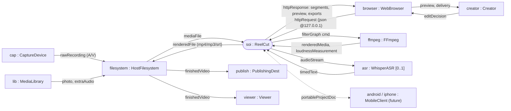

# Enterprise / SoS · Step 2 — SoS Internal Block Diagram (exchanged items) & Mission Analysis

> MagicGrid **Structure / SoS**. The BDD (Step 1) said *what the nodes are*; this
> IBD says *how they connect* — the **item flows** (data / signals / media / control)
> that cross the ports. The exchanged-item set must be **sufficient to enable every
> mission vignette** the user needs are transposed into. Item flows were enriched
> with `/brainstorming` to make sure every way a node can interact with the SoI is
> captured.

## SoS IBD — connectors & exchanged items

## Exchanged-item dictionary (item flows)

| Item flow | Type / signal | From → To | Enables vignette |
|---|---|---|---|
| **rawRecording** | A/V stream/file | Capture → Filesystem | MV-1 |
| **mediaFile** | MediaFile (in) | Filesystem → ReelCut | MV-1,2,3 |
| **photo** | ImageFile | Media Library → Filesystem → ReelCut | MV-3 |
| **extraAudio** | AudioFile | Media Library → Filesystem → ReelCut | MV-3 |
| **editDecision** | EditDecision (keep/order/transition/track) | Creator → Browser → ReelCut | MV-2,3 |
| **httpRequest / httpResponse** | http+json @127.0.0.1 | Browser ↔ ReelCut | all (HMI) |
| **segments / preview** | SegmentModel, PreviewClip | ReelCut → Browser | MV-1,2 |
| **filterGraph cmd** | FFmpeg command | ReelCut → FFmpeg | MV-1,2,3 |
| **renderedMedia / loudnessMeasurement** | MediaFile / LUFS+TP | FFmpeg → ReelCut | MV-1,2,3 |
| **audioStream** | PCM/stream | ReelCut → Whisper | MV-2 |
| **timedText** | TimedText (captions) | Whisper → ReelCut | MV-2 |
| **renderedFile** | mp4 / mp3 / srt | ReelCut → Filesystem | MV-1,2,3 |
| **finishedVideo** | mp4 | Filesystem → Viewer / Publish | MV-1, (MV-4 keeps it local) |
| **portableProjectDoc** | ProjectDoc (JSON) | ReelCut ↔ Mobile Client | MV-5 |

## Mission vignettes (what the SoS must let the creator accomplish)

Transposed from user needs (N-10…N-18) and stakeholder needs (SN-1…SN-7):

| ID | Mission vignette |
|---|---|
| **MV-1** | **Raw → watchable**: a non-expert turns a raw phone recording into a clean, finished video unaided. |
| **MV-2** | **Tighten & order**: cut dead air, re-order topics into the best sequence, add gap-aware transitions, and caption it. |
| **MV-3** | **Re-voice / re-score / illustrate**: replace the audio, add a music/VO track (ducked), and drop in photos — independently of the video. |
| **MV-4** | **Private by construction**: complete the whole job with **nothing leaving the device** unless the creator explicitly publishes. |
| **MV-5** | **Edit on the go**: continue the same edit on a phone via a portable project document. |
| **MV-6** | **Never lose work**: autosave & restore (incl. crash recovery), undo/redo edits, and cancel/abort any long operation. |

## `/brainstorming` — every way a node interacts with the SoI

Enriching the IBD against the need set surfaced these interaction modes (folded
into the dictionary above): Creator↔SoI via Browser (decisions + preview);
Filesystem↔SoI (ingest + deliver, plus reference `uploadDir`); FFmpeg↔SoI
(command + measurement round-trip — the **measurement** return path is what makes
loudness/A-V-sync verifiable); Whisper→SoI (captions, with silence-detect
fallback when absent); Media Library→SoI (the MV-3 add/replace assets); Mobile↔SoI
(portable doc, bidirectional). The **measurement** and **portableProjectDoc**
flows were the two most-missed in the first pass — both are now first-class.

> Step 2 continues in `3-mission-use-cases-to-needs.md`: decompose each vignette
> into mission use cases, consolidate by purpose into capabilities, regroup, and
> **derive the stakeholder needs** so the SN set is justified bottom-up.
</content>
</invoke>
