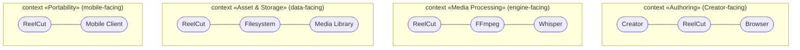
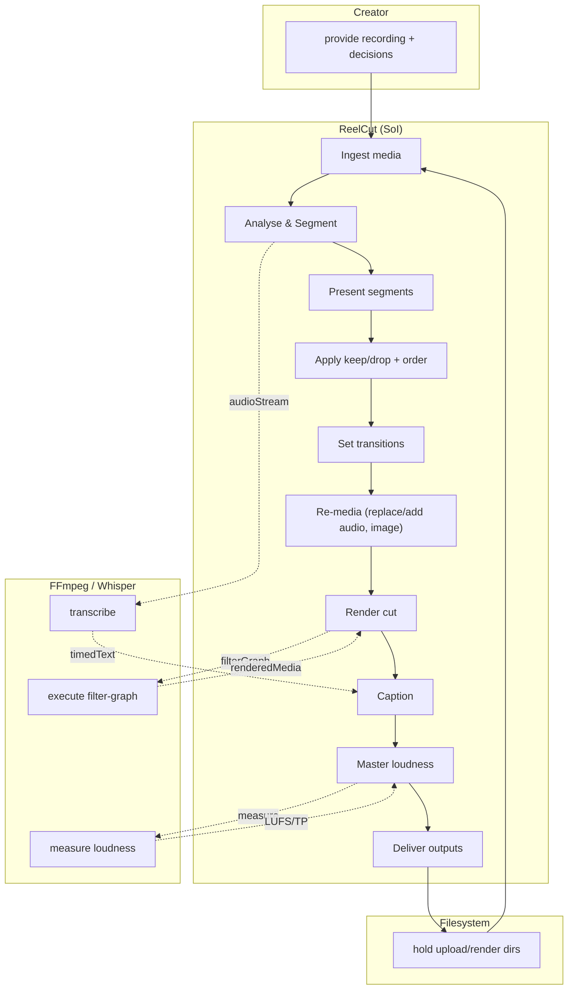

# Enterprise / SoS · Step 3 — Actors, Perspective Contexts & System-Level Activities

> With stakeholder needs justified (Step 2), identify the **actors** that interact
> with the SoI to enable them, derive **use cases**, then re-draw the SoS IBD **per
> perspective** — each perspective is a **system context** that *owns its own set of
> use cases*. Finally an **activity diagram** for the SoI + external entities exposes
> the **system-level activities** (the bridge into the conceptual system layer,
> Step 4).

## 1 · Actors that enable the stakeholder needs

| Actor | Kind | Enables needs |
|---|---|---|
| **Creator** | primary human | SN-1, SN-2, SN-5, SN-6 |
| **Viewer/Audience** | secondary human | SN-2 |
| **FFmpeg/ffprobe** | supporting system | SN-1, SN-2, SN-5 |
| **Whisper ASR** | supporting system (opt) | SN-2 |
| **Host Filesystem** | supporting / environment | SN-3, SN-4 |
| **Media Library** | supporting | SN-5 |
| **Mobile Client** | environment (future) | SN-7 |

Use cases derived from these actors are the existing **UC-1…UC-10**
(`1-problem-domain/black-box/2-use-cases.md`); the actor→UC mapping below assigns
each to the perspective that owns it.

## 2 · Perspective-based system contexts (each owns its use cases)

The single system context splits into **four perspectives**; each is an IBD on the
SoI restricted to the actors needed for that perspective's use cases.

| Perspective (context) | Actors | Owns use cases |
|---|---|---|
| **Authoring** | Creator, Browser | UC-1 Upload, UC-3 Keep/drop, UC-4 Re-order, UC-5 Transitions, UC-10 Level/mute |
| **Media Processing** | FFmpeg, Whisper | UC-2 Auto-segment, UC-6 Export (render/caption/master) |
| **Asset & Storage** | Filesystem, Media Library | UC-1 Upload (ingest side), UC-7 Replace audio, UC-8 Add audio, UC-9 Add image |
| **Portability** | Mobile Client | (future) carry/resume edit over portable doc |

> Splitting by perspective keeps each system context cohesive and gives each its own
> use-case set — the precondition for clean white-box allocation later.

## 3 · System-level activity (SoI + external entities, swimlanes)

Exposes the end-to-end **system activities** that Step 4 decomposes into
sub-system (conceptual) activities → functions → system requirements.

The eleven system activities (A2…A11, plus external A0/A1) are the input to
**Step 4** — decomposed into conceptual sub-system activities, de-duplicated, and
turned into the **functional system requirements** (`white-box/2` → `white-box/1`).
</content>
</invoke>
