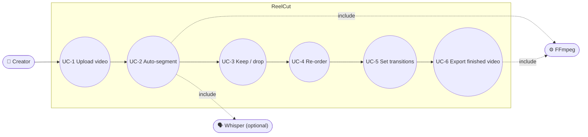

# ReelCut — MBSE Model (02 · Use Cases)

## Actors
- **Creator** (STK-1) — drives the whole edit.
- **FFmpeg** (B-9) — supporting actor that performs media operations.
- **Whisper** (optional) — supporting actor that transcribes for better tags.

## Use-case diagram

## Use-case briefs

| UC | Name | Main success scenario | Realised by |
|---|---|---|---|
| **UC-1** | Upload video | Creator drops a file → it is copied to a local project and probed → wizard advances. | A-1, B-2/B-4 |
| **UC-2** | Auto-segment | Creator clicks *Analyse & split* → media is transcribed (or silence-split) → tagged segments/sub-sections appear. | A-2, B-5 |
| **UC-3** | Keep / drop | Creator ticks the segments and sub-sections to keep. | A-3, B-3 |
| **UC-4** | Re-order | Creator sets output order via drag, swap, or renumber; ordering is validated. | A-4, B-3 |
| **UC-5** | Set transitions | Creator reviews boundaries (gaps flagged) and assigns transition type+duration. | A-5, B-3/B-6 |
| **UC-6** | Export | Creator clicks *Build my video* → render → caption re-time → master → downloadable MP4/MP3/SRT. | A-6, B-6/B-7/B-8 |

## Notes
- UC-2 **degrades gracefully**: if Whisper is not installed the silence engine still produces a usable segmentation (CR-2).
- UC-4 and UC-5 are revisitable any number of times before UC-6; the edit is a
  declarative document (`project.json`) so re-export is always cheap and lossless.
