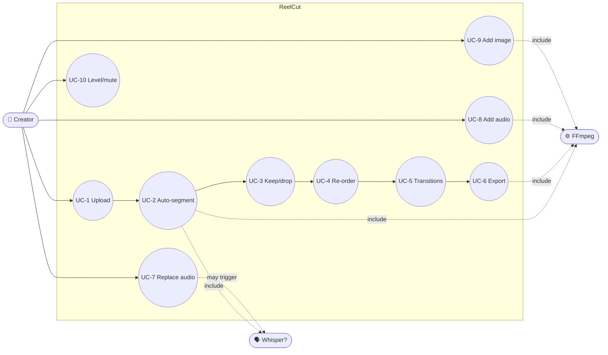

# ReelCut — MBSE Model (02 · Use Cases)

> MagicGrid cell **B2** (Use Cases — black-box behaviour). Mermaid view is
> illustrative; the brief table is normative.

## Actors
- **STK-1 Creator** — drives the edit. · **STK-5 Mobile creator** — future client.
- Supporting systems: **B-9 FFmpeg** (engine), **Whisper** (optional ASR).

## Use-case diagram

## Use-case briefs (normative)

| UC | Name | Main success scenario | Realised by | Pri | Status |
|---|---|---|---|---|---|
| **UC-1** | Upload | File copied to a local project and probed; wizard advances. | A-1, B-2/B-4 | M | Built |
| **UC-2** | Auto-segment | Transcribe (or silence-split) → tagged segments/sub-sections. | A-2, B-5 | M | Built |
| **UC-3** | Keep / drop | Tick the segments/sub-sections to keep. | A-3, B-3 | M | Built |
| **UC-4** | Re-order | Set output order via drag / swap / renumber; validated. | A-4, B-3 | M | Built |
| **UC-5** | Set transitions | Review boundaries (gaps flagged); assign transition+duration. | A-5, B-3/B-6 | S | Built |
| **UC-6** | Export | Render → caption re-time → master → MP4/MP3/SRT. | A-6, B-6/B-7/B-8 | M | Built |
| **UC-7** | Replace audio | New audio **becomes** the audio track; stale captions flagged (offer re-transcribe); still −16 LUFS. | A-10, B-10/B-13 | M | Planned |
| **UC-8** | Add audio track | Music/VO **mixed** with per-track level+mute; optional duck under speech; final mix −16 LUFS. | A-11, B-12 | M | Planned |
| **UC-9** | Add image clip | Photo → still clip (editable duration, optional Ken-Burns); ordered via existing UX. | A-12, B-11/B-10 | M | Planned |
| **UC-10** | Level / mute tracks | Per-track volume/mute; spoken sub-sections stay A/V-locked (threshold MoP). | A-11, B-10 | S | Planned |

## Notes
- **Graceful degradation (CR-2):** UC-2 and UC-7 work without Whisper — silence-split
  segments; replacing audio simply **drops** stale captions rather than shipping a mismatch (MOE-6).
- UC-3…UC-10 are revisitable before UC-6; the edit is a declarative document, so re-export is cheap.
- UC-7/8/9/10 live in a new **Media step** in the wizard (see `04 §W2` state machine).
