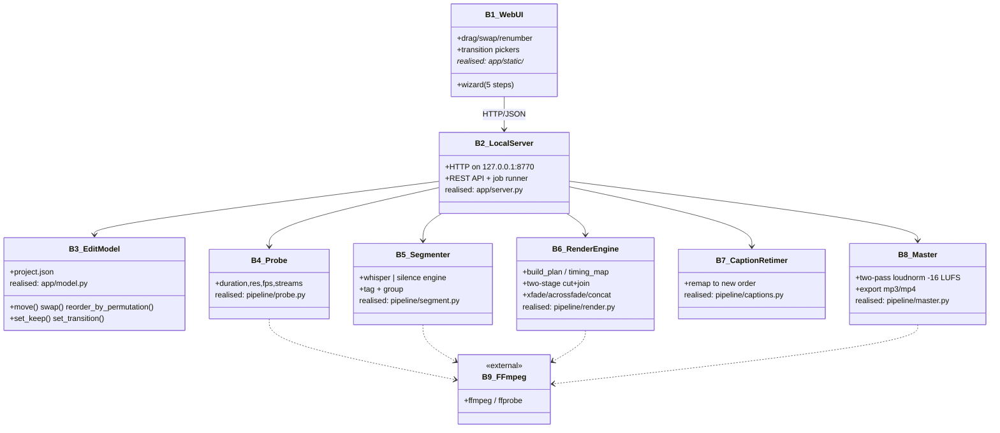
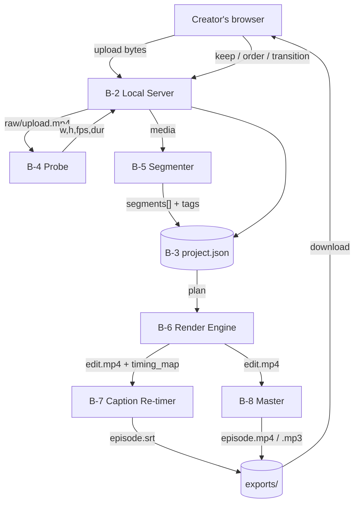

# ReelCut — MBSE Model (03 · Structure)

## Block Definition Diagram (BDD) — what the system is made of

## Internal Block Diagram (IBD) — how data flows between blocks

## Key interface (ports) — the REST API of B-2

| Port (endpoint) | Dir | Payload | Block served |
|---|---|---|---|
| `POST /api/upload` | in | raw body + `X-Filename` | B-4 |
| `POST /api/segment` | in | `{id,model,language}` | B-5 |
| `POST /api/keep` | in | `{id,item,keep}` | B-3 |
| `POST /api/reorder` | in | `{id,method,…}` | B-3 |
| `POST /api/transition` | in | `{id,to,type,duration}` | B-3 |
| `GET /api/sequence` | out | ordered items + boundaries | B-3/B-6 |
| `POST /api/render` | in | `{id}` | B-6/B-7/B-8 |
| `GET /api/file` | out | exported media | exports/ |

## Deployment view
A single Python process serves the UI and runs all blocks in-process; **B-9
FFmpeg** is the only external dependency. Everything binds to `127.0.0.1`
(satisfies **CR-1** privacy / local-only).
