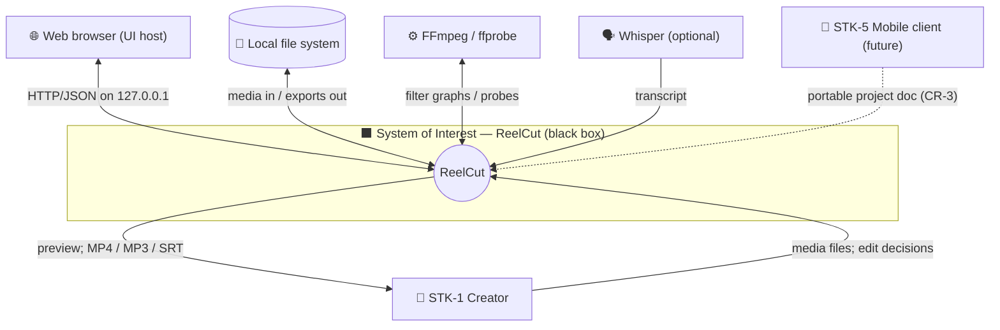
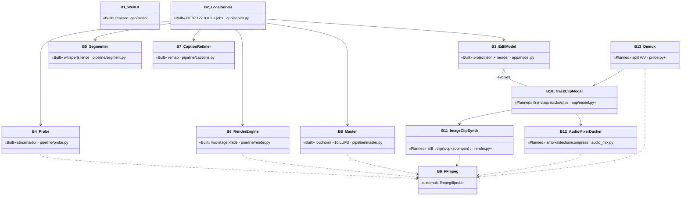
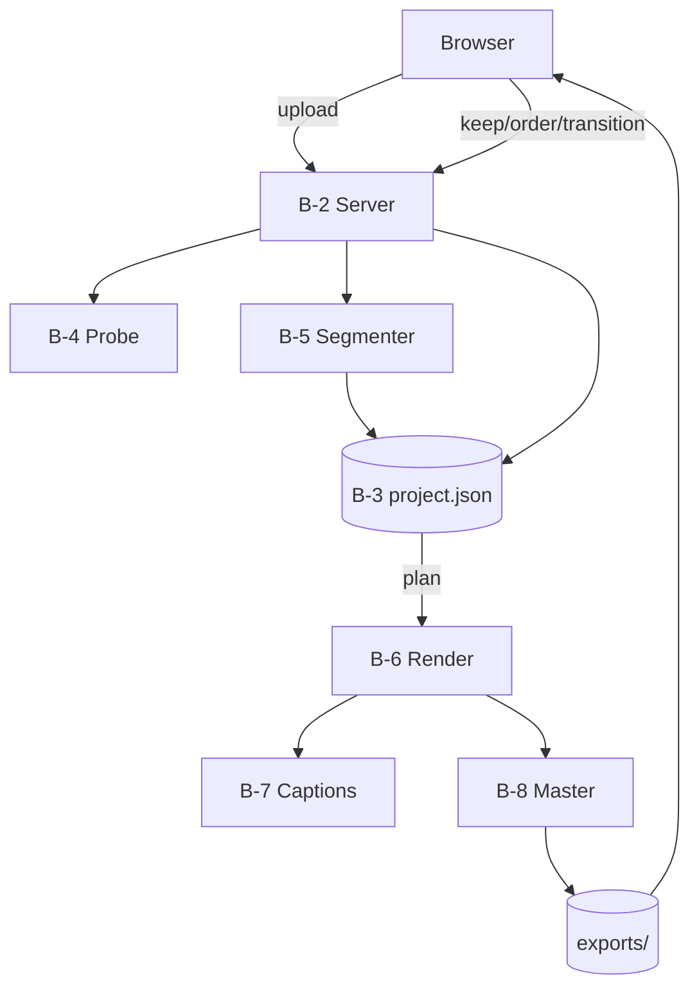

# ReelCut — MBSE Model (03 · Structure pillar)

> MagicGrid cells **B3** (System Context, black box) and **W3** (System
> Structure, white box). Diagrams are Mermaid views; the SysML v2 `part`/`port`
> blocks are authoritative for interfaces.

## §B3 — System Context (black box)

The System-of-Interest (**ReelCut**) is treated as a black box: only the actors,
the boundary, and the item flows across it are modelled.



**Boundary item flows (normative):**

| Flow | Dir | From/To | Carries |
|---|---|---|---|
| media-in | in | Creator/FS | video, audio, image files |
| edits-in | in | Creator (via browser) | keep/order/transition/replace/add/level |
| exports-out | out | → FS/Creator | episode.mp4, .mp3, .srt |
| engine | bi | FFmpeg | filter graphs, measurements |
| transcript | in | Whisper | timed text (optional) |

```sysml
part def ReelCut {                 // System of Interest (black box)
    port creatorHMI : HMIPort;     // browser <-> 127.0.0.1
    port fileIO    : MediaFilePort;
    port engine    : FFmpegPort;   // external dependency B-9
    port asr       : WhisperPort [0..1]; // optional
}
port def HMIPort { in editDecisions; out previewAndExports; }
port def MediaFilePort { in mediaFiles; out renderedFiles; }
```

## §W3 — System Structure (white box)

Opening the box: the blocks that realise the system. **Status** distinguishes
Built from Planned (media-tracks v2).



### IBD — data flow (Built baseline)


### Ports — REST API (B-2)

| Endpoint | Dir | Payload | Block | Req | Status |
|---|---|---|---|---|---|
| `POST /api/upload` | in | raw + `X-Filename` | B-4 | FR-1 | Built |
| `POST /api/segment` | in | `{id,model,language}` | B-5 | FR-2 | Built |
| `POST /api/keep` | in | `{id,item,keep}` | B-3 | FR-3 | Built |
| `POST /api/reorder` | in | `{id,method,…}` | B-3 | FR-4 | Built |
| `POST /api/transition` | in | `{id,to,type,duration}` | B-3,B-6 | FR-5 | Built |
| `GET /api/sequence` | out | items + boundaries | B-3,B-6 | FR-5 | Built |
| `POST /api/render` | in | `{id}` | B-6,B-7,B-8 | FR-6..8 | Built |
| `GET /api/file` | out | exported media | exports/ | FR-8 | Built |
| `POST /api/audio/replace` | in | audio + `X-Filename` | B-10,B-13 | FR-11 | Planned |
| `POST /api/audio/add` | in | audio + `{level,mute,duck}` | B-12 | FR-12 | Planned |
| `POST /api/track` | in | `{id,track,level,mute}` | B-10 | PR-3 | Planned |
| `POST /api/image/add` | in | image + `{duration,kenburns,order}` | B-11 | FR-13 | Planned |

```sysml
part def TrackClipModel {                 // B-10  (Planned)
    attribute renderAgnostic : Boolean = true;     // CR-3
    part tracks : Track[1..*];
    part clips  : Clip[0..*] { ref track : Track; ref media : MediaHandle; }
}
part def Track { attribute kind : TrackKind; attribute level : Real; attribute muted : Boolean; }
// TrackKind = video | audioPrimary | audioAdded | imageItem
```

## Deployment / CR-3 note
All blocks run in **one local process**; **B-9 FFmpeg** is the only external
dependency (CR-1/CR-2). **CR-3** keeps the project document portable &
renderer-agnostic so a future **B-? mobile client** (N-19) can author the same
document and target a different renderer/transport.
