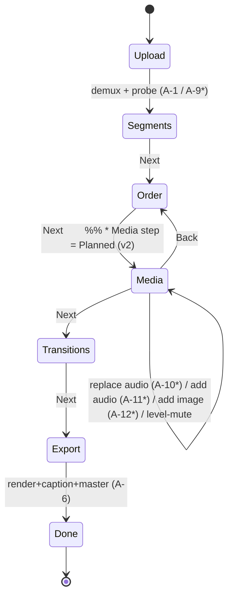
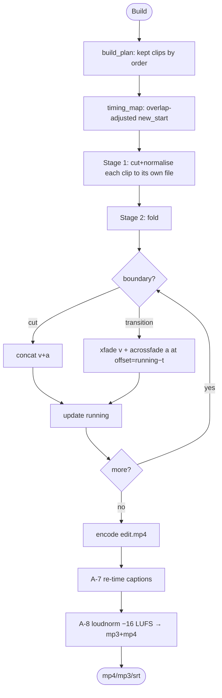
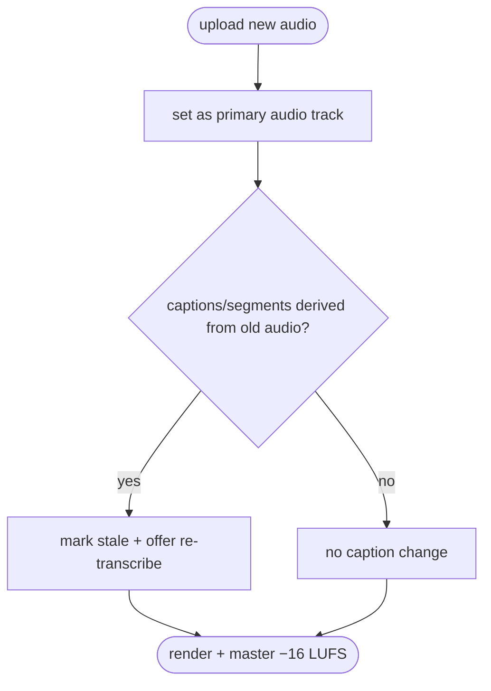

# ReelCut — MBSE Model (04 · Behaviour pillar)

> MagicGrid cell **W2** (System Behaviour — white box). State/activity/sequence
> diagrams are Mermaid views; the activity catalogue is normative.

## Wizard state machine (Media step = Planned)

`*` = Planned. The Built baseline goes Upload→Segments→Order→Transitions→Export.

## A-6 Export — critical activity (Built)

## A-10 Replace audio — activity (Planned)

## Activity catalogue (normative)

| ID | Activity | Realised by | Req | Status |
|---|---|---|---|---|
| **A-1** | Upload & probe | `server._upload` + `probe` | FR-1 | Built |
| **A-2** | Segment & tag | `segment.segment` | FR-2 | Built |
| **A-3** | Keep/drop (+ renumber) | `model.set_keep`/`renumber` | FR-3 | Built |
| **A-4** | Re-order (move/swap/permutation) | `model.*` | FR-4 | Built |
| **A-5** | Set transition / flag gaps | `model.set_transition` + `render.build_plan` | FR-5 | Built |
| **A-6** | Render (two-stage) | `render.render` | FR-6 | Built |
| **A-7** | Caption re-time | `captions.remap` | FR-7 | Built |
| **A-8** | Master (loudnorm) | `master.master` | FR-8, PR-1 | Built |
| **A-9** | Demux input → A/V tracks | `probe` + ingest (ext) | FR-9 | Planned |
| **A-10** | Replace audio (+ invalidate captions) | `model`+`captions` (ext) | FR-11 | Planned |
| **A-11** | Add/mix audio + optional duck | `audio_mix` (new) + `master` | FR-12 | Planned |
| **A-12** | Synthesise image clip (loop + Ken-Burns) | `render` (ext) | FR-13 | Planned |

## Critical behavioural properties
- **MOP-2 (A/V sync):** each transition overlaps clips by its duration, so the engine tracks a
  running, overlap-adjusted duration and sets `xfade`/`acrossfade` `offset = running − t`. Verified
  numerically (T-3) and against real FFmpeg (T-4).
- **MOP-1/PR-4 (loudness preserved):** A-11 mixes via `amix`/`sidechaincompress`, but the **final
  mix** still passes the two-pass `loudnorm` (A-8) → −16 LUFS — so add/replace audio never changes
  the loudness contract.
- **MOP-6 (caption integrity):** A-10 must never leave captions that no longer match the audible
  speech — flag/clear, never silently mismatch.
