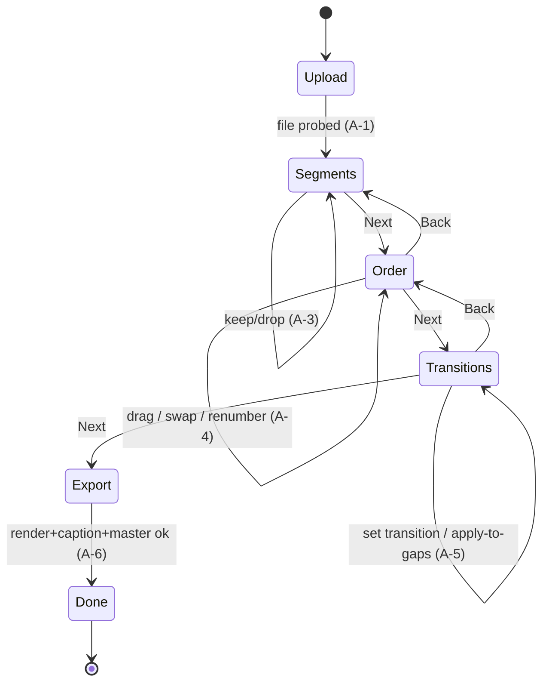
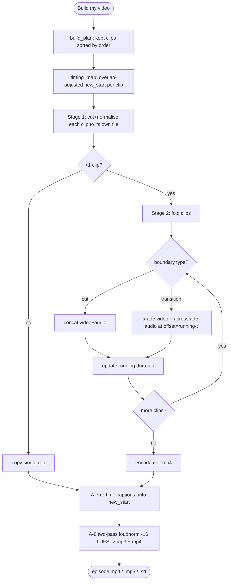

# ReelCut — MBSE Model (04 · Behaviour)

## Wizard state machine



## A-6 Export — activity diagram (the critical flow)



## A-6 sequence diagram (blocks collaborating)

```mermaid
sequenceDiagram
  participant UI as B-1 UI
  participant SV as B-2 Server
  participant RN as B-6 Render
  participant CP as B-7 Captions
  participant MS as B-8 Master
  participant FF as B-9 FFmpeg
  UI->>SV: POST /api/render {id}
  SV->>RN: render(project)
  RN->>FF: cut clip_i (stage 1) ×N
  RN->>FF: xfade/acrossfade/concat join (stage 2)
  FF-->>RN: edit.mp4 + timing_map
  RN-->>SV: ok, timing_map
  SV->>CP: remap(project, timing_map)
  CP-->>SV: episode.srt
  SV->>MS: master(edit.mp4)
  MS->>FF: 2-pass loudnorm; export mp3+mp4
  MS-->>SV: PASS -16 LUFS
  SV-->>UI: result (poll /api/job)
```

## Behaviour catalogue

| ID | Activity | Realised by |
|---|---|---|
| **A-1** | Upload & probe | `server._upload` + `probe.probe` |
| **A-2** | Segment & tag | `segment.segment` |
| **A-3** | Keep/drop | `model.set_keep` + `renumber` |
| **A-4** | Re-order (3 methods) | `model.move/swap/reorder_by_permutation` |
| **A-5** | Set transition / flag gaps | `model.set_transition` + `render.build_plan` |
| **A-6** | Render (two-stage) | `render.render` |
| **A-7** | Caption re-time | `captions.remap` |
| **A-8** | Master | `master.master` |

## Critical behavioural property (PR-2)
Each transition **overlaps** clips by its duration, so the engine tracks a
*running, overlap-adjusted duration* and sets each `xfade`/`acrossfade`
`offset = running − t`. This keeps audio and video aligned for the whole
timeline — verified numerically in **T-3** and against real FFmpeg output in
**T-4**.
