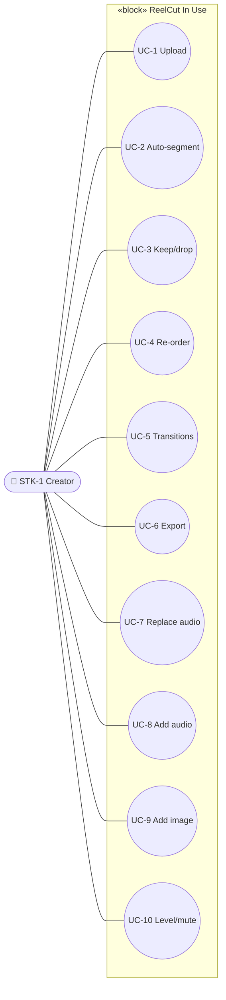

# Conceptual · Black Box · Behavior — Use Cases

> MagicGrid cell **Behavior / Conceptual**. Use cases sit inside the SoI context
> block (p.17 pattern) and **refine stakeholder needs**. Each use case is
> decomposed into an **activity** in *Functional Analysis* (white box).

| UC | Name | Refines need | Decomposed to activity | Status |
|---|---|---|---|---|
| **UC-1** | Upload | SN-1 | act *Ingest* | Built |
| **UC-2** | Auto-segment | SN-1/SN-2 | act *Analyse & Segment* | Built |
| **UC-3** | Keep / drop | SN-1 | act *Select* | Built |
| **UC-4** | Re-order | SN-1 | act *Sequence* | Built |
| **UC-5** | Set transitions | SN-2 | act *Set Transitions* | Built |
| **UC-6** | Export | SN-1/SN-2 | act *Render→Caption→Master* | Built |
| **UC-7** | Replace audio | SN-5 | act *Replace Audio* | Planned |
| **UC-8** | Add audio | SN-5 | act *Add/Mix Audio* | Planned |
| **UC-9** | Add image clip | SN-5 | act *Add Image Clip* | Planned |
| **UC-10** | Level / mute tracks | SN-6 | act *Adjust Tracks* | Planned |

> The activities (functional analysis) are where **functions** are identified and
> from which **functional system requirements** are written (see white-box `2`).
