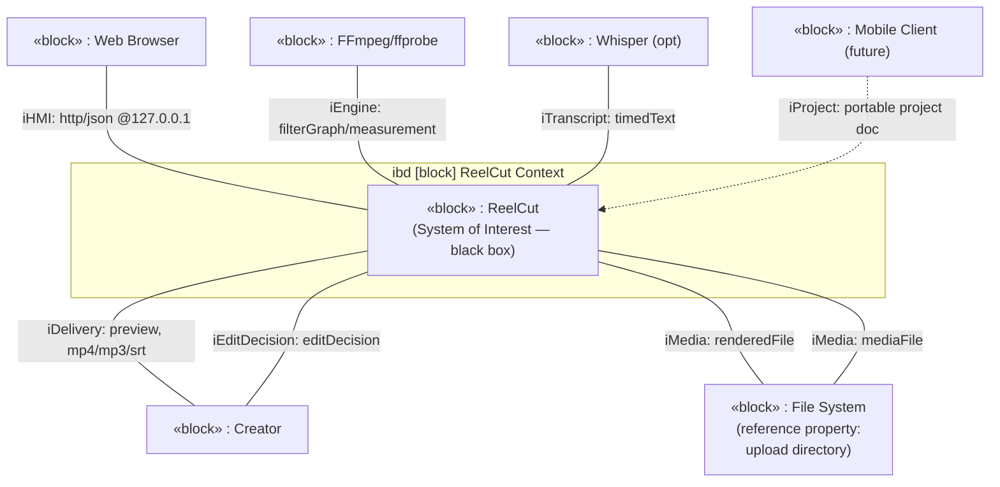

# Conceptual · Black Box · Structure — System Context (IBD)

> MagicGrid cell **Structure / Conceptual**. Per your direction the system context
> is an **Internal Block Diagram**: the SoI as a black box wired to external blocks
> through **ports typed by interface blocks** carrying **flow properties (signals)**.
> Requirement *conditions* are sourced here (and from the wizard state machine).



## Interface blocks (ports) & item flows
| Interface block | Flow properties (signals) | Between |
|---|---|---|
| **I-HMI** | editDecision (in), previewExports (out) | Browser ↔ ReelCut |
| **I-Media** | mediaFile (in), renderedFile (out) | File System ↔ ReelCut |
| **I-Engine** | filterGraph (out), measurement (in) | ReelCut ↔ FFmpeg |
| **I-Transcript** | timedText (in) | Whisper → ReelCut |
| **I-Project** | projectDoc (bi) | Mobile ↔ ReelCut |

```sysml
// SoI as a black box with ports typed by interface blocks (flow props = signals)
part def ReelCut {
    port hmi      : I_HMI;
    port media    : I_Media;
    port engine   : I_Engine;
    port asr      : I_Transcript [0..1];
    ref  uploadDir : Directory;          // reference property — EXTERNAL (your answer #6)
}
interface def I_Media { in mediaFile : MediaFile; out renderedFile : MediaFile; }
interface def I_HMI   { in editDecision : EditDecision; out previewExports : Delivery; }
```

> **Reference property:** `uploadDir : Directory` is something ReelCut *references*
> but is **not composed of** — the external folder media is uploaded from. Part
> properties (the subsystems) come in the **logical** layer; this black box only
> exposes the boundary.
