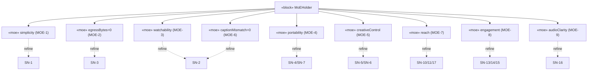

# Conceptual · Black Box · Parametrics — Measurements of Effectiveness

> MagicGrid cell **Parametrics / Conceptual**. MoE are **problem-level, solution-
> independent** effectiveness measures, modelled as **«moe» value properties** on a
> *MoE Holder* and **refining stakeholder needs** (p.24 trace). They are *satisfied
> through* white/physical-layer MoP (`2-solution-domain/4`).

| ID | Measure of Effectiveness | Refines | Target | Realised by MoP |
|---|---|---|---|---|
| **MOE-1** | Simplicity — non-expert completes raw→export unaided | SN-1 | 0 docs; ≤ TBD min | MOP-4 |
| **MOE-2** | Privacy — media leaving device | SN-3 | **0** (firm) | MOP-8 |
| **MOE-3** | Watchability — consistent loudness + A/V sync | SN-2 | on-spec | MOP-1, MOP-2 |
| **MOE-4** | Cost / portability — free, runs anywhere, portable doc | SN-4/SN-7 | $0; portable | MOP-9 |
| **MOE-5** | Creative control — keep/order/replace/add media | SN-5/SN-6 | all ops (threshold) | MOP-3 |
| **MOE-6** | Accessibility — captions present, correct, readable | SN-2 | SRT; **0** mismatch | MOP-6 |
| **MOE-7** | Reach — output fits target platforms & is followable sound-off / cross-language | SN-10/11/17 | aspect presets; open+translated captions | MOP-10 |
| **MOE-8** | Engagement — tight pacing, strong hook, navigable | SN-2/13/14/15 | filler/silence removed; chapters | MOP-11 |
| **MOE-9** | Audio clarity — speech intelligible, low noise | SN-16 | noise floor ↓; speech leveled | MOP-12 |

## MoE value tree (bdd — «moe» value properties refining needs)




```sysml
block def MoEHolder {
    moe simplicity   : Real;
    moe egressBytes  : Bytes  = 0;     // MOE-2 firm
    moe captionMismatch : Integer = 0; // MOE-6 firm
}
refine MoEHolder::egressBytes -> SN_3_Privacy;     // «refine» MoE → need (p.24)
```
