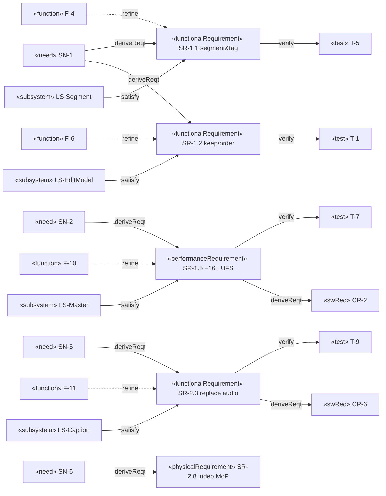

# Logical · White Box · Requirements — System Requirements

> MagicGrid cell **Requirements / Logical**. Per your method: **functional**
> requirements are written **from the behaviour model** (the unique functions F-*,
> white-box `2`); **non-functional / performance** requirements come from **timing
> constraints of sequence diagrams and parametric models**; **interface** and
> **condition** requirements come from the **system context IBD / state machine**.
> SR **derive** from SN (`«deriveReqt»`) and are **refined by** functions (`«refine»`).

Stereotypes (p.16): «functionalRequirement» F · «interfaceRequirement» I ·
«performanceRequirement» P · «physicalRequirement» Ph. Attributes per p.15.

## Requirements diagram (relationships: derive · refine · satisfy · verify)




| ID | Stereo | Shall statement | refinedBy | derivedFrom | verify | St | Pri |
|---|---|---|---|---|---|---|---|
| **SR-1.1** | F | Split media into tagged segments & sub-sections. | F-4 | SN-1 | T | Built | M |
| **SR-1.2** | F | Keep/drop & re-order kept sub-sections. | F-5,F-6 | SN-1 | T | Built | M |
| **SR-1.3** | F | Render the chosen order with transitions. | F-8 | SN-1 | T | Built | M |
| **SR-1.4** | F | Re-time captions to the new sequence. | F-9 | SN-2 | T | Built | M |
| **SR-1.5** | P | Output audio = **−16 LUFS ±1, TP ≤ −1 dBTP**. | F-10 | SN-2 | T | Built | M |
| **SR-1.6** | P | A/V remain in sync across cuts & transitions. | F-8 | SN-2 | A/T | Built | M |
| **SR-1.7** | I | HMI over HTTP on **127.0.0.1**; media not uploaded. | — (ctx) | SN-3 | I | Built | M |
| **SR-1.8** | I | Output **H.264/AAC MP4, MP3 44.1 kHz, SubRip**. | F-8,F-10 | SN-2 | T | Built | M |
| **SR-2.1** | F | **Demux** input into independent A/V tracks. | F-2 | SN-6 | T | Planned | M |
| **SR-2.2** | F | First-class **portable, renderer-agnostic** project doc (stable media handles; no abs paths / FFmpeg strings). | F-2 | SN-6 | I/T | Planned | M |
| **SR-2.3** | F | **Replace audio**; invalidate/flag captions; offer re-transcribe. | F-11 | SN-5 | T | Planned | M |
| **SR-2.4** | F | **Add audio**: per-track level/mute + optional duck-under-speech. | F-12 | SN-5 | T | Planned | M |
| **SR-2.5** | F | **Add image clips** (still, editable dur 4 s, Ken-Burns off, no intrinsic audio). | F-13 | SN-5 | T | Planned | M |
| **SR-2.6** | P | Add/replace audio **preserves −16 LUFS** on the final mix & A/V sync. | F-10,F-12 | SN-2 | T | Planned | M |
| **SR-2.7** | I | Endpoints for replace/add audio & add image; accept PNG/JPG + MP3/WAV/M4A/AAC. | — (ctx) | SN-5 | T | Planned | M |
| **SR-2.8** | Ph | Independent-manipulation **MoP threshold/objective**. | F-6,F-14 | SN-6 | D | Planned | M/C |
| **SR-3.1** | F | **Validate** every imported artifact (media/audio/image) against accepted formats; **reject with a reason**. | F-15 | SN-1 | T | Planned | S |
| **SR-3.2** | F | **Autosave** the project doc continuously and **restore** it on resume / after a crash. | F-16 | SN-8 | T | Planned | S |
| **SR-3.3** | F | **Undo / redo** any edit operation via a reversible command stack. | F-17 | SN-8 | T | Planned | S |
| **SR-3.4** | F | **Cancel / abort** any long operation and report **progress + errors** to the HMI. | F-18,F-19 | SN-8 | T | Planned | S |
| **SR-3.5** | F | On any **source change**, invalidate/flag derived artifacts and offer regeneration. | F-4,F-11 | SN-2 | T | Planned | S |
| **SR-3.6** | P | **Incremental re-render**: on edit after a render, re-cut only changed clips. | F-20 | SN-1 | A/T | Planned | C |

## Full requirement attributes (p.15 «extendedRequirement»: risk + rationale)
| ID | risk | rationale (why this requirement exists) |
|---|---|---|
| SR-1.1 | Low | Segmentation is the basis for every downstream edit operation. |
| SR-1.2 | Low | Keep/order is the core creative act a non-expert performs. |
| SR-1.3 | Med | Gap-aware transitions are where the FFmpeg starvation bug lived; render must be robust. |
| SR-1.4 | Med | Re-ordering invalidates caption timing; mismatch breaks accessibility (MOE-6). |
| SR-1.5 | Low | −16 LUFS is the platform-neutral loudness target for watchability (MOE-3). |
| SR-1.6 | Med | Overlapping transitions can drift A/V; sync is a hard watchability gate. |
| SR-1.7 | Low | Local-only HMI is the privacy guarantee (MOE-2, egress=0). |
| SR-1.8 | Low | Fixed output formats keep outputs universally playable. |
| SR-2.1 | Med | Demux is the precondition for independent A/V manipulation (SN-6). |
| SR-2.2 | High | A portable, renderer-agnostic doc underpins the future mobile port; abs paths/FFmpeg strings would lock it in. |
| SR-2.3 | Med | Replacing audio orphans captions/segments derived from the old audio. |
| SR-2.4 | Med | Mixing must not blow the loudness budget; duck needs a speech track. |
| SR-2.5 | Low | Image clips reuse the reorder UX; main risk is duration/motion defaults. |
| SR-2.6 | Med | Any added/replaced audio must re-pass −16 LUFS on the final mix. |
| SR-2.7 | Low | New endpoints must accept the agreed image/audio formats. |
| SR-2.8 | High | The threshold/objective MoP defines how independent A/V truly is — scope-defining. |
| SR-3.1 | Low | Rejecting bad input early prevents confusing downstream failures (non-expert UX). |
| SR-3.2 | Med | A long edit lost to a crash is the worst possible UX; autosave protects it (SN-8). |
| SR-3.3 | Med | Non-experts make mistakes; reversibility makes the tool safe to explore. |
| SR-3.4 | Med | Renders are slow; cancel + progress avoid a frozen, opaque app. |
| SR-3.5 | Med | Stale captions/segments after a source change silently corrupt the output. |
| SR-3.6 | Low | Re-cutting only changed clips keeps iterative editing responsive. |

```sysml
requirement def SR_1_5_Loudness {
    attribute stereotype = "performanceRequirement";
    attribute verifyMethod : VerificationMethodKind = Test;
    require constraint LoudnessBudget;          // parametric, solution-domain/4
}
refine F_10_Master    -> SR_1_5_Loudness;       // SR written FROM the function
deriveReqt SR_1_5_Loudness from SN_2_Watchable;
verify SR_1_5_Loudness by Test_T7;              // verified by behaviour/test
```
