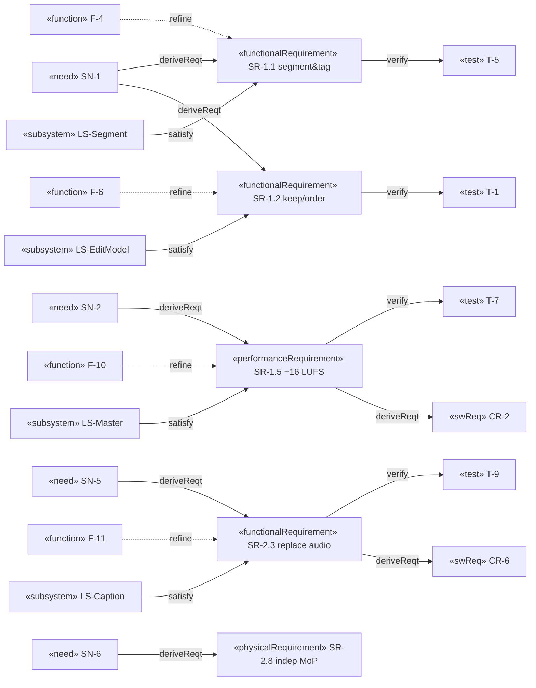

# Logical · White Box · Requirements — System Requirements

> MagicGrid cell **Requirements / Logical**. Per your method: **functional**
> requirements are written **from the behaviour model** (the unique functions F-*,
> white-box `2`); **non-functional / performance** requirements come from **timing
> constraints of sequence diagrams and parametric models**; **interface** and
> **condition** requirements come from the **system context IBD / state machine**.
> SR **derive** from SN (`«deriveReqt»`) and are **refined by** functions (`«refine»`).

Stereotypes (p.16): «functionalRequirement» F · «interfaceRequirement» I ·
«performanceRequirement» P · «physicalRequirement» Ph. Attributes per p.15.

## Requirements diagram (relationships: derive · refine · satisfy · verify)




> **Form:** every requirement is written in the canonical **"‹actor› shall ‹do›"**
> form. The actor is the **ReelCut system** (or a named subsystem); where the
> creator initiates, the obligation is still on the system ("ReelCut shall let the
> creator …").

| ID | Stereo | Requirement (actor shall …) | refinedBy | derivedFrom | verify | St | Pri |
|---|---|---|---|---|---|---|---|
| **SR-1.1** | F | ReelCut shall split media into tagged segments and sub-sections. | F-4 | SN-1 | T | Built | M |
| **SR-1.2** | F | ReelCut shall let the creator keep/drop and re-order the kept sub-sections. | F-5,F-6 | SN-2.1,SN-2.2 | T | Built | M |
| **SR-1.3** | F | ReelCut shall render the chosen order with transitions. | F-8 | SN-1 | T | Built | M |
| **SR-1.4** | F | ReelCut shall re-time captions to the new sequence. | F-9 | SN-2.3 | T | Built | M |
| **SR-1.5** | P | ReelCut shall output audio at **−16 LUFS ±1, TP ≤ −1 dBTP**. | F-10 | SN-2.4 | T | Built | M |
| **SR-1.6** | P | ReelCut shall keep audio and video in sync across cuts and transitions. | F-8 | SN-2.5 | A/T | Built | M |
| **SR-1.7** | I | ReelCut shall serve the HMI over HTTP on **127.0.0.1** and shall not upload media. | — (ctx) | SN-3 | I | Built | M |
| **SR-1.8** | I | ReelCut shall output **H.264/AAC MP4, MP3 44.1 kHz, and SubRip**. | F-8,F-10 | SN-1 | T | Built | M |
| **SR-2.1** | F | ReelCut shall demux input into independent A/V tracks. | F-2 | SN-6 | T | Planned | M |
| **SR-2.2** | F | ReelCut shall hold a portable, renderer-agnostic project document (stable media handles; no absolute paths / FFmpeg strings). | F-2 | SN-6 | I/T | Planned | M |
| **SR-2.3** | F | ReelCut shall replace the audio, invalidate/flag affected captions, and offer re-transcribe. | F-11 | SN-5.3 | T | Planned | M |
| **SR-2.4** | F | ReelCut shall add audio with per-track level/mute and optional duck-under-speech. | F-12 | SN-5.2 | T | Planned | M |
| **SR-2.5** | F | ReelCut shall add image clips (still, editable 4 s default, Ken-Burns off, no intrinsic audio). | F-13 | SN-5.1 | T | Planned | M |
| **SR-2.6** | P | ReelCut shall preserve **−16 LUFS** and A/V sync on the final mix after add/replace audio. | F-10,F-12 | SN-2.4 | T | Planned | M |
| **SR-2.7** | I | ReelCut shall expose endpoints for replace/add audio and add image, accepting PNG/JPG + MP3/WAV/M4A/AAC. | — (ctx) | SN-5.1 | T | Planned | M |
| **SR-2.8** | Ph | ReelCut shall support independent A/V manipulation at the **MoP threshold/objective** level. | F-6,F-14 | SN-6 | D | Planned | M/C |
| **SR-3.1** | F | ReelCut shall validate every imported artifact against accepted formats and reject it with a reason. | F-15 | SN-1 | T | Planned | S |
| **SR-3.2** | F | ReelCut shall autosave the project document continuously and restore it on resume / after a crash. | F-16 | SN-8.1 | T | Planned | S |
| **SR-3.3** | F | ReelCut shall let the creator undo/redo any edit via a reversible command stack. | F-17 | SN-8.2 | T | Planned | S |
| **SR-3.4** | F | ReelCut shall let the creator cancel/abort any long operation and shall report progress and errors to the HMI. | F-18,F-19 | SN-8.3 | T | Planned | S |
| **SR-3.5** | F | ReelCut shall, on any source change, invalidate/flag derived artifacts and offer regeneration. | F-4,F-11 | SN-2.3 | T | Planned | S |
| **SR-3.6** | P | ReelCut shall re-cut only changed clips when re-rendering after an edit. | F-20 | SN-1 | A/T | Planned | C |
| **SR-4.1** | F | ReelCut shall treat the original recording as read-only and keep all edits non-destructive and reversible. | F-30 | SN-9 | T | Planned | M |
| **SR-4.2** | F | ReelCut shall let the creator export in a chosen aspect ratio {16:9, 9:16, 1:1} and resolution preset. | F-25 | SN-10.1,SN-10.2 | T | Planned | S |
| **SR-4.3** | F | ReelCut shall produce captions in the detected spoken language and, on request, an English translation. | F-26 | SN-11.1,SN-11.2 | T | Planned | S |
| **SR-4.4** | P | ReelCut shall render a preview that is frame-accurate to the exported output. | F-31 | SN-12 | A/T | Planned | S |
| **SR-4.5** | F | ReelCut shall detect and optionally remove filler words and silences beyond a creator-set threshold. | F-21 | SN-13.1,SN-13.2 | T | Planned | S |
| **SR-4.6** | F | ReelCut shall export creator-selected highlight sub-ranges as standalone clips and let the creator pick a cover frame. | F-22 | SN-14.1,SN-14.2 | T | Planned | S |
| **SR-4.7** | F | ReelCut shall emit chapter markers/timestamps derived from the topic segments. | F-23 | SN-15 | T | Planned | C |
| **SR-4.8** | F | ReelCut shall apply an audio-cleanup chain (denoise/dehum, speech leveling) that preserves −16 LUFS. | F-24 | SN-16.1,SN-16.2 | T | Planned | S |
| **SR-4.9** | F | ReelCut shall optionally burn captions into the video (open captions) for sound-off playback. | F-27 | SN-17 | T | Planned | S |
| **SR-4.10** | F | ReelCut shall optionally insert branding elements: intro/outro, title card, lower-thirds, logo/watermark. | F-28 | SN-18.1–.4 | T | Planned | C |
| **SR-4.11** | F | ReelCut shall save reusable style presets and apply them to new projects. | F-29 | SN-19.1,SN-19.2 | T | Planned | C |
| **SR-5.1** | F | ReelCut shall export a full plain-text transcript of the spoken content. | F-32 | SN-21 | T | Planned | S |
| **SR-5.2** | F | ReelCut shall batch-export multiple projects using a shared preset. | F-33 | SN-24 | T | Planned | C |
| **SR-5.3** | F | ReelCut shall flag added audio not marked royalty-free and let the creator record a license note. | F-34 | SN-28 | T | Planned | C |
| **SR-5.4** | F | ReelCut shall embed title, description, and chapter metadata into the exported MP4/MP3. | F-35 | SN-30,SN-25 | T | Planned | C |

## Full requirement attributes (p.15 «extendedRequirement»: risk + rationale)
| ID | risk | rationale (why this requirement exists) |
|---|---|---|
| SR-1.1 | Low | Segmentation is the basis for every downstream edit operation. |
| SR-1.2 | Low | Keep/order is the core creative act a non-expert performs. |
| SR-1.3 | Med | Gap-aware transitions are where the FFmpeg starvation bug lived; render must be robust. |
| SR-1.4 | Med | Re-ordering invalidates caption timing; mismatch breaks accessibility (MOE-6). |
| SR-1.5 | Low | −16 LUFS is the platform-neutral loudness target for watchability (MOE-3). |
| SR-1.6 | Med | Overlapping transitions can drift A/V; sync is a hard watchability gate. |
| SR-1.7 | Low | Local-only HMI is the privacy guarantee (MOE-2, egress=0). |
| SR-1.8 | Low | Fixed output formats keep outputs universally playable. |
| SR-2.1 | Med | Demux is the precondition for independent A/V manipulation (SN-6). |
| SR-2.2 | High | A portable, renderer-agnostic doc underpins the future mobile port; abs paths/FFmpeg strings would lock it in. |
| SR-2.3 | Med | Replacing audio orphans captions/segments derived from the old audio. |
| SR-2.4 | Med | Mixing must not blow the loudness budget; duck needs a speech track. |
| SR-2.5 | Low | Image clips reuse the reorder UX; main risk is duration/motion defaults. |
| SR-2.6 | Med | Any added/replaced audio must re-pass −16 LUFS on the final mix. |
| SR-2.7 | Low | New endpoints must accept the agreed image/audio formats. |
| SR-2.8 | High | The threshold/objective MoP defines how independent A/V truly is — scope-defining. |
| SR-3.1 | Low | Rejecting bad input early prevents confusing downstream failures (non-expert UX). |
| SR-3.2 | Med | A long edit lost to a crash is the worst possible UX; autosave protects it (SN-8). |
| SR-3.3 | Med | Non-experts make mistakes; reversibility makes the tool safe to explore. |
| SR-3.4 | Med | Renders are slow; cancel + progress avoid a frozen, opaque app. |
| SR-3.5 | Med | Stale captions/segments after a source change silently corrupt the output. |
| SR-3.6 | Low | Re-cutting only changed clips keeps iterative editing responsive. |
| SR-4.1 | Low | Trust: creators must know the original is safe; underpins free experimentation. |
| SR-4.2 | Med | Vertical/square output is table-stakes for reels/shorts; wrong frame = unusable. |
| SR-4.3 | Med | Captions/translation widen reach and accessibility (sound-off, non-native). |
| SR-4.4 | Med | If preview ≠ export, the non-expert loses trust and re-renders blindly. |
| SR-4.5 | Med | Filler/silence removal is the single biggest tightening win for talk content. |
| SR-4.6 | Med | Repurposing one recording into shorts is the main audience-growth lever. |
| SR-4.7 | Low | Chapters reuse existing topic segments; cheap navigation win for long-form. |
| SR-4.8 | Med | Clean speech is a hard intelligibility gate; noisy audio loses audience fast. |
| SR-4.9 | Med | Most social video is watched muted; open captions are how the audience follows. |
| SR-4.10 | Low | Branding drives recognition/consistency but must stay optional (authenticity). |
| SR-4.11 | Low | Presets cut per-episode effort and keep a channel visually consistent. |
| SR-5.1 | Low | A plain-text transcript serves screen-reader users and SEO/show-notes reuse. |
| SR-5.2 | Med | Bulk creators need many episodes out with one house style; per-project export does not scale. |
| SR-5.3 | Med | Flagging unlicensed audio protects creators from takedowns; ReelCut has no Content-ID DB, so it flags, not enforces. |
| SR-5.4 | Low | Embedded title/chapter metadata makes the export discoverable and navigable once published. |

```sysml
requirement def SR_1_5_Loudness {
    attribute stereotype = "performanceRequirement";
    attribute verifyMethod : VerificationMethodKind = Test;
    require constraint LoudnessBudget;          // parametric, solution-domain/4
}
refine F_10_Master    -> SR_1_5_Loudness;       // SR written FROM the function
deriveReqt SR_1_5_Loudness from SN_2_Watchable;
verify SR_1_5_Loudness by Test_T7;              // verified by behaviour/test
```


## Cross-layer like-to-like links (ADR-013)

> Mirrors this file's rows from the cross-layer spine (`../../../8-cross-layer-traceability.md`).
> `▽` = within-layer decomposition · `⇒` = across-layer realization (routed via a Configuration item).

| Link | Type | From | To |
|------|------|------|----|
| SR-2.x ▽ {SR-2.3, SR-2.4, SR-2.5} | ▽ containment | media-set parent req | replace audio · add audio · add image |
| SR-2.1 ▽→ SR-2.2 ▽→ SR-2.3 | ▽ prerequisite | demux | portable doc → replace audio |
| SR-x ⇒ CR-x | ⇒ deriveReqt (via CFG) | logical system req | physical component req |
