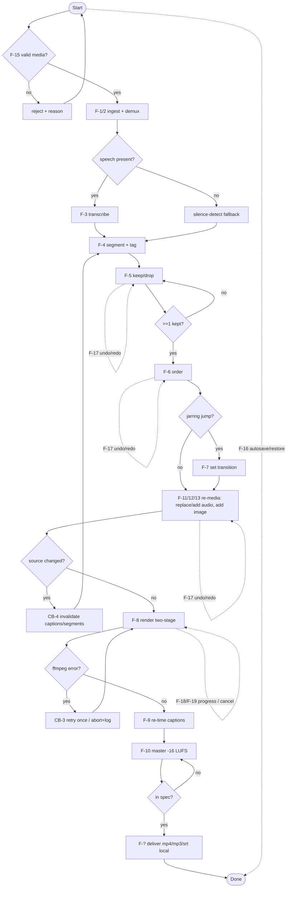

# Logical · White Box · Behavior — Functional Analysis

> MagicGrid cell **Behavior / Logical**. Per your method: **each use case is
> decomposed into an activity; the actions across all activities are pooled, and
> the UNIQUE functions identified.** These unique functions are what the
> **functional system requirements** are written from (white-box `1`), and each is
> later **allocated** (in its entirety) to a logical subsystem (white-box `3`).

## Use-case → activity → actions (sample, UC-6 Export)

## Unique functions (pooled & de-duplicated)
| ID | Function | From use case(s) | Status | Allocated to (LS) |
|---|---|---|---|---|
| **F-1** | Ingest media | UC-1 | Built | LS-Ingest |
| **F-2** | Demux into A/V tracks | UC-1/UC-7/UC-9 | Planned | LS-Ingest |
| **F-3** | Transcribe (ASR) | UC-2 | Built | LS-Segment |
| **F-4** | Segment & tag | UC-2 | Built | LS-Segment |
| **F-5** | Select (keep/drop) | UC-3 | Built | LS-EditModel |
| **F-6** | Sequence (order) | UC-4 | Built | LS-EditModel |
| **F-7** | Set transition / flag gaps | UC-5 | Built | LS-EditModel |
| **F-8** | Render (cut + join) | UC-6 | Built | LS-Render |
| **F-9** | Re-time captions | UC-6/UC-7 | Built | LS-Caption |
| **F-10** | Master (loudnorm −16 LUFS) | UC-6/UC-8 | Built | LS-Master |
| **F-11** | Replace audio (+ invalidate captions) | UC-7 | Planned | LS-EditModel/LS-Caption |
| **F-12** | Mix audio + duck | UC-8 | Planned | LS-AudioMix |
| **F-13** | Synthesise image clip | UC-9 | Planned | LS-Render |
| **F-14** | Adjust track level/mute | UC-10 | Planned | LS-EditModel |
| **F-15** | Validate input (CB-1) | UC-1/7/9 | Planned | LS-Ingest |
| **F-16** | Manage session: autosave/restore (CB-7) | (all) | Planned | LS-HMI |
| **F-17** | Undo / redo (CB-6) | (all edit UCs) | Planned | LS-EditModel |
| **F-18** | Report progress / errors | UC-6/7/8 | Planned | LS-HMI |
| **F-19** | Cancel / abort operation (CB-3) | UC-6 | Planned | LS-HMI |
| **F-20** | Incremental re-render (CB-5) | UC-6 | Planned | LS-Render |
| **F-21** | Detect & trim filler words / silence | UC-2 | Planned | LS-Segment |
| **F-22** | Extract highlight clip + pick cover frame | UC-6 | Planned | LS-Render |
| **F-23** | Generate chapters from segments | UC-2 | Planned | LS-Segment |
| **F-24** | Clean audio (denoise / dehum / level) | UC-8 | Planned | LS-AudioMix |
| **F-25** | Reframe / letterbox to aspect preset | UC-6 | Planned | LS-Render |
| **F-26** | Translate captions | UC-2 | Planned | LS-Caption |
| **F-27** | Burn-in (open) captions | UC-6 | Planned | LS-Render |
| **F-28** | Compose branding overlays | UC-6 | Planned | LS-Render |
| **F-29** | Save / apply style preset | UC-1 | Planned | LS-EditModel |
| **F-30** | Enforce non-destructive source (read-only) | UC-1 | Planned | LS-Ingest |
| **F-31** | Render WYSIWYG preview | UC-6 | Planned | LS-Render |
| **F-32** | Export plain-text transcript | UC-2 | Planned | LS-Caption |
| **F-33** | Batch-export projects with shared preset | UC-6 | Planned | LS-Render |
| **F-34** | Flag non-royalty-free audio / log license | UC-9 | Planned | LS-Ingest |
| **F-35** | Embed title/description/chapter metadata | UC-6 | Planned | LS-Render |

> **F-15…F-20** were surfaced by the `brainstorming` behaviour-completeness pass
> (`5-behaviour-catalogue.md`): the alternate/exception/edge flows consolidate into
> reusable behaviours (CB-) that need these previously-missing functions.
> **F-21…F-31** were surfaced by the conceptual-layer **need elicitation**
> (`brainstorming`): production-quality & growth needs SN-9…SN-19.
> **F-32…F-35** were surfaced by the **stakeholder-register expansion** (SN-20…SN-30):
> transcript export, batch export, license flagging, embedded metadata. The remaining
> register needs map onto existing functions/requirements.

> **Allocation rule (your #5.4):** each function is decomposed until it can be
> allocated **in its entirety** to one logical subsystem (same abstraction layer);
> see the `«allocate»` rows in white-box `3`.

## End-to-end activity (behaviours + flow, with alternate / exception branches)

> Decision nodes are the **alternate/exception** branches from the behaviour
> catalogue; the dotted edges are the **cross-cutting** session behaviours
> (undo/redo, autosave, progress/cancel) that apply throughout.
