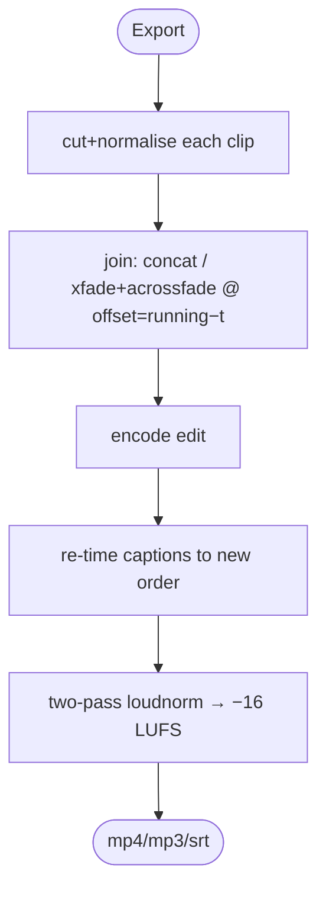

# Logical · White Box · Behavior — Functional Analysis

> MagicGrid cell **Behavior / Logical**. Per your method: **each use case is
> decomposed into an activity; the actions across all activities are pooled, and
> the UNIQUE functions identified.** These unique functions are what the
> **functional system requirements** are written from (white-box `1`), and each is
> later **allocated** (in its entirety) to a logical subsystem (white-box `3`).

## Use-case → activity → actions (sample, UC-6 Export)

## Unique functions (pooled & de-duplicated)
| ID | Function | From use case(s) | Status | Allocated to (LS) |
|---|---|---|---|---|
| **F-1** | Ingest media | UC-1 | Built | LS-Ingest |
| **F-2** | Demux into A/V tracks | UC-1/UC-7/UC-9 | Planned | LS-Ingest |
| **F-3** | Transcribe (ASR) | UC-2 | Built | LS-Segment |
| **F-4** | Segment & tag | UC-2 | Built | LS-Segment |
| **F-5** | Select (keep/drop) | UC-3 | Built | LS-EditModel |
| **F-6** | Sequence (order) | UC-4 | Built | LS-EditModel |
| **F-7** | Set transition / flag gaps | UC-5 | Built | LS-EditModel |
| **F-8** | Render (cut + join) | UC-6 | Built | LS-Render |
| **F-9** | Re-time captions | UC-6/UC-7 | Built | LS-Caption |
| **F-10** | Master (loudnorm −16 LUFS) | UC-6/UC-8 | Built | LS-Master |
| **F-11** | Replace audio (+ invalidate captions) | UC-7 | Planned | LS-EditModel/LS-Caption |
| **F-12** | Mix audio + duck | UC-8 | Planned | LS-AudioMix |
| **F-13** | Synthesise image clip | UC-9 | Planned | LS-Render |
| **F-14** | Adjust track level/mute | UC-10 | Planned | LS-EditModel |

> **Allocation rule (your #5.4):** each function is decomposed until it can be
> allocated **in its entirety** to one logical subsystem (same abstraction layer);
> see the `«allocate»` rows in white-box `3`.
