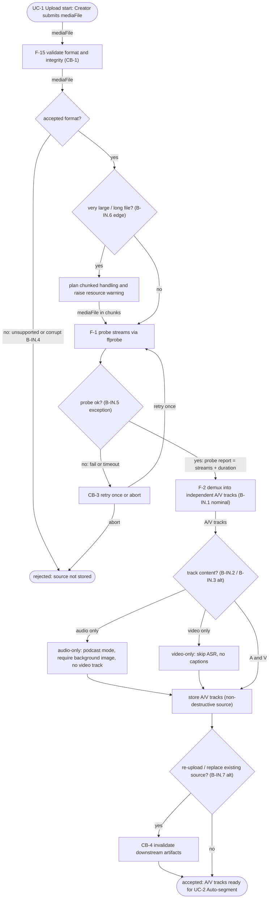
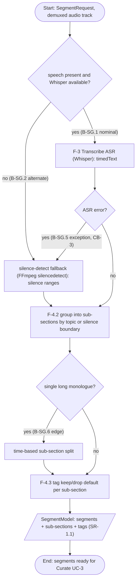
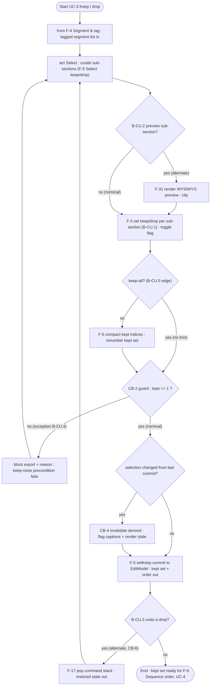
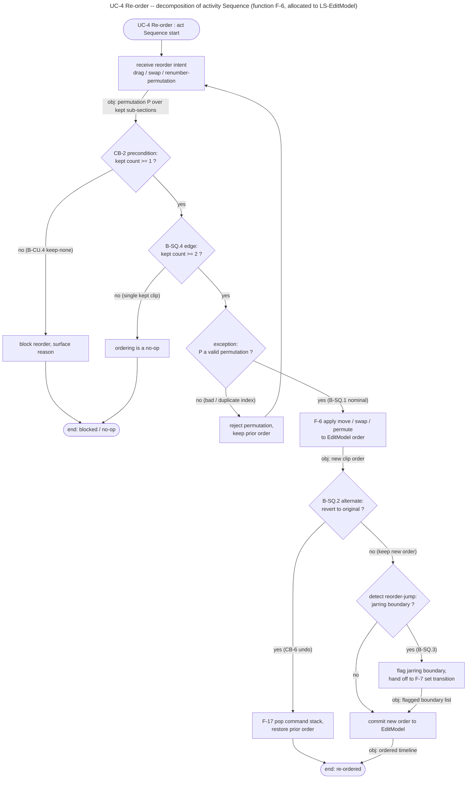
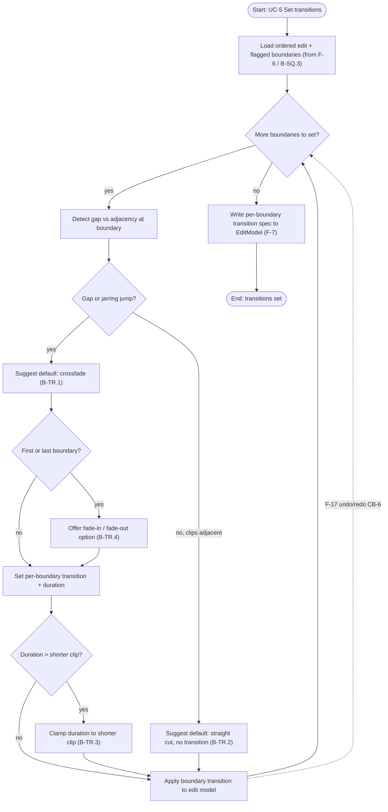
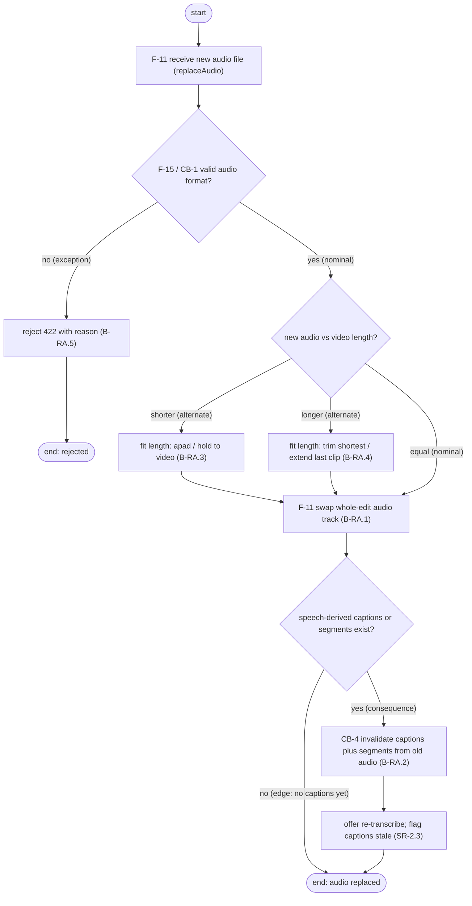
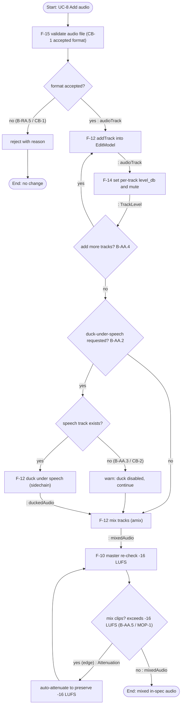
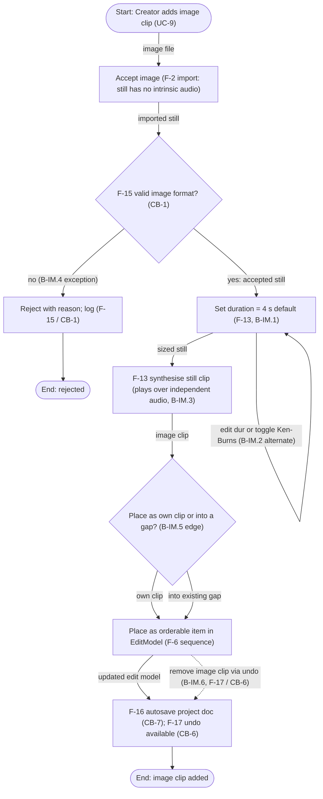
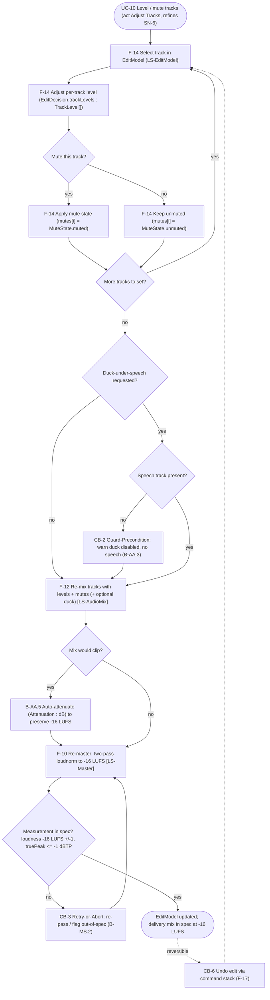

# Logical · White Box · Per-Use-Case Activity Decomposition

> **SE step (Q1 closure):** one **activity diagram per use case**, each decomposing the use
> case into its internal sub-activities with control flow and object flow on the edges — the
> companion to the use-case model (`2-use-cases.md`) and functional analysis (`2-functional-analysis.md`,
> which holds the UC-6 Export activity). Behaviours were enumerated nominal / alternate / exception /
> edge (brainstorming discipline) and each diagram was render-validated. Generated via a draft ->
> adversarial-review agent pipeline; names verified against the real functions (F-*) and reusable
> behaviours (CB-*).

## UC-1 Upload — Activity Diagram (act Ingest)

SysML activity diagram decomposing use case UC-1 "Upload" (refines stakeholder need SN-1) into its internal sub-activities, control flow, and object flow for the act *Ingest*. The flow exercises F-15 (Validate input, realising reusable behaviour CB-1 Validate-and-Reject) as the format/integrity guard, F-1 (Ingest media — probe streams via ffprobe), and F-2 (Demux into A/V tracks). Object flows are carried on the edges: mediaFile from start through validation and (chunked) into probe; the probe report (streams + duration) from F-1 into F-2; and the resulting A/V tracks from demux into storage. Behaviour completeness is enumerated as branches drawn directly from the Ingest stage of the behaviour catalogue (B-IN.1..B-IN.7): NOMINAL accept/probe/demux into independent A/V tracks (B-IN.1); ALTERNATE audio-only podcast mode requiring a background image with no video track (B-IN.2), video-only no-audio path that skips ASR so there are no captions (B-IN.3), and a re-upload/replace-source path that triggers CB-4 to invalidate downstream artifacts (B-IN.7); EXCEPTION unsupported/corrupt media rejected with reason via CB-1 (B-IN.4) and probe fail/timeout handled by CB-3 retry-once-or-abort before rejecting (B-IN.5); EDGE very large/long file routed through chunked handling with a resource warning (B-IN.6). Two distinct end states separate the accepted outcome (stored A/V tracks, ready for UC-2 Auto-segment) from the rejected outcome (source not stored). All node text is ASCII-only, decisions are diamonds, quotes are balanced, and the orientation is flowchart TB.

## UC-2 Auto-segment — Activity Decomposition (Analyse & Segment)

SysML activity diagram decomposing UC-2 "Auto-segment" into its internal sub-activities with control flow and object flow on edges. Sub-actions are real ReelCut model functions: F-3 Transcribe ASR (Whisper) on the nominal speech path, the silence-detect fallback (FFmpeg silencedetect) on the alternate/exception path, F-4.2 group into sub-sections, and F-4.3 tag keep/drop default. Object flow is named on edges/nodes (demuxed audio track in; timedText / silence ranges intermediate; SegmentModel out, traced to SR-1.1). All four behaviour classes from the Segment & tag catalogue are rendered as branches: NOMINAL F-3 transcribe (B-SG.1); ALTERNATE no speech / no Whisper -> silence-detect fallback (B-SG.2); EXCEPTION ASR error -> route to fallback and flag, per CB-3 Retry-or-Abort (B-SG.5); EDGE single long monologue -> time-based sub-section split before tagging (B-SG.6). Internal control structure matches the Segmenting composite state (Transcribing -> Tagging via timedText; Transcribing -> SilenceFallback on "no speech / no Whisper" -> Tagging). Render-validated with @mermaid-js/mermaid-cli (exit 0, valid 114 KB SVG) using the repo chrome-headless-shell config. ASCII-only, balanced quotes, decisions as diamonds, stadium start/end, 13 nodes (within the 8-16 focus target). This is a finalised draft for review; not committed and not written into model files.

## UC-3 Keep / drop - act Select (F-5) activity diagram

SysML activity diagram decomposing use case UC-3 "Keep / drop" into the sub-activities of its act *Select* (function F-5 "Select (keep/drop)", allocated to LS-EditModel). Control flow runs the nominal spine - curate sub-sections, set keep/drop per sub-section (B-CU.1), compact/renumber the kept indices, then guard and commit - while object flow is annotated on the edges: the tagged segment list arrives from F-4 "Segment & tag" (the UC-2 upstream producer), and the kept set plus order leave the act toward F-6 "Sequence (order)" in UC-4; the undo path emits restored state. Behaviour completeness is taken straight from the Curate block of the behaviour catalogue (5-behaviour-catalogue.md): Nominal toggle keep/drop (B-CU.1) on the main spine; Alternate preview-before-deciding (B-CU.2) routed through F-31 render WYSIWYG preview; Alternate undo-a-drop (B-CU.3) routed through CB-6 / F-17 pop-command-stack; Exception keep-none which the CB-2 Guard-Precondition (kept >= 1) blocks from export (B-CU.4); and the Edge keep-all no-trim case (B-CU.5), which now meaningfully bypasses index compaction. The CB-4 Invalidate-Derived-on-Source-Change branch fires only when the selection changed since the last commit, flagging captions and render output stale before committing the kept set to the EditModel. Names are verbatim from the model: UC-3 / act Select (2-use-cases.md); F-4 "Segment & tag", F-5 "Select (keep/drop)", F-6 "Sequence (order)", F-17 "Undo / redo", F-31 "Render WYSIWYG preview" (2-functional-analysis.md); B-CU.1..B-CU.5, CB-2, CB-4, CB-6 (5-behaviour-catalogue.md); and the setKeep / commit / F-17 pop-command-stack interaction (6-interaction-model.md, "Curate + reorder with undo"). Render-validated by mermaid-cli as flowchart-v2; ASCII-only, balanced quotes, 16 nodes.

## UC-4 Re-order -- decomposition of activity Sequence (function F-6, allocated to LS-EditModel)

SysML activity diagram decomposing use case UC-4 "Re-order" of the ReelCut MBSE model into the action nodes of activity *Sequence*. UC-4 "Re-order" maps to activity *Sequence* (black-box `1-problem-domain/black-box/2-use-cases.md`, row UC-4 -> act *Sequence*, refines SN-1); the realising function is F-6 "Sequence (order)", allocated to LS-EditModel and traced to UC-4 (white-box `1-problem-domain/white-box/2-functional-analysis.md`, F-6 row). The action nodes (receive reorder intent; F-6 apply move/swap/permute; detect reorder-jump; flag jarring boundary with hand-off to F-7 "Set transition / flag gaps") and every branch class are taken from the Sequence-stage behaviours B-SQ.1..B-SQ.4 and the precondition behaviour B-CU.4 in `5-behaviour-catalogue.md`, plus the curate/reorder interaction `diagrams/logical/seq-curate-reorder.mmd`. The diagram carries internal control flow AND object flow on edges (permutation P, new clip order, flagged boundary list, ordered timeline), so it genuinely decomposes the use case rather than restating it. Behaviour completeness is enumerated as branches: Nominal = B-SQ.1 apply move/swap/permute then commit; Alternate = B-SQ.2 revert-to-original via F-17 undo/redo (control behaviour CB-6); Alternate/consequence = B-SQ.3 reorder creates a jarring jump -> flag boundary and hand off to F-7 "set transition"; Exception = invalid permutation (bad/duplicate index) -> reject and keep prior order; Exception/guard = CB-2 precondition (kept count >= 1, sourced from B-CU.4) blocks the reorder; Edge = B-SQ.4 single kept clip -> ordering is a no-op. ASCII-only labels, "-16 LUFS" style convention honoured (loudness is out of scope here). Render-validated to SVG with mermaid-cli (no-sandbox puppeteer config), exit 0, viewBox 1411x2348, content present.

## UC-5 Set transitions - activity decomposition (F-7 Set transition / flag gaps)

SysML activity diagram decomposing use case UC-5 "Set transitions" into the internal sub-activities of function F-7 "Set transition / flag gaps" (allocated to LS-EditModel). Grounded in the reelcut MBSE model: UC-5 refines SN-2 and maps to act "Set Transitions" (1-problem-domain/black-box/2-use-cases.md, row UC-5); F-7 derives from UC-5 and is allocated LS-EditModel (1-problem-domain/white-box/2-functional-analysis.md, row F-7); behaviour set B-TR.1-B-TR.4 (1-problem-domain/white-box/5-behaviour-catalogue.md, Transition (F-7) table). Upstream object flow (ordered edit + flagged jarring-jump boundaries) comes from B-SQ.3 (Sequence/F-6 tie -> F-7) and the state transition Ordering -> Transitioning "jumps flagged" (7-state-model.md). The diagram iterates per boundary (control + object flow on edges) rather than restating the use case, and enumerates behaviour completeness as branches: NOMINAL = gap/jarring jump detected -> suggest crossfade default -> set per-boundary transition + duration (B-TR.1); ALTERNATE = adjacent clips, no gap -> suggest straight cut, no transition (B-TR.2); EXCEPTION = chosen duration longer than the shorter clip -> clamp to shorter clip (B-TR.3); EDGE = first/last boundary -> offer fade-in/fade-out option (B-TR.4). Cross-cutting F-17 undo/redo (CB-6) is shown as a dotted edge back to the boundary loop. Requested sub-activities map exactly: "detect gap/adjacency" -> Detect node + Gap decision; "suggest default (cut vs crossfade)" -> the two Suggest-default nodes gated by the Gap decision; "set per-boundary transition + duration" -> Set node with the clamp guard and Apply-to-edit-model write-back. Object flow: ordered edit + flagged boundaries in (from F-6/B-SQ.3), per-boundary transition spec written to EditModel out (F-7, setTransition()). Every label traces to F-7, B-TR.*, B-SQ.3, the state model, or the task brief - no names invented (crossfade/fade are real values of TransitionKind in 7-properties-and-types.md; LS-EditModel and setTransition() confirmed there too). 15 nodes, within the 8-16 budget; flowchart TB, ASCII-only, balanced quotes, diamonds for decisions, explicit Start/End. Render-validated via mermaid-cli (SVG produced, exit 0).

## UC-7 — Replace audio

SysML activity diagram decomposing use case UC-7 "Replace audio" (refines SN-5; act Replace Audio) into its internal sub-activities, control flow, and object flow. The realizing function is F-11 "Replace audio (+ invalidate captions)" allocated to LS-EditModel/LS-Caption and satisfying SR-2.3, with format validation delegated to F-15 "Validate input (CB-1)". The original task brief cited F-25, but in the verified model F-25 is "Reframe / letterbox to aspect preset" (tied to UC-6); the correct realizing function for UC-7 is F-11, so this diagram uses F-11. Object flow is carried on edges: the new audio file enters at replaceAudio, the new-audio-versus-video length comparison drives the apad/shortest fit, and the old-audio-derived captions plus segments are the objects invalidated by CB-4. Behaviour completeness is enumerated from behaviour-catalogue B-RA.*: nominal = B-RA.1 replace whole-edit audio (valid format, equal length); alternate = B-RA.3 shorter audio padded (apad/hold) and B-RA.4 longer audio trimmed (shortest/extend last clip); exception = B-RA.5 unsupported format rejected 422 via CB-1; consequence = B-RA.2 invalidate captions plus segments and offer re-transcribe via CB-4; edge = no speech-derived captions or segments exist yet, so invalidation is skipped. Two end nodes capture the rejected versus replaced outcomes. 14 nodes, ASCII-only text, balanced quotes; renders clean under mermaid-cli.

## UC-8 — Add audio (act Add/Mix Audio)

SysML activity diagram decomposing use case UC-8 "Add audio" (act Add/Mix Audio; need SN-5; realized by SR-2.4 add_audio) into sub-activities with control flow and object flow on the edges. The decomposition is taken from the real reelcut MBSE model under /home/user/planets/reelcut/mbse/, not invented: functional analysis (1-problem-domain/white-box/2-functional-analysis.md), behaviour catalogue B-AA.* (5-behaviour-catalogue.md), the interaction model (6-interaction-model.md and diagrams/logical/seq-add-audio.mmd), and property types (7-properties-and-types.md: TrackLevel dB, Attenuation dB, Loudness LUFS).

ACCURACY / DISCREPANCY (confirmed against the model): the task brief names "F-26" as the UC-8 audio function, but F-26 is actually "Translate captions" (UC-2, LS-Caption) per 2-functional-analysis.md line 48. The genuine UC-8 audio function is F-12 "Mix audio + duck" (LS-AudioMix; operations mix(), duck()), supported by F-15 "Validate input (CB-1)", F-14 "Adjust track level/mute" (TrackLevel dB + mute), and F-10 "Master (loudnorm -16 LUFS)" (LS-Master). The diagram models the real functions so names stay accurate.

Sub-activity / function mapping (verified):
- validate -> F-15 (CB-1 Validate-and-Reject; accepted audio format)
- addTrack -> F-12 / EditModel.addTrack; object: audioTrack
- set level_db / mute -> F-14 (TrackLevel dB, mute flag)
- duck-under-speech (sidechain) -> F-12 duck() (B-AA.2); object: duckedAudio
- mix (amix) -> F-12 mix(); object: mixedAudio
- master re-check -16 LUFS -> F-10 (LS-Master), MOP-1; object: Attenuation on the clip loop

Behaviour completeness (B-AA.* catalogue classes, lines 71-75):
- Nominal B-AA.1: add one track, per-track level/mute, mix, master in spec.
- Alternate B-AA.4: add-multiple-tracks loop (MULTI back-edge to ADD).
- Alternate B-AA.2: one-tap duck-under-speech via sidechain when a speech track exists.
- Exception B-AA.3 / CB-2 (Guard-Precondition): duck requested but no speech track -> warn, duck disabled, continue mixing.
- Exception CB-1 / B-RA.5: audio format not accepted on validate -> reject with reason, no change.
- Edge B-AA.5 / MOP-1: mix would clip -> auto-attenuate (Attenuation dB) and re-master to preserve -16 LUFS (loop until in spec).

Change from draft: object-flow type annotations (": audioTrack", ": TrackLevel", ": duckedAudio", ": mixedAudio", ": Attenuation") were moved OUT of action-node names and ONTO the edges where each token is produced/consumed, which is the correct SysML activity-diagram placement for object flow. F-12 addTrack wording tightened to "addTrack into EditModel" (addTrack is the EditModel entry point per seq-add-audio.mmd). All IDs (F-10/F-12/F-14/F-15, B-AA.1-5, B-RA.5, CB-1, CB-2, MOP-1, TrackLevel, Attenuation) confirmed present in the model files.

## UC-9 Add image clip - activity decomposition

SysML activity diagram decomposing UC-9 "Add image clip" into sub-activities, validated against the real reelcut MBSE model under /home/user/planets/reelcut/mbse/. The use case maps to F-13 "Synthesise image clip" (allocated to LS-Render; functional-analysis row 35). The brief's "F-27" is wrong for this UC: in the model F-27 is "Burn-in (open) captions" for UC-6 (row 49); F-13 is the correct function and is used here. Supporting functions are model-accurate: F-2 import/demux (UC-1/7/9, row 24), F-15 Validate input under CB-1 (row 37; CB-1 line 137 maps B-IM.4 to F-15), F-6 Sequence/order (row 28), F-16 Manage session autosave under CB-7 (row 38; CB-7 line 143), F-17 Undo/redo under CB-6 (row 39; CB-6 line 142). Behaviour completeness is drawn directly from catalogue B-IM.* (lines 81-86): NOMINAL B-IM.1 (still as orderable clip, default 4 s, F-13); ALTERNATE B-IM.2 (edit duration / toggle Ken-Burns, modeled as a self-loop on Set duration), B-IM.3 (image plays over independent audio, no intrinsic audio), B-IM.6 (remove image clip via undo, dotted edge, F-17/CB-6); EXCEPTION B-IM.4 (unsupported format -> reject with reason via F-15/CB-1, dedicated rejected end node); EDGE B-IM.5 (own clip vs inserted into an existing gap, decision diamond). The diagram truly decomposes the UC: it shows internal sub-activities (accept -> validate -> set duration -> synthesise -> place -> autosave) with named OBJECT FLOW on edges (image file, imported still, accepted still, sized still, image clip, updated edit model) plus CONTROL FLOW, rather than restating the use case text. Mermaid is flowchart TB, ASCII-only (4 s, no unicode), balanced quotes, decisions as {} diamonds, explicit Start and two End nodes (added / rejected). 14 nodes, within the 8-16 target.

## UC-10 Level / mute tracks — activity decomposition (act Adjust Tracks)

SysML activity diagram decomposing UC-10 "Level / mute tracks" (black-box use case, refines SN-6, decomposes to activity "Adjust Tracks", Status Planned) into its internal sub-activities with control flow and object flow on the edges. Realized by the model-accurate functions (NOT the brief's F-28, which is "Compose branding overlays" / UC-6): F-14 "Adjust track level/mute" (LS-EditModel, the function that actually realizes UC-10 per 2-functional-analysis.md line 36 and 6-element-dictionary.md line 112) for per-track level and mute-state setting; F-12 "Mix+duck" (LS-AudioMix) to re-mix with new levels/mutes plus optional duck-under-speech; and F-10 "Master loudnorm" (LS-Master) to re-master via two-pass loudnorm and keep -16 LUFS. Behaviour is enumerated from the model's own brainstormed catalogue (5-behaviour-catalogue.md): Nominal (B-AA.1, B-MS.1); Alternate (mute vs unmuted via MuteState, more-tracks loop, optional duck B-AA.2); Exception (duck with no speech -> CB-2 Guard-Precondition warn, B-AA.3; loudness out-of-spec -> CB-3 Retry-or-Abort, B-MS.2); Edge (mix would clip -> auto-attenuate to preserve -16 LUFS, B-AA.5, MOP-1); Cross-cutting (whole edit reversible via CB-6 Undo/Redo, F-17, shown as a dashed reversibility edge). Object flows on edges use the real type model (7-properties-and-types.md / diagrams/types/value-types.mmd): EditDecision.trackLevels typed TrackLevel[] and EditDecision.mutes typed MuteState[] (corrected from the draft's incorrect Real[]/Boolean[]); MuteState {muted, unmuted}; Measurement.loudness : Loudness (unit LUFS); truePeak : TruePeak (unit dBTP); Attenuation : dB. 19 nodes, flowchart TB, ASCII-only node text, balanced quotes, decisions as {} diamonds, explicit start/end nodes. Render-validated to SVG with mermaid-cli (exit 0, no syntax errors).

