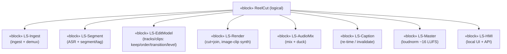
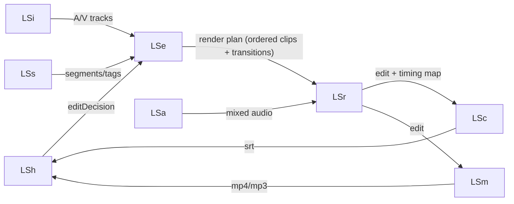

# Logical · White Box · Structure — Logical Subsystems Communication

> MagicGrid cell **Structure / Logical**. **Solution-neutral** logical subsystems
> connected through **interface blocks / ports / item flows** (p.19–21 pattern).
> Functions (white-box `2`) are **«allocate»d** here; logical subsystems
> **«satisfy»** system requirements. *No code/physical choices yet.*

## Logical block definition (bdd)


## Interconnections (ibd — item flows over interface blocks)


## Allocation & satisfaction
| Function (F) | «allocate» → Logical Subsystem | Subsystem «satisfy» → SR |
|---|---|---|
| F-1,F-2 | LS-Ingest | SR-2.1, SR-2.2 |
| F-3,F-4 | LS-Segment | SR-1.1 |
| F-5,F-6,F-7,F-14 | LS-EditModel | SR-1.2, SR-2.8 |
| F-8,F-13 | LS-Render | SR-1.3, SR-2.5 |
| F-12 | LS-AudioMix | SR-2.4, SR-2.6 |
| F-9,F-11 | LS-Caption | SR-1.4, SR-2.3 |
| F-10 | LS-Master | SR-1.5 |
| (HMI) | LS-HMI | SR-1.7, SR-2.7 |

```sysml
block def LS_EditModel {
    port toRender : I_RenderPlan;
    in  port fromHMI : I_HMI;
}
allocate F_6_Sequence to LS_EditModel;     // behaviour → structure, same layer
satisfy  LS_EditModel  by_satisfies SR_1_2; // logical structure satisfies SR
```


## Cross-layer like-to-like links (ADR-013)

> Mirrors this file's rows from the cross-layer spine (`../../../8-cross-layer-traceability.md`).
> `▽` = within-layer decomposition · `⇒` = across-layer realization (routed via a Configuration item).

| Link | Type | From | To |
|------|------|------|----|
| ReelCut System ▽ {LS-Ingest … LS-HMI} | ▽ composition | system block | 8 logical subsystems |
| LS-Ingest ▽ {C-Probe, C-Demux} · LS-HMI ▽ {C-Server, C-UI} | ▽ composition | logical subsystem | physical components |
| LS ⇒ C | ⇒ allocate / realize | logical subsystem | physical component |
