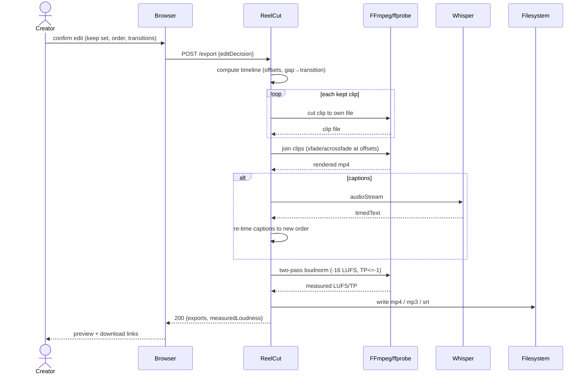
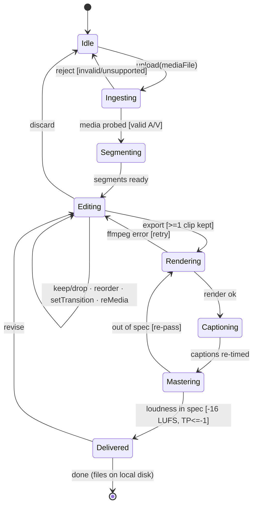

# Logical · White Box · Behavior (dynamics) — Sequence & State Machine

> Step 5 enrichment of the behavioural model. The **activity** view
> (`2-functional-analysis.md`) gives function flow; this file adds the two missing
> dynamic views: a **sequence diagram** (interaction order across SoI + external
> entities) and a **state machine** (the SoI's lifecycle / wizard states that source
> requirement *conditions*, per answer #3). Non-functional requirements draw their
> timing from the sequence; conditional requirements draw their guards from the
> state machine.

## Sequence — UC-6 Export (render → caption → master)

> Timing facts harvested here feed performance requirements (e.g. SR-1.5 loudness,
> SR-1.6 A/V sync) and the MoP constraint blocks (`2-solution-domain/4`).

## State machine — ReelCut session lifecycle

## Condition / guard catalogue (sourced for conditional requirements)

| Guard (from state machine) | Sources requirement condition |
|---|---|
| `[valid A/V]` on Ingesting→Segmenting | SR-1.x ingest acceptance |
| `[>=1 clip kept]` on Editing→Rendering | SR-1.2 keep/order precondition |
| `[-16 LUFS, TP<=-1]` on Mastering→Delivered | SR-1.5 loudness (performance) |
| `[ffmpeg error]` retry loop | render robustness (CR-1) |
| `Delivered → local disk` | SR-1.7 local-only (interface, MOE-2) |

> These guards are the **conditions** referenced by the system requirements
> (`white-box/1-system-requirements.md`); the sequence supplies their **timing**.
</content>
</invoke>
