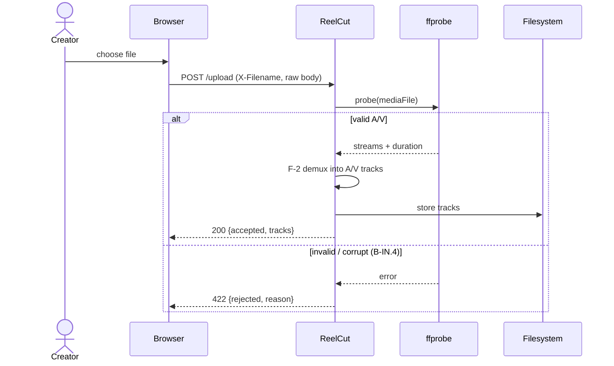
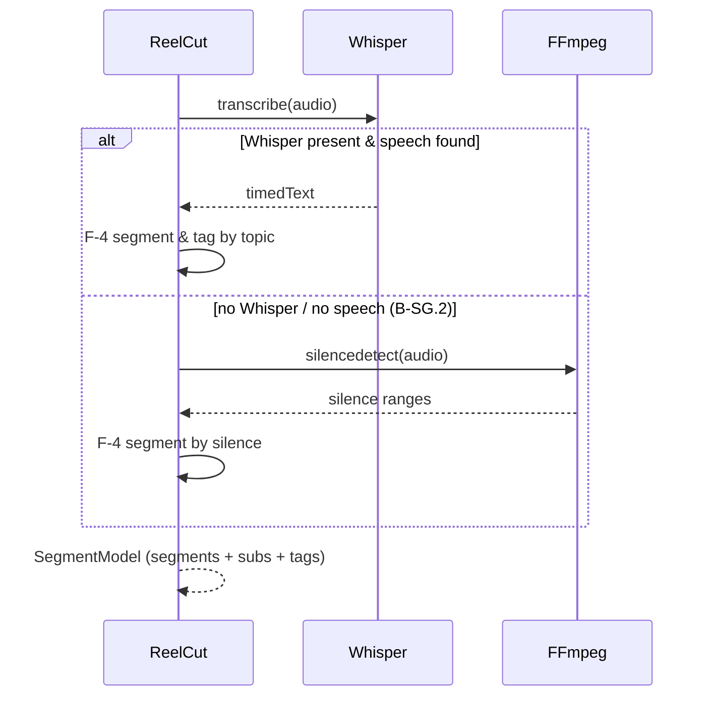
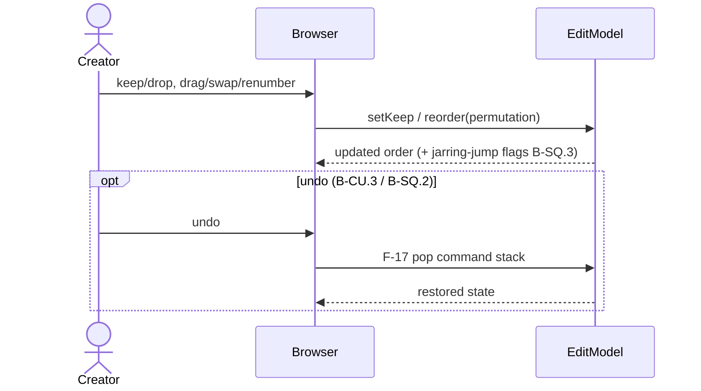
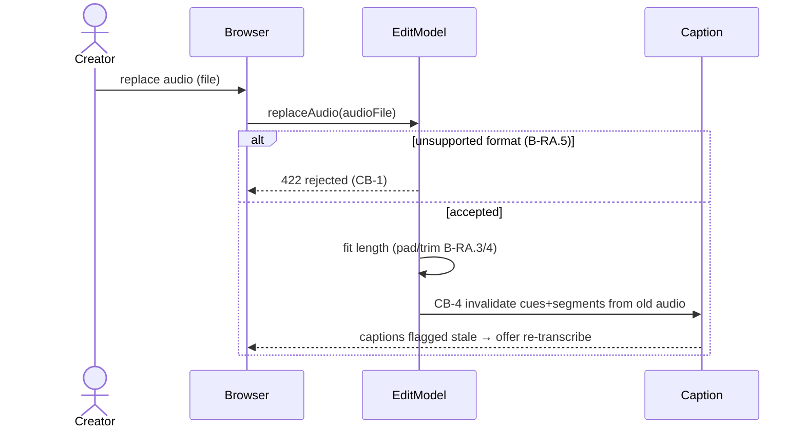
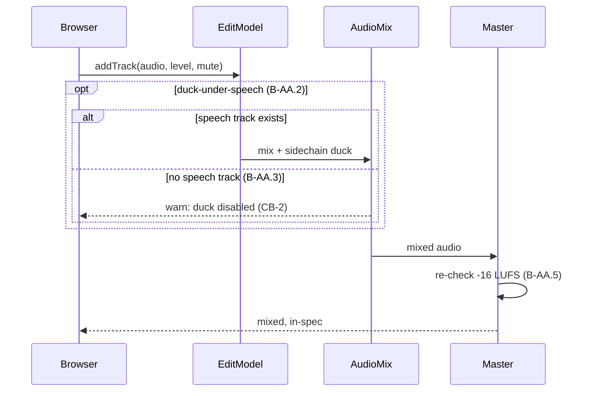
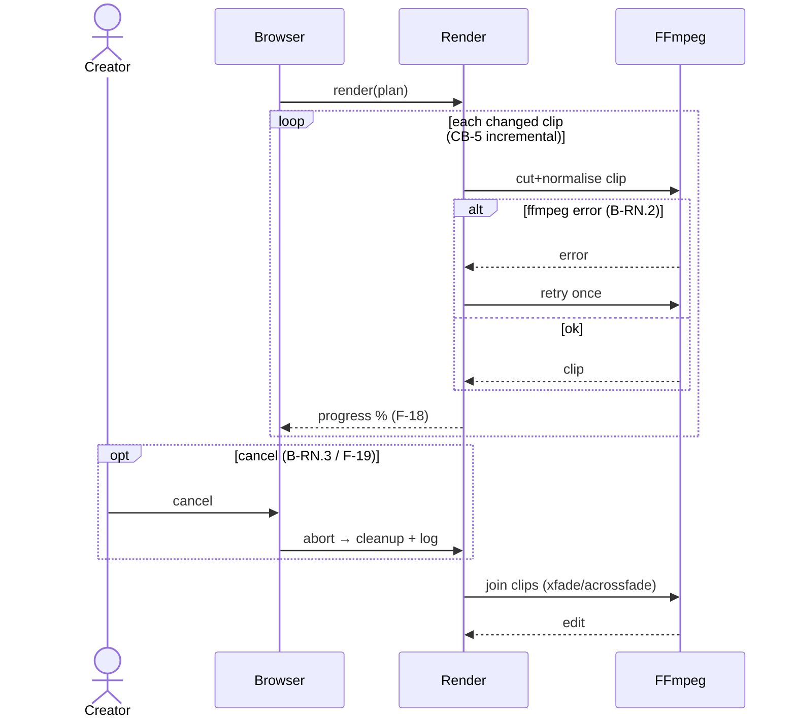
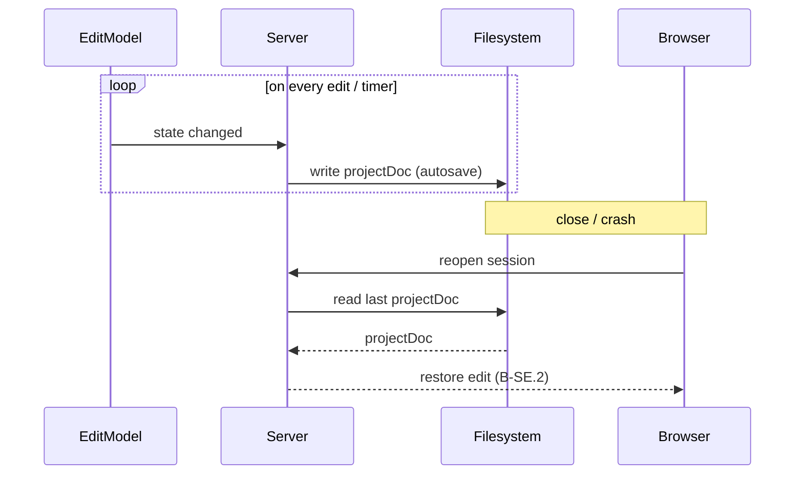

# Logical · White Box · Behavior — Interaction (Sequence) Model

> The **interaction model** shows the **interaction between the entities involved**
> (your definition). One sequence per significant use case / behaviour group, drawn
> from `5-behaviour-catalogue.md` — including the **alternate / exception** fragments
> (`alt` / `opt` / `loop`). The export sequence (UC-6 nominal) lives in `4`; this
> file covers the remaining interactions end-to-end.

## Ingest + validate (UC-1; B-IN.*)

## Segment with fallback (UC-2; B-SG.*)

## Curate + reorder with undo (UC-3/4; B-CU.*, B-SQ.*)

## Replace audio → invalidate captions (UC-7; B-RA.*, CB-4)

## Add audio + duck (UC-8; B-AA.*)

## Render with retry / cancel (UC-6; B-RN.*, CB-3/CB-5)

## Autosave / restore (B-SE.1/2; CB-7)

</content>
</invoke>
