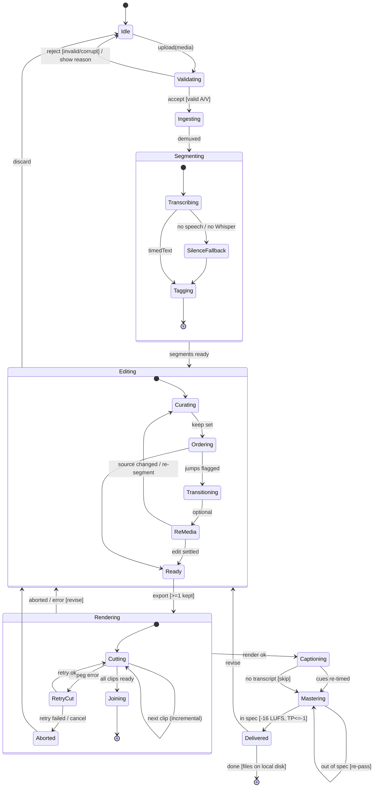
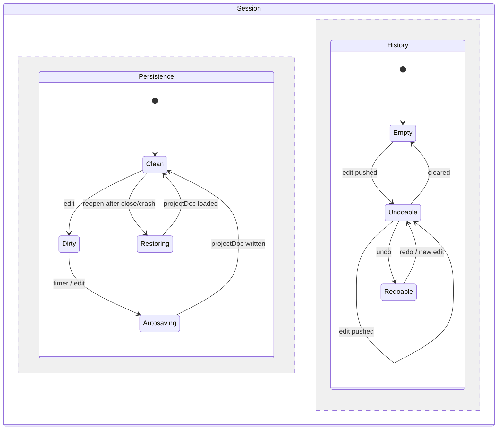

# Logical · White Box · Behavior — State Model (overall context, end-to-end)

> The **state model** is the **overall context** (your definition): the complete
> lifecycle of a ReelCut session including **every** alternate, exception and
> recovery state from `5-behaviour-catalogue.md`, plus a **concurrent persistence
> region** (autosave / undo) that runs alongside the main flow. Guards in `[...]`
> are the **conditions** that source conditional requirements.

## End-to-end session state machine (with error/recovery)

## Concurrent persistence & history region (runs throughout)

## Guard → conditional-requirement catalogue (extends `4`)

| Guard | Sources |
|---|---|
| `[invalid/corrupt]` (Validating) | SR-3.1 validate-and-reject |
| `[no speech / no Whisper]` (Segmenting) | SR-1.1 fallback segmentation |
| `[>=1 kept]` (Ready→Rendering) | SR-1.2 precondition |
| `ffmpeg error → retry/abort` (Rendering) | SR-3.4 cancel/abort, CR-1 robustness |
| `next clip (incremental)` | SR-3.6 incremental re-render |
| `out of spec → re-pass` (Mastering) | SR-1.5 loudness |
| `reopen after close/crash → Restoring` | SR-3.2 autosave/restore |
| `undo / redo` (History) | SR-3.3 undo/redo |
| `done [files on local disk]` | SR-1.7 local-only (MOE-2) |

> The two regions are **orthogonal**: the main lifecycle and the
> persistence/history region are active **simultaneously** for the whole session —
> that is what makes autosave, crash-recovery and undo/redo cross-cutting rather
> than steps in the pipeline.
</content>
</invoke>
