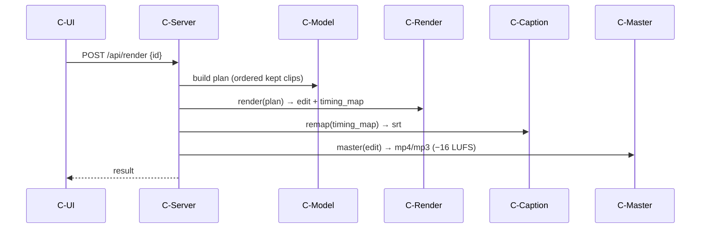

# Physical · Solution · Behavior — Component Behavior

> MagicGrid cell **Behavior / Physical**. The functions (white-box) are realised as
> concrete component operations and **«allocate»d** to the physical components.

| Operation (component behaviour) | Component | Realises F | Allocated | St |
|---|---|---|---|---|
| `probe()` | C-Probe | F-1 | ✓ | Built |
| `demux()` | C-Demux | F-2 | ✓ | Planned |
| `segment()` | C-Segment | F-3,F-4 | ✓ | Built |
| `set_keep/move/swap/reorder_by_permutation/set_transition()` | C-Model | F-5,F-6,F-7 | ✓ | Built |
| `set_track_level/mute()`, `replace_audio()` | C-Model | F-14,F-11 | ✓ | Planned |
| `render()` (two-stage) | C-Render | F-8 | ✓ | Built |
| `synth_image_clip()` | C-ImageSynth | F-13 | ✓ | Planned |
| `mix()/duck()` | C-AudioMix | F-12 | ✓ | Planned |
| `remap()` | C-Caption | F-9 | ✓ | Built |
| `master()` | C-Master | F-10 | ✓ | Built |

> Non-functional timing (e.g. render-time MOP-7) is read from this sequence; that
> is the source of the **performance** system requirements (your #3).
