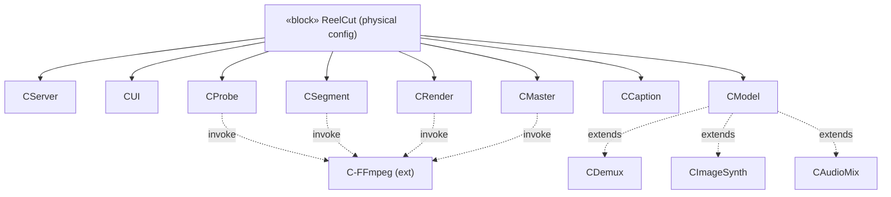

# Physical · Solution · Structure — Component Structure

> MagicGrid cell **Structure / Physical (Design)**. Logical subsystems are
> **«allocate»d** to **physical components** = the actual code modules under
> `reelcut/app/`. This layer is the **framework for the scripts** (your #1).

| Component | «allocate» from LS | Realised by (script) | Status |
|---|---|---|---|
| **C-Probe** | LS-Ingest | `app/pipeline/probe.py` | Built |
| **C-Demux** | LS-Ingest | `app/pipeline/` (ext) | Planned |
| **C-Segment** | LS-Segment | `app/pipeline/segment.py` | Built |
| **C-Model** | LS-EditModel | `app/model.py` (track/clip) | Built→ext |
| **C-Render** | LS-Render | `app/pipeline/render.py` | Built |
| **C-ImageSynth** | LS-Render | `app/pipeline/render.py` (ext) | Planned |
| **C-AudioMix** | LS-AudioMix | `app/pipeline/audio_mix.py` | Planned |
| **C-Caption** | LS-Caption | `app/pipeline/captions.py` | Built |
| **C-Master** | LS-Master | `app/pipeline/master.py` | Built |
| **C-Server** | LS-HMI | `app/server.py` | Built |
| **C-UI** | LS-HMI | `app/static/` | Built |
| **C-FFmpeg** | (external) | system binary | external |



```sysml
part def ReelCutConfig {            // physical components allocated from logical
    part server  : C_Server;
    part model   : C_Model;
    part render  : C_Render;
    part master  : C_Master;
    ref  ffmpeg  : C_FFmpeg;        // external dependency
}
allocate LS_EditModel to C_Model;   // structure → structure (same scope)
```
