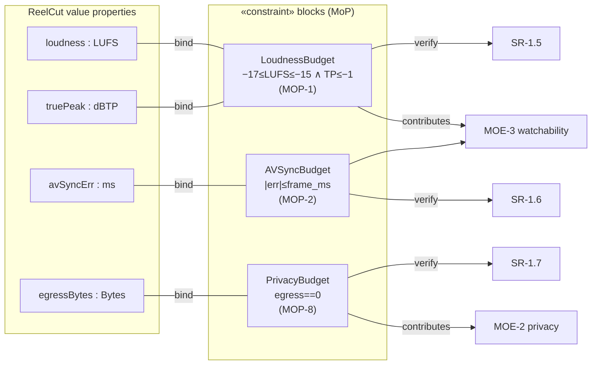

# Physical · Solution · Parametrics — Component Parameters (MoP)

> MagicGrid cell **Parametrics / Physical**. **Measures of Performance** as
> **«constraint» blocks** with value bindings; each **verifies** a performance
> requirement and **contributes to** an MoE (black-box `4`). Hard targets firm,
> soft TBD.

| ID | Parameter | Value / unit | verifies | → MoE | St |
|---|---|---|---|---|---|
| **MOP-1** | Integrated loudness / true-peak | −16 LUFS ±1 / ≤ −1 dBTP (firm) | SR-1.5 | MOE-3 | Built |
| **MOP-2** | A/V sync error | ≤ 1 frame (overlap-adjusted) | SR-1.6 | MOE-3 | Built |
| **MOP-3** | Independent-manipulation level | threshold / objective | SR-2.8 | MOE-5 | Planned |
| **MOP-4** | Image default duration / motion | 4 s / Ken-Burns off | SR-2.5 | MOE-1 | Planned |
| **MOP-5** | Duck attenuation under speech | TBD dB | SR-2.4 | MOE-3 | Planned |
| **MOP-6** | Caption integrity on replace | 0 mismatches (firm) | SR-2.3 | MOE-6 | Planned |
| **MOP-7** | Render time / min footage | TBD | SR-1.3 | MOE-1 | Planned |
| **MOP-8** | Media egress bytes | 0 (firm) | SR-1.7 | MOE-2 | Built |
| **MOP-9** | Runtime deps beyond stdlib+FFmpeg | 0 | SR (CR) | MOE-4 | Built |
| **MOP-10** | Aspect/preset fidelity + caption availability | exact preset; open+translated avail | SR-4.2/4.3/4.9 | MOE-7 | Planned |
| **MOP-11** | Filler/silence removed; chapters present | filler ≥ threshold trimmed; chapters = #segments | SR-4.5/4.7 | MOE-8 | Planned |
| **MOP-12** | Speech clarity gain / noise floor | noise floor ↓ TBD dB; speech leveled | SR-4.8 | MOE-9 | Planned |

## Parametric diagram (constraint blocks · value bindings · MoE roll-up)




```sysml
constraint def LoudnessBudget { in I_LUFS; in TP;
    require { I_LUFS >= -17 and I_LUFS <= -15 and TP <= -1 } }   // MOP-1
constraint def AVSyncBudget   { in err_ms; require { abs(err_ms) <= frame_ms } } // MOP-2
constraint def PrivacyBudget  { in egress; require { egress == 0 } }            // MOP-8
// value bindings + verify
binding  ReelCutConfig::loudness -> LoudnessBudget.I_LUFS;
verify   SR_1_5_Loudness by LoudnessBudget;     // parametric verifies requirement (p.25)
```
