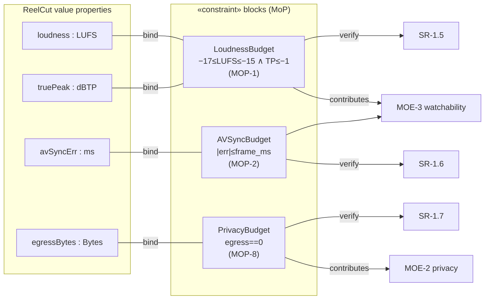
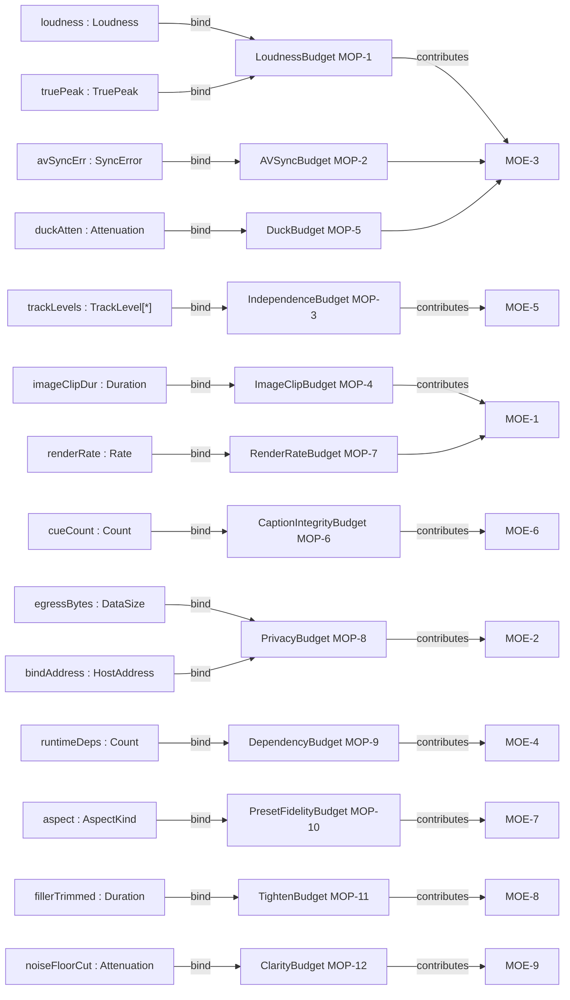

# Physical · Solution · Parametrics — Component Parameters (MoP)

> MagicGrid cell **Parametrics / Physical**. **Measures of Performance** as
> **«constraint» blocks** with value bindings; each **verifies** a performance
> requirement and **contributes to** an MoE (black-box `4`). Hard targets firm,
> soft TBD.

| ID | Parameter | Value / unit | verifies | → MoE | St |
|---|---|---|---|---|---|
| **MOP-1** | Integrated loudness / true-peak | −16 LUFS ±1 / ≤ −1 dBTP (firm) | SR-1.5 | MOE-3 | Built |
| **MOP-2** | A/V sync error | ≤ 1 frame (overlap-adjusted) | SR-1.6 | MOE-3 | Built |
| **MOP-3** | Independent-manipulation level | threshold / objective | SR-2.8 | MOE-5 | Planned |
| **MOP-4** | Image default duration / motion | 4 s / Ken-Burns off | SR-2.5 | MOE-1 | Planned |
| **MOP-5** | Duck attenuation under speech | TBD dB | SR-2.4 | MOE-3 | Planned |
| **MOP-6** | Caption integrity on replace | 0 mismatches (firm) | SR-2.3 | MOE-6 | Planned |
| **MOP-7** | Render time / min footage | TBD | SR-1.3 | MOE-1 | Planned |
| **MOP-8** | Media egress bytes | 0 (firm) | SR-1.7 | MOE-2 | Built |
| **MOP-9** | Runtime deps beyond stdlib+FFmpeg | 0 | SR (CR) | MOE-4 | Built |
| **MOP-10** | Aspect/preset fidelity + caption availability | exact preset; open+translated avail | SR-4.2/4.3/4.9 | MOE-7 | Planned |
| **MOP-11** | Filler/silence removed; chapters present | filler ≥ threshold trimmed; chapters = #segments | SR-4.5/4.7 | MOE-8 | Planned |
| **MOP-12** | Speech clarity gain / noise floor | noise floor ↓ TBD dB; speech leveled | SR-4.8 | MOE-9 | Planned |

## Parametric diagram (constraint blocks · value bindings · MoE roll-up)




```sysml
constraint def LoudnessBudget { in I_LUFS; in TP;
    require { I_LUFS >= -17 and I_LUFS <= -15 and TP <= -1 } }   // MOP-1
constraint def AVSyncBudget   { in err_ms; require { abs(err_ms) <= frame_ms } } // MOP-2
constraint def PrivacyBudget  { in egress; require { egress == 0 } }            // MOP-8
// value bindings + verify
binding  ReelCutConfig::loudness -> LoudnessBudget.I_LUFS;
verify   SR_1_5_Loudness by LoudnessBudget;     // parametric verifies requirement (p.25)
```


## Complete MoP value-binding matrix (every MoP bound via a constraint block)

Each MoP is a `«constraintBlock»` whose parameters are **bound to typed value properties**
defined in `7-properties-and-types.md`; the constraint `verify`s a requirement and `contributes`
to an MoE. No MoP is left without a backing, typed value property.

| MoP | `«constraintBlock»` | bound value property : type (owner block) | constraint expression | verify | → MoE |
|---|---|---|---|---|---|
| MOP-1 | `LoudnessBudget` | `loudness : Loudness`, `truePeak : TruePeak` (LS-Master) | −17 ≤ loudness ≤ −15 ∧ truePeak ≤ −1 | SR-1.5 | MOE-3 |
| MOP-2 | `AVSyncBudget` | `avSyncErr : SyncError` (ReelCut) | abs(avSyncErr) ≤ frame_ms | SR-1.6 | MOE-3 |
| MOP-3 | `IndependenceBudget` | `trackLevels : TrackLevel[*]` (LS-EditModel) | each track independently leveled ∧ spoken subs stay A/V-locked | SR-2.8 | MOE-5 |
| MOP-4 | `ImageClipBudget` | `imageClipDur : Duration` (LS-Render) | imageClipDur == 4 (default) ∧ motion = off | SR-2.5 | MOE-1 |
| MOP-5 | `DuckBudget` | `duckAtten : Attenuation` (LS-AudioMix) | duckAtten ≤ target_dB while speech present | SR-2.4 | MOE-3 |
| MOP-6 | `CaptionIntegrityBudget` | `cueCount : Count` (LS-Caption) | cueCount_after == cueCount_remapped (0 mismatch) | SR-2.3 | MOE-6 |
| MOP-7 | `RenderRateBudget` | `renderRate : Rate` (LS-Render) | renderRate ≤ target | SR-1.3 | MOE-1 |
| MOP-8 | `PrivacyBudget` | `egressBytes : DataSize` (ReelCut), `bindAddress : HostAddress` (LS-HMI) | egressBytes == 0 ∧ bindAddress == 127.0.0.1 | SR-1.7 | MOE-2 |
| MOP-9 | `DependencyBudget` | `runtimeDeps : Count` (ReelCut) | runtimeDeps == 0 (beyond stdlib + FFmpeg) | CR-7 | MOE-4 |
| MOP-10 | `PresetFidelityBudget` | `aspect : AspectKind` (LS-Render) | aspect == selectedPreset ∧ captions open+translated available | SR-4.2/4.3/4.9 | MOE-7 |
| MOP-11 | `TightenBudget` | `fillerTrimmed : Duration` (LS-EditModel), `cueCount : Count` (LS-Caption) | fillerTrimmed ≥ threshold ∧ chapters == segmentCount | SR-4.5/4.7 | MOE-8 |
| MOP-12 | `ClarityBudget` | `noiseFloorCut : Attenuation` (LS-AudioMix) | noiseFloorCut ≥ target_dB | SR-4.8 | MOE-9 |

### Full parametric diagram (all 12 constraint blocks ↔ bound value properties ↔ MoE)



```sysml
constraint def IndependenceBudget { in lv : TrackLevel[*]; require { each(lv) independentlySet and lockedSubsPreserved } } // MOP-3
constraint def ImageClipBudget    { in d : Duration; require { d == 4 and motion == off } }                               // MOP-4
constraint def DuckBudget         { in a : Attenuation; require { a <= target_dB } }                                       // MOP-5
constraint def CaptionIntegrityBudget { in nAfter : Count; in nRemap : Count; require { nAfter == nRemap } }               // MOP-6
constraint def RenderRateBudget   { in r : Rate; require { r <= target } }                                                 // MOP-7
constraint def DependencyBudget   { in deps : Count; require { deps == 0 } }                                               // MOP-9
constraint def PresetFidelityBudget { in asp : AspectKind; require { asp == selectedPreset } }                            // MOP-10
constraint def TightenBudget      { in trimmed : Duration; in chapters : Count; in segs : Count; require { trimmed >= threshold and chapters == segs } } // MOP-11
constraint def ClarityBudget      { in cut : Attenuation; require { cut >= target_dB } }                                   // MOP-12
binding LS_AudioMix::duckAtten -> DuckBudget.a;  binding LS_Caption::cueCount -> CaptionIntegrityBudget.nAfter;
verify SR_2_4 by DuckBudget;  verify SR_2_3 by CaptionIntegrityBudget;
```

## Cross-layer like-to-like links (ADR-013)

> Mirrors this file's rows from the cross-layer spine (`../../8-cross-layer-traceability.md`).
> `▽` = within-layer decomposition · `⇒` = across-layer realization (routed via a Configuration item).

| Link | Type | From | To |
|------|------|------|----|
| MOP-1 / MOP-1b ⇐ MOE-9 | ⇐ refine | Measure of Performance | from MOE-9 (loudness/true-peak) |
| MOP ⇒ value binding ⇒ test | ⇒ verify | performance parameter | bound value property → pass-gate |
