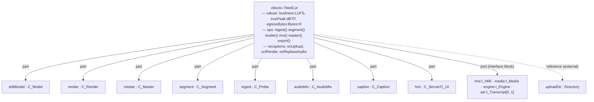

# System Configuration — Top-level System Block

> Per your #6, the top-level **ReelCut** system block is composed of **structural
> features** and **behavioural features**. This is the "System Configuration" of the
> MagicGrid (NTRS p.10) that ties the logical and physical structure together.

## System-configuration BDD (top block: structural + behavioural features)



## Structural features
| Kind | Feature | Typed by | Notes |
|---|---|---|---|
| **part property** | `editModel, render, master, segment, ingest, audioMix, caption, hmi` | subsystem **blocks** (LS-/C-) | what the system **is composed of** |
| **value property** | `loudness : LUFS`, `truePeak : dBTP`, `totalDuration : s`, `egressBytes : Bytes = 0` | **value types** | measurable state (MoP/MoE bindings) |
| **flow property** | `mediaIn : MediaFile`, `editDecision : EditDecision`, `exportOut : Delivery` | **signals** | items that flow |
| **port** | `hmi : I_HMI`, `media : I_Media`, `engine : I_Engine`, `asr : I_Transcript[0..1]` | **interface blocks** (contain flow properties) | the boundary (matches the context IBD) |
| **reference property** | `uploadDir : Directory` | external **block** | referenced, **not composed** — the external upload folder |

## Behavioural features
| Kind | Feature | Notes |
|---|---|---|
| **operation** | `ingest()`, `segment()`, `render()`, `mix()`, `master()`, `export()` | invoked behaviour |
| **reception** | `onUpload(MediaFile)`, `onRender()`, `onReplaceAudio(MediaFile)` | async signal receptions from the HMI |

```sysml
part def ReelCut {
    // structural features
    part editModel : C_Model;             part render   : C_Render;
    part master    : C_Master;            part ingest   : C_Probe;
    value loudness : LUFS;                value egressBytes : Bytes = 0;
    out flow exportOut : Delivery;        in  flow mediaIn   : MediaFile;
    port hmi    : I_HMI;                  port engine : I_Engine;
    ref  uploadDir : Directory;           // external reference (your #6)
    // behavioural features
    operation render();   operation master();
    reception onUpload( in m : MediaFile );
    reception onReplaceAudio( in a : MediaFile );
}
```

> Item flows on the ports are typed by **signals**; ports are typed by **interface
> blocks** that *contain* those flow properties — so the context IBD (black-box `3`)
> and this configuration are consistent.

---

## Configuration as the inter-layer join (see `8-cross-layer-traceability.md` §8.6)

The block above is the **root configuration item `CFG-ReelCut`**. In the cross-layer
traceability model it plays a second role: it is the **intermediate join** that carries the
four like-to-like pillar threads across each abstraction hop. Each configuration item binds a
4-tuple `⟨R, S, B, P⟩` — the requirements it satisfies, the structure variant it selects, the
behaviour it allocates, and the parameter values that meet the MoP — and **decomposes
recursively** into child configuration items (`CFG-Edit`, `CFG-Render`, `CFG-Media`, `CFG-HMI`)
that mirror the structure tree (§8.2).

Two **configuration variants** specialise the root after the trade-study selection:

- **`CFG-Desktop`** (Built) — `C-Server` + `C-UI` + bundled `C-FFmpeg` (ADR-009); full function
  set; `egressBytes = 0`, `loudness = −16 LUFS`.
- **`CFG-Mobile`** (Planned, best-effort — HC-1, SR-2.7, WV-001/WV-002) — React-Native shell +
  `ffmpeg-kit` (ADR-010); render subset on-device; `egressBytes = 0` preserved.

They share `CFG-Edit`/`CFG-Render`/`CFG-Media` and differ only at `CFG-HMI` + engine — exactly
what the structure decomposition predicts. This closes the "no post-selection configuration
variants" gap (DECISIONS.md ADR-013).
