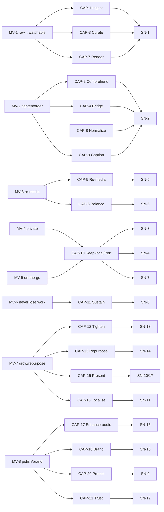
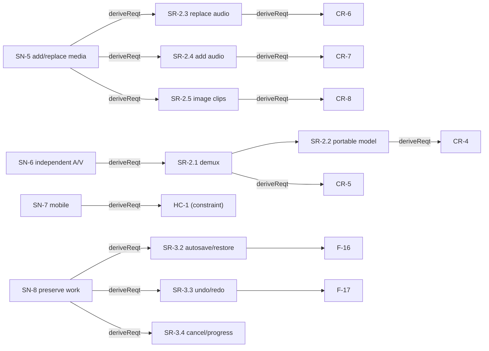

# Traceability

> The MagicGrid closes the loop across layers with SysML relationships
> (your #5 rules). Direction: **SN —«deriveReqt»→ SR —«deriveReqt»→ CR/HC**;
> functions **«refine»** SR & SN; logical subsystems **«satisfy»** SR; behaviour
> **«allocate»** to structure; requirements **«verify»** by behaviour/structure/tests;
> MoP **value-bind** to structure and roll up to MoE.

## Mission thread (Enterprise/SoS: Vignette → Mission UC → Capability → Need)

> Bottom-up validation: every capability is owned by ≥1 need; every need traces to
> ≥1 capability (see `0-enterprise-sos/3`). SN baseline therefore complete & justified.

## Vertical thread (p.27 style: Need → System Req → Component Req)

## Cross-pillar matrix (per system requirement)
| SR | refinedBy (F, behavior) | satisfiedBy (LS, structure) | verifiedBy (test) | param (MoP) |
|---|---|---|---|---|
| SR-1.1 segment | F-4 | LS-Segment | T-5 | — |
| SR-1.2 keep/order | F-5,F-6 | LS-EditModel | T-1,T-2 | — |
| SR-1.3 render | F-8 | LS-Render | T-3,T-4 | MOP-2,MOP-7 |
| SR-1.4 captions | F-9 | LS-Caption | T-6 | MOP-6 |
| SR-1.5 loudness | F-10 | LS-Master | T-7 | MOP-1 |
| SR-1.6 A/V sync | F-8 | LS-Render | T-3,T-4 | MOP-2 |
| SR-1.7 local-only | — (context) | LS-HMI | T-7 | MOP-8 |
| SR-2.1 demux | F-2 | LS-Ingest | T-8 | — |
| SR-2.2 portable model | F-2 | LS-EditModel | T-8 | — |
| SR-2.3 replace audio | F-11 | LS-Caption/EditModel | T-9 | MOP-6 |
| SR-2.4 add audio | F-12 | LS-AudioMix | T-10 | MOP-1,MOP-5 |
| SR-2.5 image clips | F-13 | LS-Render | T-11 | MOP-4 |
| SR-2.6 mix loudness | F-10,F-12 | LS-Master | T-9,T-10 | MOP-1 |
| SR-2.8 MoP threshold | F-6,F-14 | LS-EditModel | T-8..T-11 | MOP-3 |
| SR-3.1 validate input | F-15 | LS-Ingest | T-12 | — |
| SR-3.2 autosave/restore | F-16 | LS-HMI | T-13 | — |
| SR-3.3 undo/redo | F-17 | LS-EditModel | T-14 | — |
| SR-3.4 cancel/progress | F-18,F-19 | LS-HMI | T-15 | — |
| SR-3.5 invalidate-on-source-change | F-4,F-11 | LS-Caption | T-9 | MOP-6 |
| SR-3.6 incremental re-render | F-20 | LS-Render | T-16 | MOP-7 |
| SR-4.1 non-destructive | F-30 | LS-Ingest | T-17 | — |
| SR-4.2 platform aspect/preset | F-25 | LS-Render | T-18 | MOP-10 |
| SR-4.3 multilingual captions | F-26 | LS-Caption | T-19 | MOP-10 |
| SR-4.4 WYSIWYG preview | F-31 | LS-Render | T-20 | — |
| SR-4.5 auto-tighten | F-21 | LS-Segment | T-21 | MOP-11 |
| SR-4.6 highlight clips + cover | F-22 | LS-Render | T-22 | — |
| SR-4.7 chapters | F-23 | LS-Segment | T-23 | MOP-11 |
| SR-4.8 clean audio | F-24 | LS-AudioMix | T-24 | MOP-12 |
| SR-4.9 burned-in captions | F-27 | LS-Render | T-25 | MOP-10 |
| SR-4.10 branding | F-28 | LS-Render | T-26 | — |
| SR-4.11 style presets | F-29 | LS-EditModel | T-27 | — |
| SR-5.1 transcript export | F-32 | LS-Caption | T-28 | — |
| SR-5.2 batch export | F-33 | LS-Render | T-29 | MOP-7 |
| SR-5.3 license flag | F-34 | LS-Ingest | T-30 | — |
| SR-5.4 embed metadata | F-35 | LS-Render | T-31 | — |

## MoE roll-up
MOE-2←MOP-8 · MOE-3←MOP-1,MOP-2,MOP-5 · MOE-6←MOP-6 · MOE-5←MOP-3 · MOE-1←MOP-4,MOP-7 · MOE-4←MOP-9 ·
MOE-7←MOP-10 · MOE-8←MOP-11 · MOE-9←MOP-12.

## Test catalogue (`../tests/`)
T-1 reorder · T-2 keep/renumber · T-3 timing math · T-4 ffmpeg render · T-5 segment ·
T-6 caption remap · T-7 e2e/loudness · **T-8** demux/portable-model · **T-9** replace-audio ·
**T-10** add-audio · **T-11** image-clip · **T-12** validate-input · **T-13** autosave/restore ·
**T-14** undo/redo · **T-15** cancel/progress · **T-16** incremental-render ·
**T-17** non-destructive · **T-18** aspect/preset · **T-19** multilingual-captions ·
**T-20** WYSIWYG-preview · **T-21** auto-tighten · **T-22** highlight-clip ·
**T-23** chapters · **T-24** clean-audio · **T-25** burned-captions · **T-26** branding ·
**T-27** style-preset · **T-28** transcript-export · **T-29** batch-export ·
**T-30** license-flag · **T-31** embed-metadata. (T-1…T-7 Built; T-8…T-31 Planned.)

## Conformance
Model now rooted at the **Enterprise/SoS** layer: SoI black-box node inside the
System-of-Systems context block, external + environment nodes (incl. iPhone &
Android), SoS BDD + IBD with exchanged items, mission vignettes → mission use cases
→ capabilities → **derived** stakeholder needs (bottom-up validation). Below it, all
four pillars populated across **Conceptual / Logical / Physical** layers (NTRS p.7),
package tree mirrors p.10, relationships per your #5, requirement attributes per p.15,
requirement stereotypes per p.16. Mobile (SN-7) is a hardware **constraint** (HC-1),
detailed design deferred.
