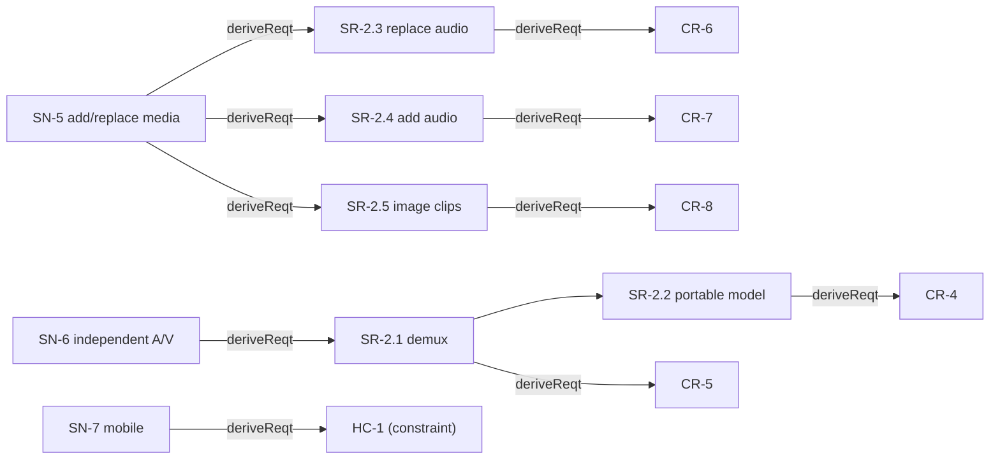

# Traceability

> The MagicGrid closes the loop across layers with SysML relationships
> (your #5 rules). Direction: **SN —«deriveReqt»→ SR —«deriveReqt»→ CR/HC**;
> functions **«refine»** SR & SN; logical subsystems **«satisfy»** SR; behaviour
> **«allocate»** to structure; requirements **«verify»** by behaviour/structure/tests;
> MoP **value-bind** to structure and roll up to MoE.

## Vertical thread (p.27 style: Need → System Req → Component Req)

## Cross-pillar matrix (per system requirement)
| SR | refinedBy (F, behavior) | satisfiedBy (LS, structure) | verifiedBy (test) | param (MoP) |
|---|---|---|---|---|
| SR-1.1 segment | F-4 | LS-Segment | T-5 | — |
| SR-1.2 keep/order | F-5,F-6 | LS-EditModel | T-1,T-2 | — |
| SR-1.3 render | F-8 | LS-Render | T-3,T-4 | MOP-2,MOP-7 |
| SR-1.4 captions | F-9 | LS-Caption | T-6 | MOP-6 |
| SR-1.5 loudness | F-10 | LS-Master | T-7 | MOP-1 |
| SR-1.6 A/V sync | F-8 | LS-Render | T-3,T-4 | MOP-2 |
| SR-1.7 local-only | — (context) | LS-HMI | T-7 | MOP-8 |
| SR-2.1 demux | F-2 | LS-Ingest | T-8 | — |
| SR-2.2 portable model | F-2 | LS-EditModel | T-8 | — |
| SR-2.3 replace audio | F-11 | LS-Caption/EditModel | T-9 | MOP-6 |
| SR-2.4 add audio | F-12 | LS-AudioMix | T-10 | MOP-1,MOP-5 |
| SR-2.5 image clips | F-13 | LS-Render | T-11 | MOP-4 |
| SR-2.6 mix loudness | F-10,F-12 | LS-Master | T-9,T-10 | MOP-1 |
| SR-2.8 MoP threshold | F-6,F-14 | LS-EditModel | T-8..T-11 | MOP-3 |

## MoE roll-up
MOE-2←MOP-8 · MOE-3←MOP-1,MOP-2,MOP-5 · MOE-6←MOP-6 · MOE-5←MOP-3 · MOE-1←MOP-4,MOP-7 · MOE-4←MOP-9.

## Test catalogue (`../tests/`)
T-1 reorder · T-2 keep/renumber · T-3 timing math · T-4 ffmpeg render · T-5 segment ·
T-6 caption remap · T-7 e2e/loudness · **T-8** demux/portable-model · **T-9** replace-audio ·
**T-10** add-audio · **T-11** image-clip. (T-1…T-7 Built; T-8…T-11 Planned.)

## Conformance
All four pillars populated across **Conceptual / Logical / Physical** layers (NTRS p.7),
package tree mirrors p.10, relationships per your #5, requirement attributes per p.15,
requirement stereotypes per p.16. Mobile (SN-7) is a hardware **constraint** (HC-1),
detailed design deferred.
