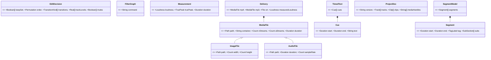
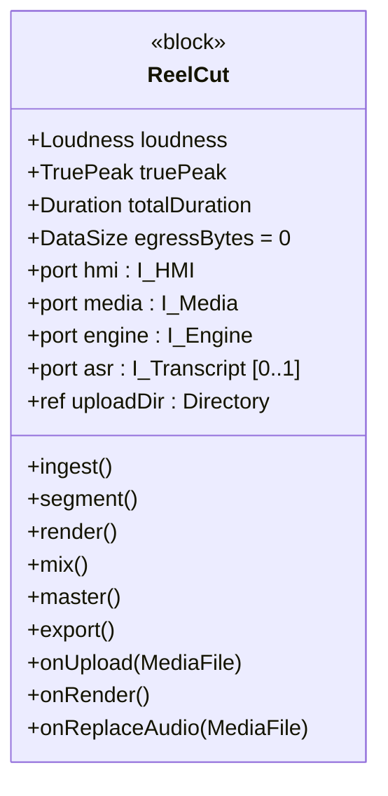

# Properties, Value Types & Signals — full definitions (with compartment diagrams)

> Closes the "every element has all its properties **defined and described**" bar.
> The element dictionary (`6`) gives each element a *meaning*; this file gives each
> block its **typed property set** (value/part/port/flow/reference properties +
> operations/constraints), defines every **value type** (with unit/quantity kind)
> and every **signal** (flow item) with its internal structure, and **visualises
> properties in compartments** (Mermaid `classDiagram` = SysML block compartments).

## 1 · Value-type catalogue (units / quantity kinds)

| Value type | Base | Unit / quantity kind | Description |
|---|---|---|---|
| `Duration` | Real | second (s) | A length of time on a timeline. |
| `Loudness` | Real | LUFS | Integrated programme loudness. |
| `TruePeak` | Real | dBTP | Sample-peak ceiling of the signal. |
| `SyncError` | Real | millisecond (ms) | Signed A/V offset; 0 = perfectly aligned. |
| `DataSize` | Integer | byte (B) | Quantity of data (e.g. egress). |
| `Count` | Integer | — | Dimensionless cardinality. |
| `Path` | String | — | Filesystem location (a `Directory` is a `Path` to a folder). |
| `Permutation` | Integer[1..*] | — | Ordering of kept sub-sections (new index sequence). |
| `TagLabel` | String | — | Topic tag attached to a segment/sub-section. |
| `TransitionKind` | enum | — | {none, crossfade, dissolve, fade, wipe, slide, circle, radial}. |
| `Status` | enum | — | {Built, Planned}. |
| `MoSCoW` | enum | — | {Must, Should, Could, Wont}. |
| `VerificationMethodKind` | enum | — | {Inspection, Analysis, Demonstration, Test}. |
| `RiskLevel` | enum | — | {Low, Medium, High}. |

```mermaid
classDiagram
  class Duration { <<valueType>> +Real value; unit = s }
  class Loudness { <<valueType>> +Real value; unit = LUFS }
  class TruePeak { <<valueType>> +Real value; unit = dBTP }
  class SyncError { <<valueType>> +Real value; unit = ms }
  class DataSize { <<valueType>> +Integer value; unit = byte }
  class TransitionKind { <<enumeration>> none crossfade dissolve fade wipe slide circle radial }
  class Status { <<enumeration>> Built Planned }
  class VerificationMethodKind { <<enumeration>> Inspection Analysis Demonstration Test }
```

## 2 · Signal / flow-item catalogue (internal structure)

Every item that crosses a port is a signal/block with typed properties:

| Signal | Carried by interface | Description |
|---|---|---|
| `MediaFile` / `ImageFile` / `AudioFile` | I-Media | The media units ingested or produced; images/audio specialise MediaFile. |
| `EditDecision` | I-HMI | The creator's complete keep/order/transition/track choice set. |
| `FilterGraph` / `Measurement` | I-Engine | Command sent to FFmpeg; loudness/probe result returned. |
| `TimedText` (`Cue`) | I-Transcript | Caption cues with start/end/text. |
| `Delivery` | I-HMI | The export bundle (mp4/mp3/srt + measured loudness). |
| `ProjectDoc` | I-Project | The portable, renderer-agnostic edit for mobile resume. |
| `SegmentModel` (`Segment`/`SubSection`) | internal | The tagged segmentation the edit model is built on. |

## 3 · Block property definitions (compartments)

### 3.1 System of Interest — `ReelCut`

### 3.2 Logical subsystems — ports & key value properties

| Block | value properties | ports (typed by interface block) | operations |
|---|---|---|---|
| **LS-Ingest** | `trackCount : Count` | `out tracks : I_AVTracks` | `ingest()`, `demux()` |
| **LS-Segment** | `segmentCount : Count` | `out segs : I_Segments` | `transcribe()`, `segment()` |
| **LS-EditModel** | `order : Permutation`, `trackLevels : Real[*]` | `in fromHMI : I_HMI`, `out plan : I_RenderPlan` | `setKeep()`, `reorder()`, `setTransition()`, `setTrackLevel()`, `replaceAudio()` |
| **LS-Render** | `runningDuration : Duration` | `in plan : I_RenderPlan`, `out edit : I_Edit` | `render()`, `synthImageClip()` |
| **LS-AudioMix** | `duckAtten : Real` | `in tracks : I_AVTracks`, `out mixed : I_Audio` | `mix()`, `duck()` |
| **LS-Caption** | `cueCount : Count` | `in timing : I_TimingMap`, `out srt : I_Captions` | `remap()`, `invalidate()` |
| **LS-Master** | `loudness : Loudness`, `truePeak : TruePeak` | `in edit : I_Edit`, `out delivery : I_Media` | `master()` |
| **LS-HMI** | `bindAddress : String = 127.0.0.1` | `hmi : I_HMI` | `serve()`, `route()` |

### 3.3 Components — value properties & operations

Component operations and their realising scripts are in `2-solution-domain/2` &
`3`; each component's **value properties** are the measurable state it owns:
`C-Master.loudness/truePeak`, `C-Render.runningDuration`, `C-Model.order/trackLevels`,
`C-Server.bindAddress`, `C-AudioMix.duckAtten`, `C-Probe.{vStreams,aStreams,duration}`.

## 4 · Coverage statement

Every block now has its **value / part / port / flow / reference properties** and
**operations / receptions** enumerated; every **value type** has a unit/quantity
kind; every **signal** has its internal structure typed; and all of this is
**visualised in compartments** (the `classDiagram` blocks above render to SVG —
`diagrams/types/value-types`, `diagrams/types/signals`, `diagrams/types/soi-block`).
Requirement-element **attributes** (risk + rationale, completing the p.15 set) are
in `1-problem-domain/white-box/1` and `2-solution-domain/1`.
</content>
</invoke>
