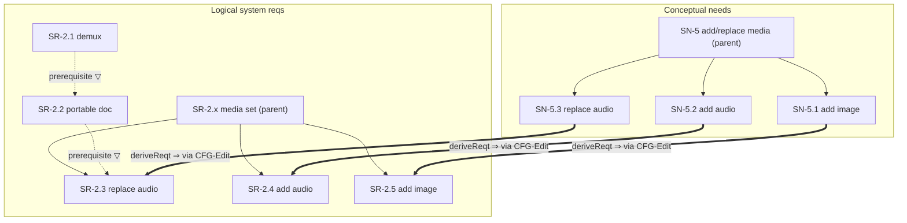
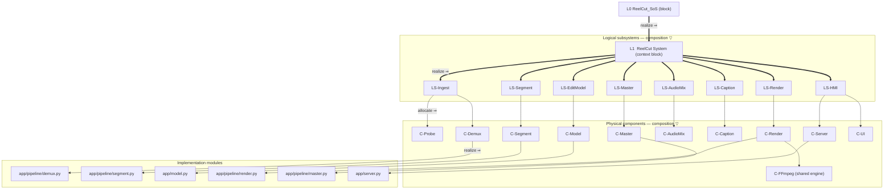
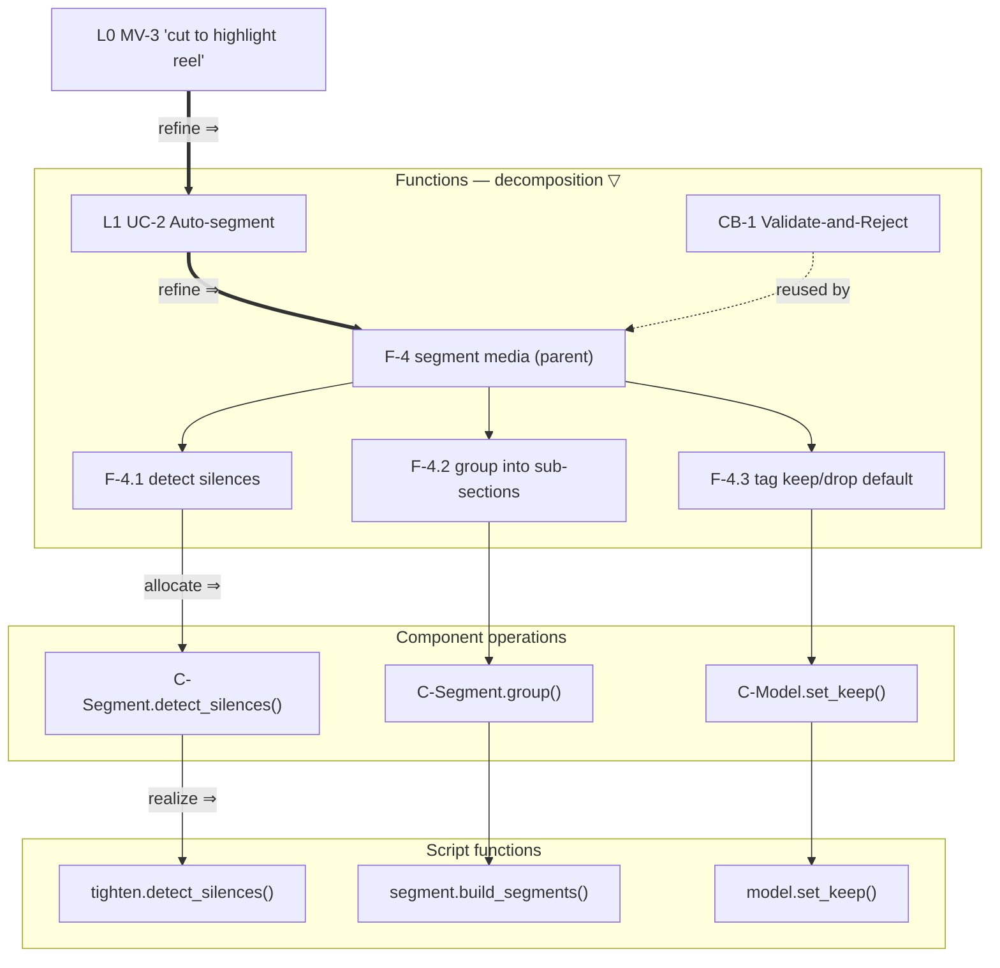
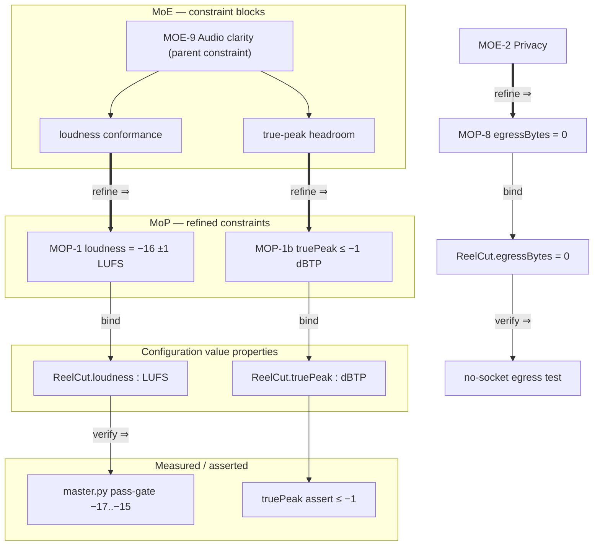
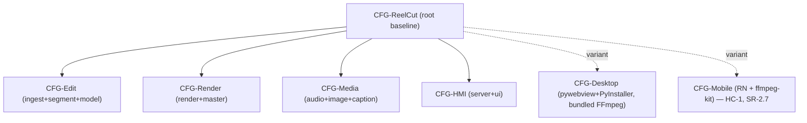

# 8 — Cross-Layer Traceability (four pillars, like-to-like, with decomposition, recursion, and a configuration join)

> **Purpose.** Give the model *complete like-to-like traceability through every layer of
> abstraction*, separately for each SysML pillar:
> **requirement→requirement**, **structure→structure**, **behaviour→behaviour**,
> **parametric→parametric**. Each thread runs top-to-bottom across the abstraction layers,
> uses **decomposition** within a layer and **realization/derivation** across layers, and is
> applied **recursively** at every level. Cross-layer hops are mediated by an explicit
> **Configuration** element (the intermediate "join") so the four threads stay coherent and
> we avoid an N×N tangle of direct links.
>
> This file is the authoritative *cross-layer* spine. `5-traceability.md` remains the
> *within-layer / cross-pillar* spine (SN→SR→CR→F→LS→C→T and MoP→MoE). The two are
> complementary: 5 = "across pillars at a level"; 8 = "down one pillar through the levels".

---

## 8.0 Abstraction layers (the vertical axis)

The same five layers carry all four threads. A sixth element — **Configuration** — is **not**
a layer but a *join that sits on each inter-layer edge* (see §8.6).

| # | Layer | Role | Pillar homes (files) |
|---|-------|------|----------------------|
| L0 | **Enterprise / SoS** | mission context | `0-enterprise-sos/*` |
| L1 | **Conceptual (black-box)** | problem space; needs, MoE | `1-problem-domain/black-box/*` |
| L2 | **Logical (white-box)** | solution-independent architecture | `1-problem-domain/white-box/*` |
| L3 | **Physical (solution)** | chosen components, MoP | `2-solution-domain/*` |
| L4 | **Implementation** | code modules, tests | `4-implementation-domain.md`, `reelcut/app/**` |
| —  | **Configuration (join)** | binds the four threads across each L*n*→L*n+1* hop | `3-system-configuration.md` + §8.6 |

### Recursion rule (uniform at every level, every pillar)

Every element `E` in any pillar carries exactly two kinds of like-to-like link:

1. **Decomposition (within a layer):** `E ▽ {E.1, E.2, …}` — a parent decomposes into children of
   the *same pillar and same layer*. The relation is pillar-specific (`containment` for
   requirements, `composition` for structure, `call-behaviour` for behaviour, `constraint
   decomposition` for parametric).
2. **Realization (across one layer):** `E ⇒ E'` — `E` at layer L*n* is realized/derived by `E'` of
   the *same pillar* at layer L*n+1*, **routed through a Configuration item** (§8.6).

Applying *(1)* then *(2)* recursively from L0 to L4 yields a self-similar tree:
`SoS ▽… ⇒ Conceptual ▽… ⇒ Logical ▽… ⇒ Physical ▽… ⇒ Implementation`.
The pattern is identical at depth 1 (System) and depth *k* (a leaf part/operation/parameter), which
is what makes the model traversable in both directions at any depth.

### Relation vocabulary (extends the keywords already in use)

| Pillar | Within-layer decomposition `▽` | Across-layer realization `⇒` |
|--------|-------------------------------|------------------------------|
| Requirements | `«containment»` (parent req ⊃ sub-req) | `«deriveReqt»` down · `«trace»` up |
| Structure | `«composition»` (block ⊃ part) | `«allocate»` / `«realize»` (logical→physical) |
| Behaviour | `«decompose»` (activity ⊃ call-behaviour) | `«refine»` (function realized by lower behaviour) |
| Parametric | constraint decomposition (`«constraint»` ⊃ sub-constraint) | `«refine»` value-binding (MoE→MoP→value) |

`«deriveReqt» «refine» «satisfy» «allocate» «verify» «contributes» bind` were already present
(see `5-traceability.md`); this file adds the **`▽` decomposition** links that were missing and the
**Configuration-routed `⇒`** semantics.

---

## 8.1 Thread R — Requirement ⇄ Requirement (down every layer)

Like-to-like requirement chain. Cross-layer derivation already existed (SN→SR→CR); the new content
is the **within-layer decomposition** `▽` (parent needs/requirements) that was previously implicit
in `x.y` numbering only.

### R-thread cross-layer chain (realization `⇒`, routed via CFG)

| L0 capability | L1 need | L2 system req | L3 component req | L4 module/test |
|---------------|---------|---------------|------------------|----------------|
| CAP-3 trim/segment | SN-1, SN-3 | SR-1.1, SR-1.2 | CR-2 | `segment.py` / T-5 |
| CAP-9 loudness | SN-2.4, SN-16 | SR-1.5, SR-4.8 | CR-7 | `master.py` / T-7 |
| CAP-12 add media | SN-5 | SR-2.3, SR-2.4, SR-2.5 | CR-6 | `audio_mix.py` / T-phase2 |
| CAP-7 captions | SN-21 | SR-4.3, SR-4.9 | CR-4 | `captions.py` / T-phase8 |
| CAP-2 privacy/egress=0 | SN-2 | SR-2.7 (no-upload) | HC-2 | `server.py` bind 127.0.0.1 |

### R-thread within-layer decomposition `▽` (NEW — fills the flat-namespace gap)



**Decomposition added:** `SN-5 ▽ {SN-5.1, SN-5.2, SN-5.3}`; `SR-2.x ▽ {SR-2.3, SR-2.4, SR-2.5}`;
plus the **SR→SR prerequisite** ordering `SR-2.1 ▽→ SR-2.2 ▽→ SR-2.3` (a within-layer like-to-like
link that was only prose before). Each `⇒` hop is labelled with its mediating Configuration item.

---

## 8.2 Thread S — Structure ⇄ Structure (down every layer)

Like-to-like structural decomposition. `«allocate»` LS→C existed; the new content is the
**composition tree** (`«composition»`) so every block names its parts at every level — recursion.



**Composition added (the missing `▽`):** `ReelCut System ▽ {LS-Ingest…LS-HMI}`;
`LS-Ingest ▽ {C-Probe, C-Demux}`, `LS-HMI ▽ {C-Server, C-UI}`, etc. The previous model had the 8
LS and 12 C as flat siblings; they are now a part-of tree realized down to modules.

---

## 8.3 Thread B — Behaviour ⇄ Behaviour (down every layer)

Like-to-like behaviour decomposition: mission vignette → use case → function → sub-function →
component operation → script function. `UC→F` existed; the new content is the **function
decomposition tree** (`F ▽ F`) and the explicit operation/method realization.

> **MBSE rule compliance.** The behaviour decomposition below was enumerated with the
> `brainstorming` skill (happy / alternate / exception / edge flows) per the repo's MBSE
> behaviour-completeness rule before being written here. See DECISIONS.md ADR-013.



**Decomposition added (the missing `▽`):** every L2 function that is non-atomic now names its
children, e.g. `F-4 ▽ {F-4.1 detect, F-4.2 group, F-4.3 tag}`, recursively down to the script
function that realizes each leaf. Reusable behaviours `CB-1…CB-7` attach as `«include»` at the leaf
that uses them.

---

## 8.4 Thread P — Parametric ⇄ Parametric (down every layer)

Like-to-like parametric refinement: Measure of Effectiveness → Measure of Performance → component
value property → measured/asserted value. `MoP «contributes» MoE` and `bind` existed; the new
content is the **constraint-block decomposition** so each MoE names the sub-constraints/MoPs that
compose it, recursively, with the binding equation carried at every level.



**Decomposition added (the missing `▽`):** `MOE-9 ▽ {loudness, true-peak}` refined to
`{MOP-1, MOP-1b}`; the binding equation (`loudness == loudnorm(I=-16)`) is the constraint carried
across the `⇒` hop. `MOE-2 Privacy ⇒ MOP-8 egressBytes=0` makes the privacy MoE measurable.

---

## 8.5 Layers × Pillars × link-type — closure summary

| Pillar | L0⇒L1 | L1▽ | L1⇒L2 | L2▽ | L2⇒L3 | L3▽ | L3⇒L4 |
|--------|------|-----|------|-----|------|-----|------|
| Requirements | CAP⇒SN | SN▽SN.x ✅new | SN⇒SR | SR▽SR ✅new | SR⇒CR | CR▽ | CR⇒module |
| Structure | SoS⇒Sys | — | Sys⇒LS | LS▽C ✅new | LS⇒C | C▽part ✅new | C⇒module |
| Behaviour | MV⇒UC | — | UC⇒F | F▽F.x ✅new | F⇒op | op▽ | op⇒script |
| Parametric | — | MoE▽ ✅new | MoE⇒MoP | MoP▽ ✅new | MoP⇒value | — | value⇒test |

✅new = like-to-like decomposition link introduced by this file (previously flat/implicit).
Every `⇒` is routed through a Configuration item (§8.6).

---

## 8.6 Configuration model — the inter-layer join

A **Configuration Item (CFG)** is the intermediate element that carries all four threads across one
abstraction hop. Instead of linking a requirement directly to a component (cross-pillar) or a
logical block directly to a physical block (cross-layer), each hop **binds a 4-tuple**:

```
CFG = ⟨ R : requirement-set satisfied,
        S : structure variant chosen,
        B : behaviour allocation,
        P : parameter values that meet the MoP ⟩
```

This makes the trade-study selection explicit at the join: the chosen `S` (e.g. variant V3) is the
reason a given `R` is realized by a given physical element with given `P`. A CFG at layer *n*
**decomposes** into CFGs at layer *n+1* (recursion), mirroring the structure tree.

### Configuration baseline tree (recursion example)



### Two configuration variants (closes the 'no post-selection variants' gap)

| CFG variant | R (requirements in scope) | S (structure) | B (behaviour) | P (parameters) | Status |
|-------------|---------------------------|---------------|---------------|----------------|--------|
| **CFG-Desktop** | all SR-1..5 + CR-1..8 | C-Server + C-UI + C-FFmpeg bundled (ADR-009) | full function set F-1..35 | egressBytes=0, loudness=−16 | Built |
| **CFG-Mobile** | SR-2.7 + subset (no batch); HC-1 hardware constraint | RN shell + ffmpeg-kit (ADR-010, WV-001) | render subset, on-device | egressBytes=0 preserved | Planned (best-effort, WV-002) |

Each variant is a leaf configuration that **selects** which structure realizes the in-scope
requirements with which parameters — the same `⟨R,S,B,P⟩` join applied recursively. `CFG-Desktop`
and `CFG-Mobile` share `CFG-Edit`/`CFG-Render`/`CFG-Media` and differ only at `CFG-HMI` + engine,
which is exactly what the structure tree (§8.2) predicts.

---

## 8.7 Closure / how this stays honest

- **Drift-check** (`.claude/hooks/drift-check.sh`) validates that every `▽` decomposition parent and
  every CFG 4-tuple element referenced here resolves to a defined ID (no dangling like-to-like link),
  in addition to the existing fence-parity and SN/F resolution checks.
- **Source of truth** remains the Mermaid blocks here + the element dictionary (`6-element-dictionary.md`);
  re-render via `diagrams/render.sh`.
- A like-to-like thread is **complete** when, for every leaf at L4, you can walk `⇐` (trace up) through
  one CFG per hop back to an L0 capability/MoE in the *same pillar* — and `⇒` back down — with no gap.

*Created 2026-06-24. Companion to `5-traceability.md` (cross-pillar) and `3-system-configuration.md`
(configuration block). Keep IDs consistent with the element dictionary.*
